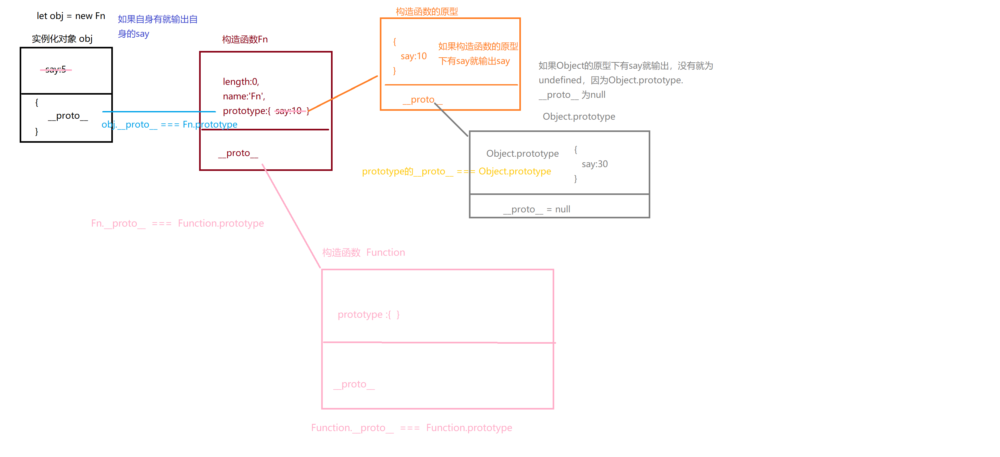

[toc]

## JS正式课第三天

### var 、 let 、const的区别
+ var
	+ 当通过var创建一个变量的时候，会进行预解析（变量提升）
	+ 因为var会预解析，所以变量会当作属性存到全局的活动变量对象下（window下）
	+ 不支持块级作用域
	+ 不会主动储存每次循环的值
+ let
	+ 当通过let创建一个变量的时候，不会进行预解析（不会变量提升）
	+ 不会在window下挂属性
	+ 在定义变量之前访问这个变量，之前访问的空间叫做暂存死区
	+ 支持块级作用域
	+ 会把每次循环的值储存起来
	+ 不能声明同名的变量、函数、参数
+ const: 常量（不可变的量）
	+ 当声明一个变量不允许可变的时候就是用const来定义
	+ 不能声明同名的变量
	+ 注意：const赋值的数据，它只会监控这个数据的地址()
	+  如果通过const声明的变量是 对象类型，如果修改对象下的属性名（key）对应的属性值（value）是可以的

```
<script>
     const obj = {
         b:0
     }
     obj.b = 100;
     console.log(obj); // { b:100}
    </script>
```

> `js是一个弱类型语言
        let num:number = 10;
        num = '10'`
```
const box = document.getElementById('box');
```

```
console.log(a); // undefined
 var a = 10;
```

```
console.log(a); // 报错 Cannot access 'a' before initialization
 let a = 10;
```

```
 var a = 10; // 相当于window.a = 10
 console.log(a); //10
```

```
let a = 10;
 console.log(window.a); // undefined
```

```
/*
        // [].push
        // ''.substring

        Object.prototype.toString
        [1,2,3] -> '1,2,3'
        {} -> '[object Object]'
    */
```
#### 块级作用域
> 块：{}
> + 类似封闭空间
> + 在块套块中，子块有函数，如果在父块或者父块的上方去访问这个函数，返回值都是nudefined
> + 如果在子块的下方访问这个函数，就能找到这个函数
#### 其他
+ js是一个弱类型语言
+ 原始值
	+ 存储在栈（stack）中的简单数据段，也就是说，它们的值直接存储在变量访问的位置。
+ 引用值
	+ 存储在堆（heap）中的对象，也就是说，存储在变量处的值是一个指针（point），指向存储对象的内存处。

#### var、let、const
    ``` 
        var 变量
            变量提升，存入到全局的活动变量对象中,允许有多个同名的变量，不支持块级作用域

        let 变量
            不会变量提升且有暂存死区(在变量定义的上方都访问不到这个变量)
            不会存入到全局的活动变量对象中
            不允许有多个同名的变量
            支持块级作用域

        const 常量
            不会变量提升且有暂存死区(在变量定义的上方都访问不到这个变量)
            不会存入到全局的活动变量对象中
            不允许有多个同名的变量
            值是不能被改变的（引用类型可以改变属性值）
            声明了必须赋值
    ```
### 单例设计模式
#### 单例模式
> 单例：单独的实例
>`obj  ={
                name:'xxx'
            }`
#####   构造函数和实例
+ 实例：描述具体的是一个事务    倪老师（具体）
+ 构造函数：抽象一个类的封装过程 老师（教书育人...）
#####   原始值和引用值
+ 原始值： 字符串、数字、布尔值...
+ 引用类型（里面放着很多的原始值和引用值）
#### 高级单例模式
+ 让当前这个实例功能更加强大,还可以隐藏或者暴露细节信息,形成模块化编程
+ 解决了命名冲突的问题
+ 形式：
> `            (function(){
                function sum() {
                }
                return {
                }
            })();`
```
高级单例模式需要知道哪些东西：
        1.为什么要用高级单例模式
            让当前这个实例功能更加强大，还可以隐藏或者暴露细节信息
        
        2.高级实例模式如何写
        (function () {
            return{
    
            }
        })();
        最后让一个变量去接收这个功能强大的对象
    
        解决命名冲突的问题：
        1.封闭空间 （把变量或者函数放到函数中）
        let a = 10;
        (function () {
            let a = 20
        })();
        2.命名空间
        // let name = 10;
           obj.name
        // let name = 20;
           obj2.name
```

```
 <script>
        /* 
        单例模式：
            单例：单独的实例
    
            obj  ={
                name:'xxx'
            }
    
        构造函数和实例
    
            实例：描述具体的是一个事务    倪老师（具体）
            构造函数：抽象一个类的封装过程 老师（教书育人...）
        原始值和引用值
    
        原始值： 字符串、数字、布尔值...
        引用类型（里面放着很多的原始值和引用值）：
    
        高级单例模式：
            让当前这个实例功能更加强大,还可以隐藏或者暴露细节信息,形成模块化编程
            解决了命名冲突的问题
            (function(){
                function sum() {
                }
                return {
                }
            })();
        高级单例模式需要知道哪些东西：
        1.为什么要用高级单例模式
            让当前这个实例功能更加强大，还可以隐藏或者暴露细节信息
        
        2.高级实例模式如何写
        (function () {
            return{
    
            }
        })();
        最后让一个变量去接收这个功能强大的对象
    
        解决命名冲突的问题：
        1.封闭空间 （把变量或者函数放到函数中）
        let a = 10;
        (function () {
            let a = 20
        })();
        2.命名空间
        // let name = 10;
           obj.name
        // let name = 20;
           obj2.name
    
    
    
        // {} -> Object [] -> Array '' -> new String()
         */
        let name = '珠峰';
        let age = 10;
        let ip = '回龙观东大街';
        let name2 = '孟记粥铺';
        let age2 = 5;
        let ip2 = '回龙观东大街';

        // 对象（实例）
        let obj = {
            name: '珠峰',
            age: 10,
            ip: '回龙观东大街'
        }
        console.log(obj);


        // 高级单例模式
        let obj2 = (function () {
            let name = '珠峰';
            let age = 10;
            let ip = '回龙观东大街';
            return {
                name: name,
                ip: ip
            }
        })();
        console.log(obj2);
    </script>
```

```
  <script>
    /* 
    单例模式：
        单例：单独的实例

    构造函数和实例

        实例：描述具体的是一个事务    倪老师（具体）
        构造函数：抽象一个类的封装过程 老师（教书育人...）
    原始值和引用值

    原始值： 字符串、数字、布尔值...
    引用类型（里面放着很多的原始值和引用值）：

    高级单例模式：
        

     */
    let name = '珠峰';
    let  age = 10;
    let ip = '回龙观东大街';
    let name2 = '孟记粥铺';
    let age2 = 5;
    let ip2 = '回龙观东大街';

    // 对象（实例）
    let obj = {
        name:'珠峰',
        age:10,
        ip: '回龙观东大街'
    }
    console.log(obj);


    // 高级单例模式
    let obj2 =(function () {
        let name = '珠峰';
        let  age = 10;
        let ip = '回龙观东大街';
        function sum() {
            for (let i = 0; i < 10; i++) {
                age++;
                
            }
            return age
        }
        sum();
        console.log(age)
        return {
            name:name,
            ip:ip,
            sum:sum
        }
    })();
    let obj3 = (function() {
        let age = 0;
        // let sumfn = obj2.sum;
        function sum() {
         console.log(1);
        }
        sum();
        // age = sumfn();
        console.log(obj2.sum());
    })();
    console.log(obj2);
    </script>
```
### 工厂设计模式
>  工厂模式为了*批量*生产实例
>  函数 目的就是为了复用
```
  <script>
        /* 
        工厂模式为了*批量*生产实例

        函数的目的就是为了复用
        
        
         */
    // 描述具体的对象
    let obj = {
        name:'珠峰',
        age:10
    }
    let obj2 = {
        name:'孟记粥铺',
        age:5
    }
    let abj3 = {
        name:'虾吃虾涮',
        age:2
    }
 function fn(name,age) {
    let obj = { }; // let obj  = new Object() 初始化原材料
        obj.name = name;
        obj.name = age;
   
    return obj;// 出厂
 }
 let obj = fn('珠峰',10);  // 批量生产
 let obj2 = fn('孟记粥铺',5);
 let obj3 = fn('虾吃虾涮',2);
 console.log(obj,obj2,obj3);

    </script>
```
### 面对对象
+ 面向对象是一种对现实世界理解和抽象的方法，是计算机编程技术发展到一定阶段后的产物。
+ *** 学习思想：换了一种写法去写代码 ***
+ 为什么要用面向对象来编程
    通过对象来编程，扩展性更强能够做到高内聚、低耦合
+ 面向对象：
        将具有相同特征、特性的代码，抽离出来归位一类，然后把描述这个类的细节特性（属性、方法）挂在这个类的原型下的一种编程方式
+ 抽象：
       抽出像的部分（把相同的代码抽离出来）
+  类  class
> `JS不是一个面向对象的编程语言，是一个基于面向对象思想构建出来的编程语言`
> `构造函数（类）
        老师：
           给我讲东西的都叫老师（归类）
    实例
        倪老师（类中其中具体一个）
       obj = new Object()
        let ary = []
        let ary = new Array()
        new Date`

```
<script>
    /* 
    面向对象是一种对现实世界理解和抽象的方法，是计算机编程技术发展到一定阶段后的产物。

    JS不是一个面向对象的编程语言，是一个基于面向对象思想构建出来的编程语言

    抽象：
       抽出像的部分（把相同的代码抽离出来）

    类  class

    *** 学习思想：换了一种写法去写代码 ***

    为什么要用面向对象来编程
    通过对象来编程，扩展性更强能够做到高内聚、低耦合

    面向对象：
        将具有相同特征、特性的代码，抽离出来归位一类，然后把描述这个类的细节特性（属性、方法）挂在这个类的原型下的一种编程方式

    构造函数（类）
        老师：
           给我讲东西的都叫老师（归类）
    实例
        倪老师（类中其中具体一个）

        obj = new Object()
        let ary = []
        let ary = new Array()

        new Date
     */
     // 类
    function Person(name,age,sex) { // 归类 构造函数（构造对象的函数）
        let obj = {};
        obj.name = name;
        obj.age = age;
        obj.sex = sex;
        return obj;
    }
    // let p1 =  Person('赵炎',24,'男'); 
    let p1 = new Person('赵炎',24,'男');// p1实例
    console.log(p1);
    </script>
```
#### new  是函数一元运算符，专门运算** 函数 **的
+ 使用new之后会调用函数，就算不加()也会调用执行，加()是为了传参
+ 使用new之后，this就变成了实例，实例就是一个对象(空白对象)
+ 使用new之后，函数默认返回值为实例化对象，就不再是undefined
+ 使用new之后，如果函数后面有值，为原始类型，返回结果还是实例，
如果return后面的值为引用类型，返回的结果就是return后的引用类型
+ >  创建对象的三种方式    {} new Object new 函数

####  new
        一元运算符，专门运算**函数**的,能让函数不加括号的情况下执行
        加括号是为了传参
        1.构造函数中的this就是这个构造函数的*实例化对象*，默认的this也是*实例化对象*
        2.return返回值如果是简单类型，那么返回的结果为*实例化对象*，如果
        返回值为如果为引用类型，那么返回的结果就是这个*引用类型*
### 原型
> `在js中，所有的class（类）都是函数模拟出来的`


+ 定义：当声明一个函数的时候，这个函数自身有一些属性或者方法（天生自带的），其中有一个属性叫做prototype，它的值为**对象**，这个prototype就叫做原型,也就是说函数身上才有原型
+ *** 函数原型下的属性或者方法只给它（构造函数）的实例化对象使用 ***
+ Object.orototype.__proto__为null，找到Obejct的原型下如果没有某个属性或者方法就真的没有了
+ 原型链: 
         ` __proto__ `实例化对象都有`__proto__` ,
         这个属性全等于 实例的构造函数的原型
 + 实例有原型链，函数有原型，原型又是一个对象，对象它就是实例，实例又有原型链，找到构造函数的原型， 
    Object.orototype.*_**_proto_**_* = null
    
*_**_proto_**_*



```
<script>
    /* 
    在js中，所有的class（类）都是函数模拟出来的

    当声明一个函数的时候，这个函数自身有一些属性或者方法（天生自带的），其中有一个属性叫做prototype，它的值为**对象**
    这个prototype就叫做原型,也就是说函数身上才有原型

    *** 函数原型下的属性或者方法只给它（构造函数）的实例化对象使用 ***

    原型链:
         __proto__ 实例化对象都有__proto__ ,
         这个属性全等于 实例的构造函数的原型
     */
function fn() {
}
fn.prototype.say = 10; // 属性
fn.prototype.aa = function() {} // 方法
let f = new fn;

/* 
f.say => f. __proto__ => fn.prototype
 */
console.log(f.say); //10
console.log(f.__proto__.say); // 10
console.dir(f);// __proto__: Object
console.log(f.__proto__ === fn.prototype);// true
  
    </script>
```

### javascript垃圾回收机制 - 标记清除法/引用计数/V8机制

#### Js GC原理：
+ 找出那些不再继续使用的变量，然后释放其所占用的内存，垃圾回收器会按照固定的时间间隔周期性地执行这一操作

#### Js GC 策略：
+ 标记清除法
+ 引用计数
#### JavaScript 内存分配：
+ 在定义变量时就完成了内存分配，还可以通过函数调用分配内存，使用值的过程实际上是对分配内存进行读取与写入的操作
#### 标记清除法：
+ 标记方式：特殊位的反转、维护一个列表
+ 原理：垃圾收集器在运行的时候会给存储在内存中的所有变量都加上标记，然后它会去掉环境中的变量已经被环境中变量被标记为引用的变量，在此之后再被标记的变量将被视为准备删除的变量。最后垃圾回收器清除标记的变量，回收它们所占用的内存空间
+ 目前主流浏览器都是使用标记清除式的垃圾回收策略，只不过收集的间隔有所不同
#### 引用计数：
+ 原理：每次引用加一，被释放时减一，当这个值的引用次数变成 0 时，就可以将其内存空间回收
+ 缺点：循环引用(obj1 和 obj2 通过各自的属性相互引用，也就是说，这两个对象的引用次数都是 2)
#### IE兼容问题
+ 在 IE9 之前，IE 中有一部分对象并不是原生 JavaScript 对象。例如，BOM 和 DOM 中的对象就是 C++ 实现的 COM 对象，而 COM 对象的垃圾收集机制采用的是引用计数策略。因此，即使 IE 中的 JavaScript 引擎使用标记清除策略实现，但是 JS 访问的 COM 对象依然是基于引用计数策略的。可以在 IE 中涉及到 COM 对象，就会存在循环引用的问题
+ 解决：将变量设置为 null
#### V8内存机制
+ V8 引擎会限制 JavaScript 所能使用的内存大小
+ 性能问题：(运行时间间隔)

  +	IE7 之前的垃圾收集器是根据内存分配量运行的，达到某一个临界值就是启动垃圾回收器

		+ 缺点：如果该脚本在其生命周期需要一直保持这么多变量，垃圾回收器就不得不频繁运行。
	+ 浏览器可自动触发： window.CollectGarbage()
	+ 避免：执行代码中只保留必要的数据，一旦数据不再有用，通过设置为 null 来释放其引用(适用于大多数全局变量和全局对象的属性)
+ V8 的堆构成

	+	新生区：大多数对象被分配在这里。新生区是一个很小的区域，垃圾回收在这个区域非常频繁，与其他区域相独立。
	+ 老生指针区：这里包含大多数可能存在指向其他对象的指针的对象。大多数在新生区存活一段时间之后的对象都会被挪到这里。
	+ 大对象区：这里存放体积超越其他区大小的对象。每个对象有自己 map 产生的内存。垃圾回收器从不移动大对象。
  - 代码区：代码对象，也就是包含 JIT 之后指令的对象，会被分配到这里。这是唯一拥有执行权限的内存区（不过如果代码对象因过大而放在大对象区，则该大对象所对应的内存也是可执行的。译注：但是大对象内存区本身不是可执行的内存区）。
  - Cell 区、属性 Cell 区、Map 区：这些区域存放 Cell、属性 Cell 和 Map，每个区域因为都是存放相同大小的元素，因此内存结构很简单
+ 分代回收

	+ 原因：绝大多数对象的生存期很短，只有某些对象的生存期较长
	+ 过程：
       1、对象起初会被分配在新生区（通常很小，只有 1-8 MB）在新生区的内存分配非常容易：我们只需保有一个指向内存区的指针，不断根据新对象的大小对其进行递增即可。当该指针达到了新生区的末尾，就会有一次清理（小周期），清理掉新生区中不活跃的死对象。

       2、活跃超过 2 个小周期的对象，则需将其移动至老生区老生区在标记－清除或标记－紧缩（大周期）的过程中进行回收。大周期进行的并不频繁。一次大周期通常是在移动足够多的对象至老生区后才会发生。至于足够多到底是多少，则根据老生区自身的大小和程序的动向来定。