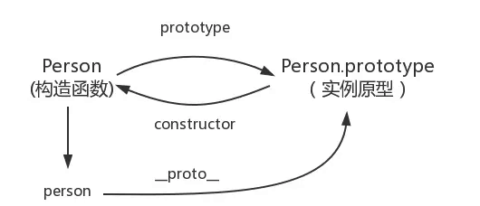

[toc]

## JS正式课第五天
### 复习

#### 函数
+ 普通函数  运行函数中的代码      为了复用
+ 构造函数 (class)
	+ this 实例
	+ 默认return  实例
	+ 在类里面一般都是添加属性
+ new  构造函数

> `{
> name:'郝永旺'
> }
> function () {
> this.name = '郝永旺'
> }
> console.log(new Fn().name); // '郝永旺'
> console.log({name:'郝永旺'}.name); // '郝永旺' `

#### 原型和原型链
+ 函数走原型   （构造函数的实例）
+ 实例走链     （实例找不到某个属性或者方法就走链）
+ 实例的原型链 ===  构造函数的原型


```
<script>
    /* 
    {name:'xxx'} -> this.name = 'xxx'
    obj.name = 'xxx' -> new Fn().name = 'xxx'

    obj.__proto__ -> fn.prototype -> fn.prototype.__proto__ ->Object.proto -> Object.prototype.__proto__
     */
    </script>
```
### 重写new

```
<script>
    /* 
    call （that,无数个）
    apply（that,两个 第二个参数是数组，数组里放的是实参）
    bind （that,无数个）

    共同特点：第一个参数都是改变this指向的,函数天生自带的

    注意：参数不要传null  undefined (无效的) 传了都是window

    1.this实例
    2.默认return 实例，如果return为引用类型就为引用类型
    3. 实例的原型链 === 构造函数的原型
    4.可以不加括号调用
     */
     function Fn(name) {
        this.name = name;
        // console.log(this); // 此处this指代的是{name: "郝永旺"}
     }
     let f = New(Fn,'郝永旺'); // -> new Fn()
    //  console.log(f.__proto__); // Objcet.prototype
     console.log(f.constructor);
     function New (fn,...arg) {
         let obj = new Object; // 实例
        let callback = fn.call(obj,...arg); //把构造函数的this改成实例
        //使实例的原型链等于构造函数的原型
        obj.__proto__ = fn.prototype;

        /* 要么是个对象类型，要么是个函数 */
        if(callback !== null && typeof callback === 'objcect' || typeof callback === 'function'){
            return callback;
        }
        return obj;
     }
    </script>
```

### call的使用
+ 所有的数据都有一个toString的方法，但是写法是不一样的。唯独Object的toString是能够去检测当前的数据的类型，所以可以把this改变，达到我们的目的
+ Array的toString，除了数组本身别的也都能检测数据类型
+ Array.from()  把类数组转为数组 ES6内置新方法

```
 /* 
    为什么call this就能借到某个方法？

    因为这些方法内部使用的数据都是this

    Array.from()  把类数组转为数组 ES6内置新方法
    
     */
```

```
  <script>
        /*  
          所有的数据都有一个toString的方法，但是写法是不一样的
          唯独Object的toString是能够去检测当前的数据的类型，所以可以
          把this改变，达到我们的目的

          Array的toString，除了数组本身别的也都能检测数据类型

          Array.from()  把类数组转为数组 ES6内置新方法
        */
    // console.log(Object.prototype.toString.call([]));// '[object Array]'
    // let toS = Object.prototype.toString;

    // let str = "123321";
    // console.log(str.toString());
    // console.log([1,2,3].toString());

    console.log(Array.prototype.toString.call('3212'));// [object String]
    console.log(Array.prototype.toString.call(['3212','456']));// '3212,456'  自己转自己不好使
    console.log(Array.prototype.toString.call({}));// '[object Object]'
    </script>
```
### class
> `用法：
> class 类名 {
>  constructor() {
>  // 给自身添加属性或者方法，就必须要写constructor
>   }
>      }`

```
 <script>
        /* 
        class 类名 {
            constructor() {
               // 给自身添加属性或者方法，就必须要写constructor
            }
        }
         */
    class Person {
       constructor(name) {
           this.name = name;
       }
       say() { // Person.prototype.say
          console.log(this.name);
       }
    } // function Perosn() {}
    let p = new Person('哈哈');
    let obj = {
        fn:function() {
         console.log(1);
        }// 等价于 fn() {  console.log(1); }
    }
    obj.fn();
   console.log(p);

   
    // function fn() {
    //     console.log(3);
    // }
    // let p = new Person('哈哈');


    // let obj = {
    //    fn:fn // 如果key值和value一样，那么可以只写一个  这里可以直接写成 fn
    // }
    // obj.fn();
    // console.log(p); // 3


    // Person.prototype.haha = 10;
    // Person.prototype = { // 如果使用类那么不能直接修改类的原型地址
    //     haha:10  //  获取不到  是undefined
    // }
    </script>
```

### 解构赋值

#### 数组的解构赋值

> `let [x,y] = [y,x]
> 声明的时候一定要是个数组,左右两边结构保持一致`

> `报错的情况
>        let [foo] = 1;
>       let [foo] = false;
>       let [foo] = NaN;
>       let [foo] = undefined;
>       let [foo] = null;
>       let [foo] = {};`

```
<script>
        /* 
          需求：a =5,b=10

          数组的解构赋值

           let [x,y] = [y,x]
               声明的时候一定要是个数组,左右两边结构保持一致

         // 报错的情况

         let [foo] = 1;
         let [foo] = false;
         let [foo] = NaN;
         let [foo] = undefined;
         let [foo] = null;
         let [foo] = {};
         */

        //  let a = 10;
        //  let b = 5;

        //  let c = a;
        //  a = b;
        //  b = c;
        //  console.log(a,b,c);

        // a = a + b;
        // b = a - b;
        // a = a - b;
        // console.log(a,b);

        // var a = 10;
        // var b = 5;
        // var [b, a] = [a, b];
        // console.log(a, b);

        let [x, y] = [1, 2];
        console.log(x, y); // 1,2

        let [x, y] = [1];
        console.log = (x, y);// 1,undefined

        let [x = 2, y = 3] = [1];
        console.log = (x, y);// 1,3
        
        // let [[a,[b,[c,d,[[[e],f,g]],h]],i]] = [[0,[1,[2,4,[[[6],1,2]],7]],9]]

    // console.log(f,g)

    // let [x=y,y=0] = [];
    // var [x=y,y=0] = [];
    // console.log(x,y);


    // function f() {
    //     console.log('aaa');
    // }
    // let [x = f()] = [1];
    
    // function f() {
    //     console.log('aaa');
    // }
    // let x;
    // if ([1][0] === undefined) {
    //     x = f();
    // } else {
    //     x = [1][0];
    // }
    // console.log(x);
    </script>
```

#### 对象解构赋值

##### 用法
```
/*
        let {key1,key2} = {key1:val1,key2:val2}

        在声明的时候使用块声明，块中放对象的key值，这里的key值一定要和解构对象的key值名字要一致

        如果要改别名，使用：新定义的名字即可
        let {key1:k,key2} = {key1:val1,key2:val2}

        此时key1已经访问不到了，要访问就报错，只能访问k，k就代表key1，名字要跟声明变量规则一致

        如果加了:不报错，那么可以先解构一次，再重命名

        let {
            f, // 先把f解构出来，就可以先访问了f了
            f:x
            f:{
                name:'11',
                age"22
            }
        }
          
         */

    /**
        传了对象那么就按照传的对象来解析，不会按照默认的来解析 
    **/
function move({x, y} = { x: 0, y: 0 }) {
        return [x, y];
    }
    /**
        传了对象那么就按照传的对象来解析，不会按照默认的来解析 
    **/
    const {log} = console;
    log(move({x: 3, y: 8}));  //3,8
    log( move( {x: 3} )); //3,undefined
    log( move({}));//undefined,undefined
    log(move());//0,0
```

##### 实例

```
 <script>
        /*
        let {key1,key2} = {key1:val1,key2:val2}

        在声明的时候使用块声明，块中放对象的key值，这里的key值一定要和解构对象的key值名字要一致

        如果要改别名，使用：新定义的名字即可
        let {key1:k,key2} = {key1:val1,key2:val2}

        此时key1已经访问不到了，要访问就报错，只能访问k，k就代表key1，名字要跟声明变量规则一致

        如果加了:不报错，那么可以先解构一次，再重命名

        let {
            f, // 先把f解构出来，就可以先访问了f了
            f:x
            f:{
                name:'11',
                age"22
            }
        }
          
         */

        let obj = {
            p: [
                'Hello',
                { y: 'World' }
            ]
        };

        let { p: [x, { y }] } = obj;
        x // "Hello"
        y // "World"


// let {p:[x,{y,z:{x:[{j}]}}]} = obj

    // console.log(j);


    // const node = {
    //     loc: {
    //         start: {
    //             line: 1,
    //             column: 5
    //         }
    //     }
    // };

    // let { loc, loc: { start }, loc: { start: { line }} } = node;

    // console.log(line);


    // let {
    //     f,
    //     f:x
    // } = {
    //     f:{
    //         name:'11',
    //         age:22
    //     }
    // }

    // console.log(f)


    // let obj = {};
    // let arr = [];
    //foo->123  -> obj.prop = 123 
    // ({ foo: obj.prop, bar: arr[0] } = { foo: 123, bar: true });

    // console.log(obj,arr);
    // obj.prop = {}.foo;

    // var {x, y = 5} = {x: 1};
    // console.log(x,y);

    // let {value:val} = input


    // function fn({age:{b}}){
    //     // obj.age.b
    //     console.log(b);
    // }

    // fn({name:'haha',age:{s:1,b:2}})


    // function move({x, y} = { x: 0, y: 0 }) {
    //     return [x, y];
    // }
    /**
        传了对象那么就按照传的对象来解析，不会按照默认的来解析 
    **/
    // const {log} = console;
    // log(move({x: 3, y: 8}));  //3,8
    // log( move( {x: 3} )); //3,undefined
    // log( move({}));//undefined,undefined
    // log(move());//0,0


    // log([1, undefined, 3].map((item='yes') => item) );// [1,'yes',3]
    </script>
```

