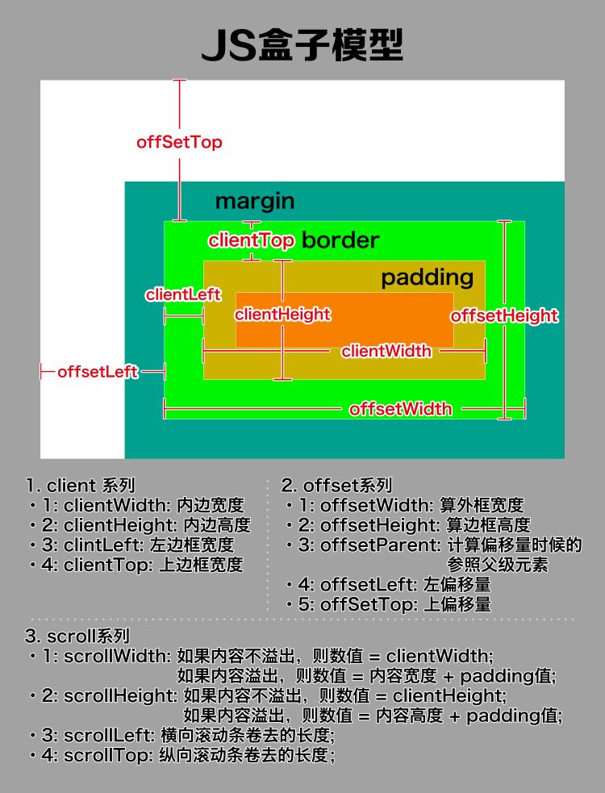

[toc]

## JS正式课第十一天

### 复习

#### 验证邮箱

```
    <script>
    /* 
      邮箱名验证

      n63_h1@163.com
        xxx_love@163.com
        xxx_32@126.com
        xx-x_32@139.com
        xxx_32@gmail.com
        xxx_32@hotmail.com
        xxx._32@hotmail.com
        xxx^._32@sina.com
        xxx._32@sina.cn
     */

     let str = 'xxx._32@sina.com';
     
    // 开头为一个字母、数字或者下划线
    console.log(/^[\w\W]{5,10}@[\da-zA-Z]{2,8}\.c(om|n)$/.test(str)); // true

    //开头字母为英文\w{4}
    // console.log(/^[a-zA-Z][\w.]{4,9}@[\da-zA-Z]{2,8}\.c(om|n)$/.test(str))
    </script>
```

#### 验证密码

```
  <script>
    /* 
    验证输入密码是否符合规则

    必须6-8位，字母+数字，可以有点，严格区分大小写
     */

    let str = 'Qasd34SC';
    console.log( /^[A-Z][a-zA-Z0-9.]{5,7}$/.test(str));// true
    </script>
```

#### 验证身份证号码

```
   <script>
        /* 
           身份证号码规则：前1、2位数字表示：所在省份的代码；第3、4位数字表示：所在城市的代码；第5、6位数字表示：所在区县的代码；第7-14位数字表示：出生年、月、日；第15、16位数字表示：所在地的派出所的代码；第17位数字表示性别：奇数表示男性，偶数表示女性；第18位数字是校检码
    
           前六位：两位省份代码，两位所在城市，两位所在区或者县，其中开头数字不能为0  故得此正则规则匹配  /^[1-9]\d{5}/
           第七位到第十位为出生年份，现在设定范围为1920-2019  其中分为1920-1999和2000-2019两个区间 分别对应 19[2-9]\d | 20[01]\d
           第十一位到第十二位为月份 其中01-09和10-12 分别对应 0[1-9] | 1[0-2] 
           第十三位到第十四位为出生日  直接写每个月31天 其中01-09 10-19 20-29 30-31 对应 0[1-9] | [12]\d | 3[01]
           第十五位到第十七位，前边两位为派出所编码，后一位表示性别，直接对应 \d{3}
           第十八位为校验码  只能是一个个位数或者X  对应 \d | X  而且校验码为最后一位 故加上结尾符  \d | X $
    
            然后将这些放到对应分组组合成整体规则  如下：
            /^[1-8]\d{5}(19[2-9]\d | 20[12]\d)(0[1-9] | 1[0-2])( 0[1-9] | [12]\d | 3[01]) \d{3}( \d | X)$/
         */
        // 现在去验证下规则是否正确，我们写一个标准的身份证号码  然后去匹配下

        let str = '530103200306086648';
        console.log(/^[1-8]\d{5}(19[2-9]\d|20[01]\d)(0[1-9]|1[0-2])(0[1-9]|[12]\d|3[01])\d{3}(\d|X)$/.test(str));// true
                //  /^[1-8]\d{5}(19[2-9]\d|20[0-1]\d)(0[1-9]|1[0-2])(0[1-9]|[12]\d|3[01])\d{3}(\d|X)$/
    </script>
```

###  () -> 重复子项 （子项重定向）
> `\数字(子项的个数) -> \1 \2  代表第N个子项`

+ \数字  数字代表的是一个子项，这个\数字，一定是和子项内容一致的
+ 注意：重复子项只能用在匹配子项之后

```
      <script>
    /* 
    () -> 重复子项

        \数字(子项的个数) -> \1 \2  代表第N个子项

        重复子项只能用在匹配子项之后

     */
     let str = 'acbc';
   // 下面的代码，本来是打算匹配acbc，因为c为第三个分组a后面跟了一个\3（c），\3在 c分组的前面所以匹配不成功
    // str.replace(/(a)\3(b)(c)/,function($0,$1){
    //     console.log($0); // 匹配不成功，无输出
    // })
    
    str.replace(/(a)(c)(b)\2/,function($0,$1){
        console.log($0); // acbc  匹配成功
    });
    </script>
```

### 字符串和对应ascll码相互转换

#### 字符串的code转换
 +  string.charCodeAt()     把字符串转成对应的编码值
   
   ```
    '1'.charCodeAt() -> 49 动态方法
   ```

#### 通过ascll码转成对应字符串
+    String.fromCharCode(编码)

    ```
        String.fromCharCode(49) -> 'a'
    ```

### QueryURLParams（正则）

#### 验证当前url是否合法

```
  <script>
    /* 
     拿到一个合法的URL然后拆分进行分析正则匹配规则
     
     http:/https: => ^(http)?s:
     // => \/\/
     www. => w{3}\.
     baidu => [a-z]{2,18}  
     .com|.cn|.com.cn|.net ... => (\.[a-z]{2,3}){1,2}
     /s? => /[a-z]{1,10}\?
     ie=utf-8&f=8&rsv_bp=1 => (([a-z]\w{0,10})=([\w=%-]+)&?)+
     #1234 =>( #\d{1,})?$

     将这些规则分好组组合起来，如下：
      /^(http)s?:\/\/w{3}\.[a-z]{2,18}(\.[a-z]{2,3}){1,2}\/[a-z]{1,10}\?(([a-z]\w{0,10})=([\w=%-]+)&?)+(\#\d{1,})?$/
     */

    let str = 'https://www.baidu.com/s?ie=utf-8&f=8&rsv_bp=1&rsv_idx=1&tn=baidu&wd=%E7%9A%AE%E5%8D%A1%E4%B8%98&rsv_pq=9944c5f8004814ea&rsv_t=8b94MmK61GDnQ8tzuN%2FSzSf1EnqhRfm8sD4CrxNXnrlgVe6lIHLTpG5j378&rqlang=cn&rsv_enter=1&rsv_dl=tb&rsv_sug3=8&rsv_sug1=10&rsv_sug7=101&rsv_sug2=0&inputT=5558&rsv_sug4=11832#1234';

    // 测试一波
    console.log(/^(http)s?:\/\/w{3}\.[a-z]{2,18}(\.[a-z]{2,3}){1,2}\/[a-z]{1,10}\?((([a-z]\w{0,10})=([\w=%-]+)&?)+)(\#\d{1,})?$/.test(str)); // true
    </script>
```
#### 正则queryURLParams

```
<script>
    /* 
     拿到一个合法url然后去获取超链接域名后边的参数
     https://www.baidu.com/s?ie=utf-8&f=8&rsv_bp=1&rsv_idx=1&tn=baidu&wd=js

     如上边url，取出 https://www.baidu.com/ 后边的参数

     经过分析  后边参数对应 key=value&key=value  对应规则为/([a-z]\w{0,10})=([\w=%-]+)&?/g
      将这些参数获取后按照key和value对应的方式写到一个新对象里
     */

    let str = 'https://www.baidu.com/s?ie=utf-8&f=8&rsv_bp=1&rsv_idx=1&tn=baidu&wd=js';
    // 将做好的规则保存下
    let re = /([a-z]\w{0,10})=([\w=%-]+)&?/g;
    // 准备好一个新的空对象
    let obj = {};

    // str.replace(re,(...arg)=>{
    //         let a = arg[1];
    //         let b = arg[2];
    //         obj[a] = b;
    //     });
    //     console.log(obj);// {ie: "utf-8", f: "8", rsv_bp: "1", rsv_idx: "1", tn: "baidu", …}

   // 优化重写
   str.replace(re,(...arg)=>{
            // console.log(arg);// arg格式为["ie=utf-8&", "ie", "utf-8", 24, "https://www.baidu.com/s?ie=utf-8&f=8&rsv_bp=1&rsv_idx=1&tn=baidu&wd=js"]，第一项为每次匹配的字符，第二项第一个分组项，第三项第二个分组项
            obj[arg[1]] = arg[2];
        });
        console.log(obj);// {ie: "utf-8", f: "8", rsv_bp: "1", rsv_idx: "1", tn: "baidu", …}

    </script>
```
### 千分符
> `从后往前找，把3个数字前面的数字后加上一个，号`
> `把173821738921,换成每3个数字前就添加一个逗号。`

```
        思路:
        从后往前找，每3个数字前的数字后面添加一个逗号

        从后往前找 ：
            /($)/  

        每3个数字前的数字:
            \d(?=(\d{3}))

        所以说最后的结果为:
            let str = '372819321';
            str.replace(/(\d)(?=(\d{3})+$)/g,'$1,','$1,');  
            "372,819,321"      
```

```
<script>
     /* 
        从后往前找，把3个数字前面的数字后加上一个，号

          (?=(\d{3})+   -> 找3个数字前的什么东西？这种情况可以出现多次

        加了$的意思是从结尾开始找(从字符串的最后开始查找)
      */

    let str = '100000000000';

    // 原生写法
    // let temp = '';
    // let num = 0;
    //  for(let i=str.length-1;i>=0;i--){
    //     if((temp.length-num)%3){
    //         temp += str[i];
    //     }else{
    //         console.log(str[i])
    //         temp += ',' +str[i];
    //         num++;
    //     }
    // }
    // // temp = temp[0]===','?temp.substring(1):temp;
    // temp = temp.substring(1);
    // temp = temp.split('').reverse().join('');

    // console.log(temp); // 100,000,000,000


    // 正则匹配
    console.log(str.replace(/(\d)(?=(\d{3})+$)/g, '$1,'));// 100,000,000,000
    </script>
```

### JS盒子模型



#### 关于通过element.style.attr(attr为style的属性名，即样式的名字，如width)
> `style为行内样式，样式表中的样式是通过元素的style的属性名获取不出来的`

```
<!DOCTYPE html>
<html lang="en">
<head>
    <meta charset="UTF-8">
    <meta name="viewport" content="width=device-width, initial-scale=1.0">
    <meta http-equiv="X-UA-Compatible" content="ie=edge">
    <title>Document</title>
    <style>
        #box{
            width: 100px;
            height: 100px;
        }
    </style>
</head>
<body>
    <div id="box" style="width:150px"></div>
    <script>
    /* 
    style为行内样式，样式表中的样式是通过元素的style的属性名获取不出来的
     */

     const box = document.getElementById('box');
     console.log(box.style.width);// 150px  获取到的是行内写进去的【style="width:150px"】，而不是样式表中定义的【 width: 100px;】
     console.log(getComputedStyle(box).width);
    </script>
</body>
</html>
```
####  getComputedStyle
+  getComputedStyle:获取到的是计算后的样式
+  想要获取样式表中的样式可以使用：getComputedStyle(element).attr（atrr样式属性名）
+  有时候需要隐藏某个元素，但是又要存一个当前元素的尺寸，这个时候使用getComputedStyle
> `这个方法获取的值是带单位的`

```
<!DOCTYPE html>
<html lang="en">
<head>
    <meta charset="UTF-8">
    <meta name="viewport" content="width=device-width, initial-scale=1.0">
    <meta http-equiv="X-UA-Compatible" content="ie=edge">
    <title>Document</title>
    <style>
        #box{
            width: 100px;
            height: 100px;
            background: skyblue;
            display: none;
        }
    </style>
</head>
<body>
    <div id="box"></div>
    <script>
    /* 
    style为行内样式，样式表中的样式是通过元素的style的属性名获取不出来的

     想要获取样式表中的样式可以使用：
    getComputedStyle(element).attr（atrr样式属性名）
    
     getComputedStyle:获取到的是计算后的样式
    *注意:
                这个方法获取的值是带单位的
    有时候需要隐藏某个元素，但是又要存一个当前元素的尺寸，这个时候使用getComputedStyle
     */
     console.log(getComputedStyle(box).width);// 获取到的是样式表中定义的【 width: 100px;】
    </script>
</body>
</html>
```

#### client系列
> `获取结果都是不带单位的数字`

+ clientWidth/clientHeight   盒子可视的宽度(支持padding，不支持border)
+ clientLeft/clientTop   左边框和上边框的宽度

```
<!DOCTYPE html>
<html lang="en">

<head>
    <meta charset="UTF-8">
    <meta name="viewport" content="width=device-width, initial-scale=1.0">
    <meta http-equiv="X-UA-Compatible" content="ie=edge">
    <title>Document</title>
    <style>
        #box {
            width: 100px;
            height: 100px;
            background: skyblue;
            padding: 50px;
            border: 1px solid #000;
        }
    </style>
</head>

<body>
    <div id="box"></div>
    <script>
        /* 
       下面的属性结果都为不带单位的数字：
            clientWidth/clientHeight   盒子可视的宽度(支持padding)

            clientLeft/clientTop   左边框和上边框
         */
        const box = document.getElementById('box');
        let { width, height } = getComputedStyle(box);

        console.log(width, height);// 100px 100px,不算padding和border的宽和高

        console.log(box.clientWidth,box.clientHeight);// 200 200  算上padding不加border宽度的宽和高，而且不带单位

        console.log(box.clientLeft,box.clientTop);// 1 1  左边框和上边款的宽度
    </script>
</body>

</html>
```

#### offset系列
> `获取结果都是不带单位的数字`

+  offsetWidth/offsetHeight   盒子可视的宽度和高度(支持padding + border)
+   offsetParent  定位父级(元素)
+  offsetLeft/offsetTop  定位父级到当前元素的距离（当前元素的左外边框到定位父级的左内边框的距离）

##### offsetWidth和offsetHeight
```
<!DOCTYPE html>
<html lang="en">
<head>
    <meta charset="UTF-8">
    <meta name="viewport" content="width=device-width, initial-scale=1.0">
    <meta http-equiv="X-UA-Compatible" content="ie=edge">
    <title>Document</title>
    <style>
    #box{
    margin: 20px auto;
    width:100px;
    height:100px;
    background: skyblue;
    padding:50px;
    border:1px solid #000;
}
    </style>
</head>
<body>
    <div id="box"></div>
    <script>
    /* 
     下面的属性结果都为不带单位的数字：
      offsetWidth/offsetHeight   盒子可视的宽度(支持padding + border)
      offsetParent  定位父级(元素)
      offsetLeft/offsetTop  定位父级到当前元素的距离（当前元素的左外边框到定位父级的左内边框的距离）
     */

     const box = document.getElementById('box');
     console.log(box.offsetWidth,box.offsetHeight);// 202 202  这是加上padding和border的宽度的宽和高
    </script>
</body>
</html>
```

##### offsetParent

```
<!DOCTYPE html>
<html lang="en">

<head>
    <meta charset="UTF-8">
    <meta name="viewport" content="width=device-width, initial-scale=1.0">
    <meta http-equiv="X-UA-Compatible" content="ie=edge">
    <title>Document</title>
    <style>
        #box {
            position: relative;
        }

        #box1 {
            position: relative;
        }

        #box2 {
            zoom: 1;
            position: absolute;
        }
    </style>
</head>

<body>
    <div id="box">
        <div id="box1">
            <div id="box2"></div>
        </div>
    </div>
    <script>
        /* 
         下面的属性结果都为不带单位的数字：
          offsetWidth/offsetHeight   盒子可视的宽度(支持padding + border)
          offsetParent  定位父级(元素)
          offsetLeft/offsetTop  定位父级到当前元素的距离（当前元素的左外边框到定位父级的左内边框的距离）
    
          关于position：
          在低版本IE下要触发haslayout属性，使用起来才不会出问题
    
            定位父级
         */

         console.log(box2.offsetParent);// box1 
    </script>
</body>

</html>
```

##### offsetLeft/offsetTop
+  offsetLeft/offsetTop在实际中(页面复杂的情况下，要慎用，获取的距离是根据定位父级来的)
+  绝对位置才是最稳的一个距离（当前元素到页面顶部的距离）
> `计算绝对位置的思路: 求得绝对位置，就是把当前元素的所有祖先节点的距离计算一遍，求和即可`

```
<!DOCTYPE html>
<html lang="en">

<head>
    <meta charset="UTF-8">
    <meta name="viewport" content="width=device-width, initial-scale=1.0">
    <meta http-equiv="X-UA-Compatible" content="ie=edge">
    <title>Document</title>
    <style>
        div {
            padding: 100px;
        }

        #box {
            background: red;
            _position: relative;
        }

        #box1 {
            background: green;
            /* position: relative; */
            border: 50px solid #000;
        }

        #box2 {
            background: skyblue;
            position: absolute;
            top: 150px;
            border: 50px solid #000;
        }
    </style>
</head>

<body>
    <div id="box">
        <div id="box1">
            <div id="box2"></div>
        </div>
    </div>
    <script>
        /* 
         /*
        offsetLeft/offsetTop在实际中(页面复杂的情况下，要慎用，获取的距离是根据定位父级来的)

        绝对位置才是最稳的一个距离（当前元素到页面顶部的距离）

        思路:
            求得绝对位置，就是把当前元素的所有祖先节点的距离计算一遍，求和即可

        具体实施:
            1.先定义一个元素（作为当前元素）
            2.先求当前元素的距离（包含定位距离和边框距离）
         */

        console.log(box2.offsetLeft);//258 将box作为定位父级，box2的左外边框到box的左内边框的距离

            /* 获取当前元素的绝对定位 */

    // 原生写法
  
    // let nowEle = box2;
    // let l = 0;
    // //只要有当前这个元素就一直循环
    // while(nowEle){
    //     l += (nowEle.offsetLeft + nowEle.clientLeft);
    //     nowEle = nowEle.offsetParent; //把本次的定位父级变成，下次循环的当前元素。
    // }

    // l = l - box2.clientLeft;
    // console.log(l); // 258

    // class面对对象写法

    class Tools {
        position(nowEle){
            let l = 0;
            let t = 0;
            let cl = nowEle.clientLeft;
            let ct = nowEle.clientTop;
            //只要有当前这个元素就一直循环
            while(nowEle){
                l += (nowEle.offsetLeft + nowEle.clientLeft);
                t += (nowEle.offsetTop + nowEle.clientTop);
                nowEle = nowEle.offsetParent; //把本次的定位父级变成，下次循环的当前元素。
            }
            l = l - cl;
            t = t - ct;

            return {
                l,
                t
            }
        }
    }


    let t1 = new Tools;
    let {l,t} = t1.position(box2);
    console.log(l,t);// 258 150
    </script>
</body>

</html>
```

#### scroll系列
> `获取结果都是不带单位的数字`
+ scrollWidth 被内容撑开的宽度,不算边框的 
+ scrollHeight 被内容撑开的高度,不算边框的 
+ srcollLeft 滚动条横向滚动的距离（不算滚动条本身）
+ scrollTop  滚动条纵向滚动的距离（不算滚动条本身）

#####  scrollHeight

```
<!DOCTYPE html>
<html lang="en">
<head>
    <meta charset="UTF-8">
    <meta name="viewport" content="width=device-width, initial-scale=1.0">
    <meta http-equiv="X-UA-Compatible" content="ie=edge">
    <title>Document</title>
    <style>
    #txt{
    width:100px;
    height:50px;
    border:1px solid #000;
}
    </style>
</head>
<body>
        <div id="txt">dsadsdsadsadsadsa
                dsadsdsadsadsadsad
                sadsdsadsadsadsadsad
                sdsadsadsadsads
                adsdsadsadsadsadsa
                dsdsadsadsadsa
            </div>
            <button id="btn">获取txt的高度</button>
    <script>
    /* 
     scrollWidth 被内容撑开的高度,不算边框的 
     scrollHeight 被内容撑开的高度,不算边框的 
     srcollLeft 滚动条横向滚动的距离（不算滚动条本身）
     scrollTop  滚动条纵向滚动的距离（不算滚动条本身）
     */
     btn.onclick = function(){
        console.log(txt.clientHeight);// 50 不加border和内容高度的实际高度
        console.log(txt.offsetHeight);// 52 加上border，不加内容高度的实际高度
        console.log(txt.scrollHeight); //被内容撑开的高度,不算边框的 125
    }
    </script>
</body>
</html>
```

##### 滚动条的距离

```
<!DOCTYPE html>
<html lang="en">

<head>
    <meta charset="UTF-8">
    <meta name="viewport" content="width=device-width, initial-scale=1.0">
    <meta http-equiv="X-UA-Compatible" content="ie=edge">
    <title>Document</title>
    <style>
        * {
            padding: 0;
            margin: 0;
        }
    </style>
</head>

<body style="height:3000px;width:3000px;">
    <script>
        /* 
       scrollWidth 被内容撑开的高度,不算边框的 
       scrollHeight 被内容撑开的高度,不算边框的 
       srcollLeft 滚动条横向滚动的距离（不算滚动条本身）
       scrollTop  滚动条纵向滚动的距离（不算滚动条本身）
       */

        //滚动条的距离
        document.onclick = function () {
            console.log(document.documentElement.scrollTop);
        }  
    </script>
</body>

</html>
```

