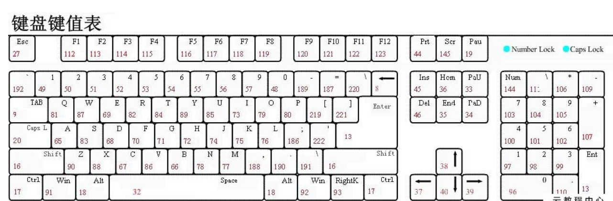

[toc]

## JS正式课第十五天

### 事件
> `带on的事件方式是DOM0中的标准，不够强大`
> `DOM2:事件绑定 ->  addEvenetListener('不带on的事件名'，事件函数，布尔|对象)`
+ onmouseover  鼠标滑上时触发该事件（移入，有冒泡）
+ onmouseout   鼠标离开时触发该事件（移出，有冒泡）
+ onclick   鼠标点击时触发该事件
+ onchange 输入框失焦内容发生改变之后触发（select改变value也会触发）
+ onkeyup  当用户释放键盘，输入完成时触发
+ oninput  当用户输入内容时触发
+ onscroll  当滚动条滚动时触发（滚动条发生变化）
+ onload  当静态资源加载成功后触发该事件
+ onerror 当资源加载失败后触发该事件
+  onfocus 当输入框聚焦时触发该事件（表单元素）
+  onblur  当输入框失去焦点时触发该事件（表单元素）
+  onresize 当浏览器窗口缩放时触发（可视区窗口发生变化）
+  onmousedown 鼠标按下触发
+  onmouseup 鼠标抬起触发
+  onmousemove  鼠标滑动触发
+  onmouseenter 鼠标移入（没有冒泡，解决了穿透问题）
+  onmouseleave 鼠标移出（没有冒泡，解决了穿透问题）
+  onmousewheel 滚轮
+  onkeydown 键盘按下
+  onkeyup   键盘抬起
+  onkeypress 按下并松开按键时

#### 如果没有添加事件，某个元素身上有事件吗？
> `当一个元素创建出来的时候，天生就自带事件，只不过事件的默认值为null`
+ 如果某个元素有这个事件，默认值为null，如果没有这个事件，这个事件值为undefined
+ 当用户操作页面的时候，浏览器会监听用户的操作行为，当用户触发了某个事件之后，如果有对应的事件函数，那么就调用该事件函数，也就是说，就算没有事件函数也会触发事件，没有响应只是因为没有绑定事件函数

```
btn.onclick = function(){
        alert(1);
    }

    给btn的点击添加一个事件函数

    btn.onclick = null;

    解除事件函数 - > 给元素事件赋值 null即可
```

#### 某个事件成立就叫事件

##### 手写鼠标长按事件（函数模拟）

```
<!DOCTYPE html>
<html lang="en">
<head>
    <meta charset="UTF-8">
    <meta name="viewport" content="width=device-width, initial-scale=1.0">
    <meta http-equiv="X-UA-Compatible" content="ie=edge">
    <title>Document</title>
    <style>
    #box{
        width: 50px;
        height: 50px;
        background: slateblue;
    }
    </style>
</head>
<body>
    <div id="box"></div>
    <button id="btn">按钮</button>
    <script>
    const box = document.getElementById('box');
    const btn = document.getElementById('btn');
    function change(cb) {
        let timer;
        btn.onmousedown = function() {
            let time = +new Date;
            timer = setInterval(() => {
                let now = new Date;
                if(now - time > 1000) {
                    console.log('长按');
                    cb();// 钩子函数，生命周期函数
                }
            });
        }
        btn.onmouseup = function() {
            clearInterval(timer);
        }
    }
   let num = 1;
   change(function() {
       num -= .01;
       box.style.opacity = num;
   });
    </script>
</body>
</html>
```


### 事件对象（ev）
>`当调用事件函数的时候，事件函数的第一个参数一定是事件对象`
>`事件对象记录用户触发事件时的细节信息`


	+ ev.clientX/ev.clientY 这两个坐标是基于浏览器可视区的位置
	+ ev.pageX/ev.pageY 这两个坐标是就与整个页面的（加上滚动条的距离）位置
	+  ev.cancelBublle = true 它不是标准  但是所有浏览器都兼容
	+  ev.stopPropagation() 它是标准  但是低版本浏览器不兼容
	+  ev.target  事件源 （事件委托 事件代理） 通过祖先节点事件函数中的事件对象，在该对象下有个target属性，这个属性表明了用户触发事件的源头(目标元素)，可以进行性能优化
	+  ev.ctrlKey 布尔值  只要按着就为true
	+  ev.shiftKey
	+  ev.altKey
	+  ev.keyCode  事件对象对应的键码值

#### ev.target(ev 事件对象)
+ 事件源 （事件委托 事件代理） 通过祖先节点事件函数中的事件对象，在该对象下有个target属性，这个属性表明了用户触发事件的源头(目标元素)，可以进行性能优化
### 冒泡

+ 当触发某个元素的事件函的时候，如果祖先级节点绑定的事件和触发的事件一致，那么会依次执行，我们把这个过程叫做冒泡
+ 从目标元素起，从下往上直到window的过程叫冒泡

```
<!DOCTYPE html>
<html lang="en">
<head>
    <meta charset="UTF-8">
    <meta name="viewport" content="width=device-width, initial-scale=1.0">
    <meta http-equiv="X-UA-Compatible" content="ie=edge">
    <title>Document</title>
    <style>
    div{
        padding: 100px;
    }
    #box{
      background: lightblue;
    }
    #box1{
       background: darkorange; 
    }
    #box2{
     background: lightgreen;
    }
    #btn{
      background: darkorchid;
    }
    </style>
</head>
<body>
    <div id='box'>
        <div id="box1">
            <div id="box2">   
                <button id="btn">按钮</button>
            </div>
        </div>
    </div>
    <script>
      box.onclick = function() {
          alert('box');
      }
      box1.onclick = function() {
          alert('btn1');
      }
      box2.onclick = function() {
          alert('btn2');
      }
      btn.onclick = function() {
          alert('btn');
      }
      window.onclick = function() {
          alert('window');
      }
    </script>
</body>
</html>
```

+ 阻止冒泡  ***目标元素是谁就阻止谁***
	+  -> ev.cancelBublle = true 它不是标准  但是所有浏览器都兼容
	+  -> ev.stopPropagation() 它是标准  但是低版本浏览器不兼容
	+  或者子节点与祖先级节点绑定事件不一样也会阻止冒泡

```
<!DOCTYPE html>
<html lang="en">
<head>
    <meta charset="UTF-8">
    <meta name="viewport" content="width=device-width, initial-scale=1.0">
    <meta http-equiv="X-UA-Compatible" content="ie=edge">
    <title>Document</title>
    <style>
    div{
        padding: 100px;
    }
    #box{
      background: lightblue;
    }
    #box1{
       background: darkorange; 
    }
    #box2{
     background: lightgreen;
    }
    #btn{
      background: darkorchid;
    }
    </style>
</head>
<body>
    <div id='box'>
        <div id="box1">
            <div id="box2">   
                <button id="btn">按钮</button>
            </div>
        </div>
    </div>
    <script>
      box.onclick = function() {
          alert('btn');
      }
      box1.onclick = function() {
          alert('btn1');
      }
      box2.onclick = function() {
          alert('btn2');
      }
      btn.onclick = function(ev) {
          alert('btn');
        // ev.canceBubble = true; // 它不是标准，但所有浏览器都兼容，可以阻止冒泡
        ev.stopPropagation(); // 它是标准  但低版本浏览器不兼容，可以阻止冒泡
      }
      window.onclick = function() {
          alert('window');
      }
    </script>
</body>
</html>
```
### 捕获
> `从window起从上而下直到目标元素止的流动过程就叫捕获`
+ 要监听捕获过程就要通过addEvenListener进行事件绑定且第三个参数为true

```
  要监听捕获过程就要通过addEventListener进行事件绑定并且第三个参数要为true
    box.addEventListener('click',function(){
        alert('box');
    },true);
    box1.addEventListener('click',function(){
        alert('box1');
    },true);
    box2.addEventListener('click',function(){
        alert('box2');
    },true);
    btn.addEventListener('click',function(){
        alert('btn');
    },true);
```

### 什么是事件模型（事件流）
> `从捕获到目标，目标到冒泡的整个过程就叫事件流(事件模型)`
> `三个阶段（第一个阶段：捕获） （第二个阶段：目标） （第三个阶段：冒泡）`
> ` **目标阶段** 使用事件绑定的方式、执行顺序是按照绑定的先后顺序来的（而不是按照先捕获再冒泡的顺序来的）`
> `当用户触发某个事件的时候，会从window起自上而下往一级级目标元素上查找传递，只要绑定DOM2事件第三个参数为true就能捕获到捕获的过程，目标阶段(事件触发的源头)，再从源头起到window止的过程叫秒冒泡(DOM0或者DOM2的第三个参数为false就能捕获到冒泡阶段)`

```
DOM 事件模型包括捕获和冒泡，捕获是从上往下到达目标元素，冒泡是从当前元素，也就是目标元素往上到 window
```

```
<!DOCTYPE html>
<html lang="en">
<head>
    <meta charset="UTF-8">
    <title>Document</title>
<style>
div{
    padding:100px;
}
#box{
    background: red;;
}
#box1{
    background:slateblue;
}
#box2{
    background:teal;
}
#btn{
    background:tomato;
}
</style>
</head>
<body>
    <div id="box">
        <div id="box1">
            <div id="box2">
                <button id="btn">按钮</button>
            </div>
        </div>
    </div>
<script>

    box.addEventListener('click',function(){
        alert('box_冒泡');
    },false);
    box.addEventListener('click',function(){
        alert('box_捕获');
    },true);


    box1.addEventListener('click',function(){
        alert('box1');
    },false);
    box2.addEventListener('click',function(){
        alert('box2');
    },false);

    
    btn.addEventListener('click',function(){
        alert('btn_冒泡');
    },false);
    btn.addEventListener('click',function(){
        alert('btn_捕获');
    },true);

   
    box1.addEventListener('click',function(){
        alert('box1');
    },true);
    box2.addEventListener('click',function(){
        alert('box2');
    },true);
    
    
</script>
</body>
</html>
```

### DOM2
> `事件绑定 ->  addEvenetListener('不带on的事件名'，事件函数，布尔|对象)`

```
布尔值：
             true: 捕获
             false：冒泡
             默认为false
```

```
DOM2级事件
1、DOM2级事件的方法
主流浏览器 DOM2 级事件是通过以下两个方法用于处理指定和删除事件处理程序的操作：

addEvenetListener
removeEventListener
2、DOM2级事件的使用
所有的 DOM 节点都包含这两个方法，使用方法如下：

target.addEventListener(type, listener[, useCapture]);
target.removeEventListener(type, listener[, useCapture]);
并且它们都接受三个参数：

type：事件类型，如'click'、'mouseover'、'mouseout'，在事件名前不加'on'
listener：事件处理方法
useCapture：布尔参数，不传该参数时默认是 false，表示在事件冒泡阶段处理，如果是 true，则表示在捕获阶段调用事件处理程序
```

```
<script>
        /* 
        带on的事件方式是DOM0中的标准，不够强大

        DOM2
            事件绑定 ->  addEvenetListener('不带on的事件名'，事件函数，布尔|对象)

            布尔值：
             true: 捕获
             false：冒泡
             默认为false
        
        */
        window.addEventListener('click',function () {
            alert('window');
        },false);
        btn.addEventListener('click',function () {
            alert(1);
        },false);
        btn.addEventListener('click',function () {
            alert(2);
        },false);
    </script>
```
### 键盘事件
+ keydown 键盘按下
+ keyup   键盘抬起
+ keypress 按下并松开按键
+  ev.ctrlKey 布尔值  只要按着就为true
+  ev.ctrlKey 布尔值  只要按着就为true
+  ev.shiftKey
+  ev.altKey

```
/* 
      键盘事件： 当按下键盘触发的事件
      keydown 键盘按下
      keyup   键盘抬起
      keypress

      特殊按键：
      ev.ctrlKey 布尔值  只要按着就为true
      ev.shiftKey
      ev.altKey 

      组合键默认是用不了的，后面的按键会把前面的按键覆盖

    */
```

```
<!DOCTYPE html>
<html lang="en">
<head>
    <meta charset="UTF-8">
    <meta name="viewport" content="width=device-width, initial-scale=1.0">
    <meta http-equiv="X-UA-Compatible" content="ie=edge">
    <title>Document</title>
</head>
<body>
    <input type="text" id="txt">
    <ul id="ul"></ul>
    <script>
    /* 
      键盘事件： 当按下键盘触发的事件
      keydown 键盘按下
      keyup   键盘抬起
      keypress

      特殊按键：
      ev.ctrlKey 布尔值  只要按着就为true
      ev.shiftKey
      ev.altKey 

      组合键默认是用不了的，后面的按键会把前面的按键覆盖

    */
//    txt.onkeydown = function() {
//        console.log(this.value); // 拿不到当前输入的值
//    }

//    txt.onkeyup = function() {
//        console.log(this.value); // 拿的到输入的值
//    }
//    console.dir(txt); 

   txt.onkeyup = function(ev) {
      if(ev.keyCode === 13) {
          console.log(ev.keyCode);
          ul.innerHTML += `<li>${this.value}</li>`;
      }
   }  
   
   txt.onkeyup = function(ev) {
      if(ev.keyCode === 13 && ev.ctrlKey) {
          console.log(ev.keyCode);
          ul.innerHTML += `<li>${this.value}</li>`;
      }
   }   
    </script>
</body>
</html>
```

### 补充
#### (键码表)


#### DOM相关

#### DOM标签元素获取
+ 静态获取 ： 通过 getElements、children 获取标签元素都是动态获取
+ 动态获取 ：通过query等获取标签元素都都是静态获取
+ 二者区别： 动态获取会随着获取元素自身及属性的改变能够及时获取到，而静态获取不能

#### DOM操作
> `DOM操作都是剪切，不是复制`

```
<!DOCTYPE html>
<html lang="en">
<head>
    <meta charset="UTF-8">
    <meta name="viewport" content="width=device-width, initial-scale=1.0">
    <meta http-equiv="X-UA-Compatible" content="ie=edge">
    <title>Document</title>
</head>
<body>
    <ul id="ul">
        <li>1</li>
        <li>2</li>
        <li>3</li>
        <li>4</li>
    </ul>
    <script>
    // let lis = document.getElementsByTagName('li');
    let lis = document.querySelectorAll('li');
    for(var i = 0;i<lis.length;i++) {
        ul.appendChild(lis[i]);// dom操作都是剪切不是复制
    }
    console.log(lis); // li排序是<li>2</li> <li>4</li> <li>1</li> <li>3</li> 由于重新排序过程中是剪切而不是赋值，会造成类似数图塌陷的问题，所以循环添加后顺序并不是原先的顺序  而是2,4,3,1
    </script>
</body>
</html>
```
#### 获取input框的value值的问题
+ 获取行内自定义默认value可以直接获取
+ 而用户输入的值则需要监听事件来获取
+ 如果想要在事件函数外边取到事件函数所执行的结果，则需要定义另外一个事件函数来获取

```
<!DOCTYPE html>
<html lang="en">

<head>
    <meta charset="UTF-8">
    <meta name="viewport" content="width=device-width, initial-scale=1.0">
    <meta http-equiv="X-UA-Compatible" content="ie=edge">
    <title>Document</title>
</head>

<body>
    <input type="text" name="" id="txt" value="哈哈" placeholder="请输入狗子">
    <script>
        let val = txt.value;
        txt.oninput = function () {
            val = txt.value;
            console.log(val);// 事件监控中才是用户输入的值 比如'123'
        }
        console.log(val); // 会一直是'哈哈',初始值
    </script>
</body>

</html>
```

```
<!DOCTYPE html>
<html lang="en">

<head>
    <meta charset="UTF-8">
    <meta name="viewport" content="width=device-width, initial-scale=1.0">
    <meta http-equiv="X-UA-Compatible" content="ie=edge">
    <title>Document</title>
</head>

<body>
    <input type="text" name="" id="txt" value="哈哈" placeholder="请输入狗子">
    <script>
        let val = txt.value;
        let num = 0;
        txt.oninput = function () {
           val = txt.value;
            num++;
            console.log(num);
        }
        document.onclick = function() {
            console.log(num);
        }
    </script>
</body>

</html>
```

#### 关于文件路径

> `./ ：当前目录（相对路径）`
> `../ ：当前目录的父目录（相对路径）`
> `/：根目录（绝对路径）`

### 瀑布流(面对对象)

#### 基本html布局

```
<!DOCTYPE html>
<html lang="en">
<head>
    <meta charset="UTF-8">
    <meta name="viewport" content="width=device-width, initial-scale=1.0">
    <meta http-equiv="X-UA-Compatible" content="ie=edge">
    <link rel="stylesheet" href="./css/index.css">
    <title>Document</title>
</head>
<body>
    <div id="box">
        <ul class="head">
            <li></li>
            <li></li>
            <li></li>
            <li></li>
            <li></li>
        </ul>
        <ul class="body">
            <li>
                <!-- <div class="img_box">
                    
                    <p class="desc">所谓伊人，在水一方！</p>
                    <p class="author">泰勒·斯威夫特</p>
                </div> -->
            </li>
            <li></li>   
            <li></li>
            <li></li>
            <li></li>
        </ul>
    </div>
    <div id="loading"></div>
<script src="./js/index.js"></script>
</body>
</html>
```
#### CSS样式

```
*{
    margin: 0;
    padding: 0;
    list-style: none;
}
body{
    background: #eee;
}
#box{
    margin: auto;
    width: 1244px;
}
.head{
    width: 100%;
    height: 142px;
    overflow: hidden;
}
.head li{
    float: left;
    width: 236px;
    height: 126px;
    margin: 0 16px 16px 0;
    overflow: hidden;
}
.head li:nth-child(5){
    margin-right: 0;
}
.head li img{
    width: 100%;
}
.body{
    width: 100%;
    overflow: hidden;
}
.body li{
    float: left;
    width: 236px;
    margin: 0 16px 16px 0;
    border-radius: 5px;
   
}
.body li:nth-child(5){
    margin-right: 0;
}
.body li div{
    transition: all 0.2s;
    margin-bottom: 16px;
    background: #fff;
}
.body li div:hover{
    box-shadow: 0px 5px 6px 6px #ccc;
    transform: translateY(-2px)
}
.img_box{
    width: 100%;
}
.img_box img{
    width: 100%;
    opacity: 0;
    transition: .5s;
}
.img_box .desc{
    font-size: 15px;
    padding:0 10px;
    color: #ccc;
    height: 35px;
    line-height: 35px;
    border-bottom: 1px solid #f2f2f2;
    text-overflow: ellipsis;
    overflow: hidden;
    white-space: nowrap;
}
.img_box .author{
    font-size: 15px;
    height: 30px;
    line-height: 30px;
    text-align: center
}

#loading{
    width:100%;
    text-align: center;
    background: #fff;
    position: fixed;
    bottom: 0;
    height:100px;
    overflow: hidden;
}
#loading img{
    position: absolute;
    top: -32px;
    left: 50%;
    margin-left: -125px;
}
```
### JS逻辑

```
class Tools {
    getMinIndex(obj) {
        // 如果获取到的不是数组
        if (!Array.isArray(obj)) {
            obj = [...obj].map(item => {
                return item.scrollHeight;
            });
        }
        // console.log(obj);
        let min = Math.min(...obj);
        let index = obj.findIndex(item => item === min);
        return {
            min,index
        }
    }
    throttling(cb, time) {
        let prevtime = 0;
        return function (...arg) {
            let nowTime = +new Date;
            // console.log(nowTime - prevtime)
            if (nowTime - prevtime > time) {
                cb.call(this, ...arg);
            }
            prevtime = nowTime;
        }
    }

    debounce(cb, time) {
        let timer;
        return function (...arg) {
            //当事件触发的时候就先关闭上次的timer
            if (timer) {
                clearTimeout(timer);
            }
            timer = setTimeout(() => {
                cb.call(this, ...arg);
            }, time);
        }
    }

}

class Waterfall extends Tools {
    constructor(name) {
        super();
        this.box = document.querySelector(name);
        this.list = this.box.children;// li
        this.wh = window.innerHeight; // 可视区的高度
        this.bodyT = this.box.offsetTop; // ul的定位距离
        this.loading = document.getElementById('loading');
        this.onoff = true;
        // console.log(this.getMinIndex(this.list));
    }
    api(url, cb) {
        let that = this;
        fetch(url).then(d => d.json()).then((data) => {
            cb.call(that,data);
        });
    }
    render() {
        this.onLd();
        this.changeLoading();
        setTimeout(() => {
            this.api('./data.json', function (data) {
                // console.log(data);
                this.offLd();
                this.changeLoading();
                data.forEach((d, i) => {
                    let {index} = this.getMinIndex(this.list);
                    let div = this.create(d);
                    // console.log(div);
                    // console.log( this.list[index]);
                    this.list[index].append(div);
                    setTimeout(() => {
                        div.children[0].style.opacity = 1;
                    }, i * 100);
    
                });
            });
        }, 1000);
    }
    create({height,pic,desc,author}) {
        let div = document.createElement('div');
        div.className = 'img_box';
        div.innerHTML = `
        
        <p class="desc">"${desc}</p>
        <p class="author">"${author}</p>`;
        return div;
    }
    scroll() {
        let fn = () => {
            let { index } = this.getMinIndex(this.list);
            if ((window.pageYOffset + this.wh) > (this.list[index].scrollHeight + this.bodyT)) {
                console.log('触底');
                this.render();
            }
        }
        window.onscroll = this.debounce(fn, 200);
        window.onresize = () => {this.wh = window.innerHeight;};
    }
    changeLoading() {
        this.loading.style.display = this.onoff ? 'block' : 'none';
    }
    onLd() {
        this.onoff = true;
    }
    offLd() {
        this.onoff = false;
    } 
}
let w = new Waterfall('.body');
w.render();
w.scroll();
```

