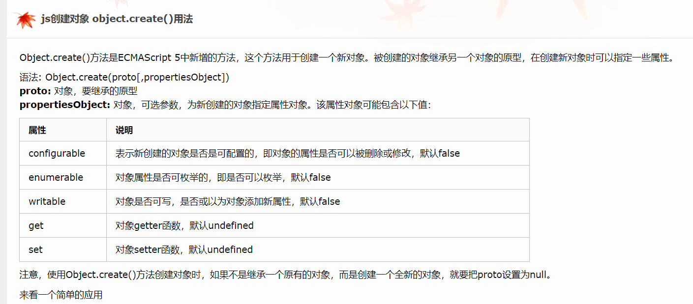

[toc]

## JS正式课第十七天
### Object方法总结
#### Object.create()
> `Object.create()方法创建一个新对象，使用现有的对象来提供新创建的对象的__proto__。`
> `语法：Object.create(proto[, propertiesObject])`
> `语法说明： proto 新创建对象的原型对象。`
> `propertiesObject  可选。如果没有指定为 undefined，则是要添加到新创建对象的可枚举属性（即其自身定义的属性，而不是其原型链上的枚举属性）对象的属性描述符以及相应的属性名称。这些属性对应Object.defineProperties()的第二个参数。`
>  `返回值  一个新对象，带着指定的原型对象和属性。`
>  `例外: 如果propertiesObject参数是 null 或非原始包装对象，则抛出一个 TypeError 异常。`

```
// Shape - 父类(superclass)
function Shape() {
  this.x = 0;
  this.y = 0;
}

// 父类的方法
Shape.prototype.move = function(x, y) {
  this.x += x;
  this.y += y;
  console.info('Shape moved.');
};

// Rectangle - 子类(subclass)
function Rectangle() {
  Shape.call(this); // call super constructor.
}

// 子类续承父类
Rectangle.prototype = Object.create(Shape.prototype);
Rectangle.prototype.constructor = Rectangle;

var rect = new Rectangle();

console.log('Is rect an instance of Rectangle?',
  rect instanceof Rectangle); // true
console.log('Is rect an instance of Shape?',
  rect instanceof Shape); // true
rect.move(1, 1); // Outputs, 'Shape moved.'
```

```
function MyClass() {
     SuperClass.call(this);
     OtherSuperClass.call(this);
}

// 继承一个类
MyClass.prototype = Object.create(SuperClass.prototype);
// 混合其它
Object.assign(MyClass.prototype, OtherSuperClass.prototype);
// 重新指定constructor
MyClass.prototype.constructor = MyClass;

MyClass.prototype.myMethod = function() {
     // do a thing
};
```

```
function MyClass() {
     SuperClass.call(this);
     OtherSuperClass.call(this);
}

// 继承一个类
MyClass.prototype = Object.create(SuperClass.prototype);
// 混合其它
Object.assign(MyClass.prototype, OtherSuperClass.prototype);
// 重新指定constructor
MyClass.prototype.constructor = MyClass;

MyClass.prototype.myMethod = function() {
     // do a thing
};
```
#### Obect.keys()
> `Object.keys() 方法会返回一个由一个给定对象的自身可枚举属性组成的数组，数组中属性名的排列顺序和使用 for...in 循环遍历该对象时返回的顺序一致 。`
> `语法: Object.keys(obj)`
> `参数 obj 要返回其枚举自身属性的对象。`
> `返回值 一个表示给定对象的所有可枚举属性的字符串数组。`
> `描述 Object.keys 返回一个所有元素为字符串的数组，其元素来自于从给定的object上面可直接枚举的属性。这些属性的顺序与手动遍历该对象属性时的一致。`


> `如果你想获取一个对象的所有属性,，甚至包括不可枚举的，请使用Object.getOwnPropertyNames .`
```
// simple array
var arr = ['a', 'b', 'c'];
console.log(Object.keys(arr)); // console: ['0', '1', '2']

// array like object
var obj = { 0: 'a', 1: 'b', 2: 'c' };
console.log(Object.keys(obj)); // console: ['0', '1', '2']

// array like object with random key ordering
var anObj = { 100: 'a', 2: 'b', 7: 'c' };
console.log(Object.keys(anObj)); // console: ['2', '7', '100']

// getFoo is a property which isn't enumerable
var myObj = Object.create({}, {
  getFoo: {
    value: function () { return this.foo; }
  } 
});
myObj.foo = 1;
console.log(Object.keys(myObj)); // console: ['foo']
```

##### 重写Obect.keys()

```
if (!Object.keys) {
  Object.keys = (function () {
    var hasOwnProperty = Object.prototype.hasOwnProperty,
        hasDontEnumBug = !({toString: null}).propertyIsEnumerable('toString'),
        dontEnums = [
          'toString',
          'toLocaleString',
          'valueOf',
          'hasOwnProperty',
          'isPrototypeOf',
          'propertyIsEnumerable',
          'constructor'
        ],
        dontEnumsLength = dontEnums.length;

    return function (obj) {
      if (typeof obj !== 'object' && typeof obj !== 'function' || obj === null) throw new TypeError('Object.keys called on non-object');

      var result = [];

      for (var prop in obj) {
        if (hasOwnProperty.call(obj, prop)) result.push(prop);
      }

      if (hasDontEnumBug) {
        for (var i=0; i < dontEnumsLength; i++) {
          if (hasOwnProperty.call(obj, dontEnums[i])) result.push(dontEnums[i]);
        }
      }
      return result;
    }
  })()
};
```

#### Object.values()
> `Object.values()方法返回一个给定对象自身的所有可枚举属性值的数组，值的顺序与使用for...in循环的顺序相同 ( 区别在于 for-in 循环枚举原型链中的属性 )。`
> `语法： Object.values(obj)`
> `参数： obj  被返回可枚举属性值的对象。`
> `返回值 一个包含对象自身的所有可枚举属性值的数组。`
> `描述： Object.values()返回一个数组，其元素是在对象上找到的可枚举属性值。属性的顺序与通过手动循环对象的属性值所给出的顺序相同。`

```
var obj = { foo: 'bar', baz: 42 };
console.log(Object.values(obj)); // ['bar', 42]

// array like object
var obj = { 0: 'a', 1: 'b', 2: 'c' };
console.log(Object.values(obj)); // ['a', 'b', 'c']

// array like object with random key ordering
// when we use numeric keys, the value returned in a numerical order according to the keys
var an_obj = { 100: 'a', 2: 'b', 7: 'c' };
console.log(Object.values(an_obj)); // ['b', 'c', 'a']

// getFoo is property which isn't enumerable
var my_obj = Object.create({}, { getFoo: { value: function() { return this.foo; } } });
my_obj.foo = 'bar';
console.log(Object.values(my_obj)); // ['bar']

// non-object argument will be coerced to an object
console.log(Object.values('foo')); // ['f', 'o', 'o']
```

#### 其他Object方法
1. Object.assign(target,source1,source2,...)
> `该方法主要用于对象的合并，将源对象source的所有可枚举属性合并到目标对象target上,此方法只拷贝源对象的自身属性，不拷贝继承的属性。
> Object.assign方法实行的是浅拷贝，而不是深拷贝。也就是说，如果源对象某个属性的值是对象，那么目标对象拷贝得到的是这个对象的引用。同名属性会替换。
> Object.assign只能进行值的复制，如果要复制的值是一个取值函数，那么将求值后再复制。
> Object.assign可以用来处理数组，但是会把数组视为对象。`

2. Object.defineProperties(obj,props)
> `直接在一个对象上定义新的属性或修改现有属性，并返回该对象。`

3. Object.defineProperty(obj,prop,descriptor)
> `在一个对象上定义一个新属性，或者修改一个对象的现有属性， 并返回这个对象。`

4. Object.entries()
> `返回一个给定对象自身可枚举属性的键值对数组，其排列与使用 for...in 循环遍历该对象时返回的顺序一致（区别在于 for-in 循环也枚举原型链中的属性）。`

5. hasOwnProperty()
> `判断对象自身属性中是否具有指定的属性。(私有)
> obj.hasOwnProperty('name')`

6. hasPubProperty()
> `判断对象自身属性中是否具有指定的属性。(公有)
> obj.hasPubProperty('name')`

7. Object.getOwnPropertyNames()
> `返回一个由指定对象的所有自身属性的属性名（包括不可枚举属性但不包括Symbol值作为名称的属性）组成的数组`

8. isPrototypeOf()
> `判断一个对象是否存在于另一个对象的原型链上。`

9. Object.setPrototypeOf(obj,prototype)
> `设置对象的原型对象`

10. Object.is()
> `判断两个值是否相同。`

+ 如果下列任何一项成立，则两个值相同：
		+ 两个值都是 undefined
		+ 两个值都是 null
		+ 两个值都是 true 或者都是 false
		+ 两个值是由相同个数的字符按照相同的顺序组成的字符串
		+ 两个值指向同一个对象
		+ 两个值都是数字并且
			+ 都是正零 +0
			+ 都是负零 -0
			+ 都是 NaN
			+ 都是除零和 NaN 外的其它同一个数字
11. Object.freeze()
> `冻结一个对象，冻结指的是不能向这个对象添加新的属性，不能修改其已有属性的值，不能删除已有属性，以及不能修改该对象已有属性的可枚举性、可配置性、可写性。也就是说，这个对象永远是不可变的。该方法返回被冻结的对象。`

12. Object.isFrozen()
> `判断一个对象是否被冻结 .`

13. Object.preventExtensions()
> `对象不能再添加新的属性。可修改，删除现有属性，不能添加新属性。`

##### 相关链接 
+ https://www.cnblogs.com/lingdu87/p/9154306.html  Object常用方法总结

### 字母和数字所对应的code值
+ 0-9  Digit[0-9]
+ A-Z  Key[A-Z]

### 字母和数字所对应的key值
+ 0-9  数字串  '0'-'9'
+ A-Z  字符串   'a'-'z'

### 封装下通过keyCode获取code值(或者互相转换 keyCode  code  key  三者之间互相转换换取 )
> `操作： 在函数执行输入相应的实参，然后在键盘按下实参对应的键，通过匹配，在控制台输出相应的key值（或者code、keyCode值）`

```
    <script>
    let str = '0123456789qwertyuioplkjhgfdsazxcvbnm';
    function myGetCode(wd) {
        document.onkeydown = function(ev) {
        let  key = ev.key;
        if(wd.includes(key)){
            let reg = new RegExp(key);
            if(reg.test(wd)) {
            console.log(ev.key);
        }
            
        }
        
       

    }
    }
    myGetCode(str);
    </script>
```

```
  document.onkeydown = function (ev) {
        console.log(ev.key,ev.code,ev.keyCode);
    }
    </script>
```
