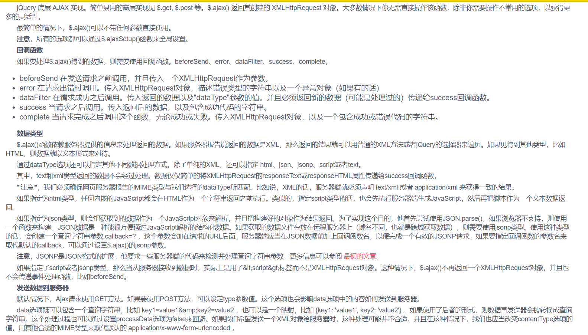
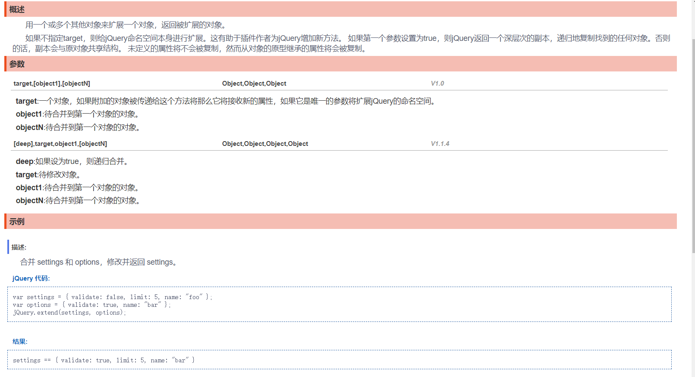

[toc]

## JS正式课第十九天

### jquery_DOM(1)

+ parentNode -> parent()
+ previousElementSibling -> prev()
+ nextElementSlbling -> next()
+ parents() 某个元素的所有祖先节点，括号中可以精确匹配
+ $('div').sibilings() 当前元素的上兄弟节点和下兄弟节点
+ 插入到某个元素之前 ` $('#box').before($('<div>2</div>'));`
+ index('button') 方法  顺序默认基于父级，也可以精确匹配
+ delegate(selector,[type],[data],fn)   使用 delegate() 方法的事件处理程序适用于当前或未来的元素（比如由脚本创建的新元素）。
+ find(expr|obj|ele)  搜索所有与指定表达式匹配的元素。这个函数是找出正在处理的元素的后代元素的好方法。
+  offset() -> 绝对位置
+  position() -> 基于父级的（offset）
```
<!DOCTYPE html>
<html lang="en">
<head>
    <meta charset="UTF-8">
    <meta name="viewport" content="width=device-width, initial-scale=1.0">
    <meta http-equiv="X-UA-Compatible" content="ie=edge">
    <title>Document</title>
</head>
<body>
    <div class="pb">
            <div class="pb">
                <div id="box">1</div>
            </div>
        </div>
        <div class="pb">4</div>
        <button>1</button>
        <button>2</button>
        <button>3</button>
    <script src="./node_modules/jquery/dist/jquery.min.js"></script>
    <script>
    /* 
    插入到某个元素之前  $('#box').before($('<div>2</div>'));

    关系： 父子  兄弟
    parentNode -> parent()
    previousElementSibling -> prev()
    nextElementSlbling -> next()
    parents() 某个元素的所有祖先节点，括号中可以精确匹配
    $('div').sibilings() 当前元素的上兄弟节点和下兄弟节点

    index('button') 方法  顺序默认基于父级，也可以精确匹配

    */
   $('#box').before($('<div>2</div>'));
   console.log($('#box').parents('.pb'));
   console.log($('button:eq(1)').siblings());
   $('button').click(function () {
       console.log($(this).index('button'));// 分别输出 0 1 2
   })
    </script>
</body>
</html>
```

### jquery事件
+  jq中的所有事件,都是on来二次封装，jq的事件全部都是事件绑定
+  jq的事件对象都是二次封装的，如果要拿到真正的原生js事件对象：ev.originalEvent(原生事件对象)
+  jq中阻止冒泡和默认行为，直接`return false`即可
+  hover的两大组成事件：`onmouseenter  onmouseleave`
+  事件的三大部分：1.事件流  2.都有哪些事件，他们是干嘛的   3.事件对象

```
<!DOCTYPE html>
<html lang="en">
<head>
    <meta charset="UTF-8">
    <meta name="viewport" content="width=device-width, initial-scale=1.0">
    <meta http-equiv="X-UA-Compatible" content="ie=edge">
    <title>Document</title>
    <style>
    #box{
        width: 100px;
        height: 100px;
        background: red;
    }
    </style>
</head>
<body>
    <div id="box">
    <ul>
        <li>1</li>
        <li>2</li>
        <li>3</li>
        <li>4</li>
    </ul>
</div>
    <script src="./node_modules/jquery/dist/jquery.min.js"></script>
    <script>
    /* 
    click
    mouseover 
    mouseout

    hover:
          onmouseenter
          onmouseleave

    jq中的所有事件,都是on来二次封装，jq的事件全部都是事件绑定

    jq的事件对象都是二次封装的，如果要拿到真正的原生js事件对象
    ev.originalEvent(原生事件对象)

    jq中阻止冒泡和默认行为，直接`return false`即可

    事件三大部分：
        1.事件流
        2.有哪些事件，他们是干嘛的
        3.事件对象
    */
   $('#box').hover(function () {
       console.log('移入');
   },function () {
       console.log('移出');
   });

   $('#box').on('mouseenter',function() {
       console.log('移入');
   });
    </script>
</body>
</html>
```

#### 事件监听

```
<!DOCTYPE html>
<html lang="en">
<head>
    <meta charset="UTF-8">
    <meta name="viewport" content="width=device-width, initial-scale=1.0">
    <meta http-equiv="X-UA-Compatible" content="ie=edge">
    <title>Document</title>
    <style>
    #box{
        width: 100px;
        height: 100px;
        background: red;
    }
    </style>
</head>
<body>
    <div id="box"></div>
    <script src="./node_modules/jquery/dist/jquery.min.js"></script>
    <script>
    /* 
    click
    mouseover 
    mouseout

    hover:
          onmouseenter
          onmouseleave

    jq中的所有事件,都是on来二次封装，jq的事件全部都是事件绑定

    jq的事件对象都是二次封装的，如果要拿到真正的原生js事件对象
    ev.originalEvent(原生事件对象)

    jq中阻止冒泡和默认行为，直接`return false`即可

    事件三大部分：
        1.事件流
        2.有哪些事件，他们是干嘛的
        3.事件对象
    */
 // 事件监听
 $('#box').delegate('li','click',function () {
       console.log($(this).text());
   });
    
     $('#box').on('click','li',function(){
        console.log('点击' + this.innerText);
     });
    </script>
</body>
</html>
```

```
<!DOCTYPE html>
<html lang="en">
<head>
    <meta charset="UTF-8">
    <meta name="viewport" content="width=device-width, initial-scale=1.0">
    <meta http-equiv="X-UA-Compatible" content="ie=edge">
    <title>Document</title>
    <style>
    #box{
        width: 100px;
        height: 100px;
        background: red;
    }
    </style>
</head>
<body>
    <div id="box">
            <button>按钮</button>
    </div>
    <script src="./node_modules/jquery/dist/jquery.min.js"></script>
    <script>
    /* 
    click
    mouseover 
    mouseout

    hover:
          onmouseenter
          onmouseleave

    jq中的所有事件,都是on来二次封装，jq的事件全部都是事件绑定

    jq的事件对象都是二次封装的，如果要拿到真正的原生js事件对象
    ev.originalEvent(原生事件对象)

    jq中阻止冒泡和默认行为，直接`return false`即可

    事件三大部分：
        1.事件流
        2.有哪些事件，他们是干嘛的
        3.事件对象
    */

    $('#box').on('click.a',function(){
        console.log(111);
    });

    $('#box').on('click.b',function(){
        console.log(222)
    });

    //解绑
    $('button').on('click',function(){
        // $('#box').off('click.a');
        console.log(222);
        // return false;
    });

    $('button').mousedown(function(){return false;})

    </script>
</body>
</html>
```

```
<!DOCTYPE html>
<html lang="en">
<head>
    <meta charset="UTF-8">
    <meta name="viewport" content="width=device-width, initial-scale=1.0">
    <meta http-equiv="X-UA-Compatible" content="ie=edge">
    <title>Document</title>
    <style>
    #box{
        width: 100px;
        height: 100px;
        background: red;
    }
    </style>
</head>
<body>
    <div id="box">
            <ul></ul>
    </div>
    <script src="./node_modules/jquery/dist/jquery.min.js"></script>
    <script>
    /* 
    click
    mouseover 
    mouseout

    hover:
          onmouseenter
          onmouseleave

    jq中的所有事件,都是on来二次封装，jq的事件全部都是事件绑定

    jq的事件对象都是二次封装的，如果要拿到真正的原生js事件对象
    ev.originalEvent(原生事件对象)

    jq中阻止冒泡和默认行为，直接`return false`即可

    事件三大部分：
        1.事件流
        2.有哪些事件，他们是干嘛的
        3.事件对象
    */
   let ary = ['尹德志','你真胖','董尚','李磊'];

   ary.forEach((item,i) => {
       let $li = $('<li>' + (i+1) + '</li>');
       $li.on('click',{data:item},function(ev) {
            //    
             console.log('我的名字叫' + ev.data.data);

       });
       $('ul').append($li);
   });


    </script>
</body>
</html>
```

### jq选项卡

```
<!DOCTYPE html>
<html lang="en">

<head>
    <meta charset="UTF-8">
    <title>Document</title>
    <style>
        * {
            margin: 0;
            padding: 0;
        }

        .active {
            background: yellow;
        }

        #box div,
        #box2 div {
            width: 200px;
            height: 100px;
            border: 1px solid #000;
            display: none;
        }

        #box div.show,
        #box2 div.show {
            display: block;
        }
    </style>
</head>

<body>
    <div id="box">
        <button class="active">按钮一</button>
        <button>按钮二</button>
        <button>按钮三</button>
        <div class="show">11111</div>
        <div>22222</div>
        <div>33333</div>
    </div>
    <div id="box2">
        <button class="active">按钮一</button>
        <button>按钮二</button>
        <button>按钮三</button>
        <div class="show">11111</div>
        <div>22222</div>
        <div>33333</div>
    </div>
    <script src="./node_modules/jquery/dist/jquery.min.js"></script>
    <script>
      const $box = $('#box');
      const $btns = $box.find('button');
      const $divs = $box.find('div');
      $btns.click(function() {
        $btns.removeClass('active');
        $divs.removeClass('show');
        $(this).addClass('active');
        $divs.eq($(this).index()).addClass('show');
      });
      
      // 改进版
        // $btns.click(function() {
    //     // 把当前的button的class添加上，把它上下兄弟的class清除掉
    //     $(this).addClass('active').siblings('button').removeClass('acitve');
    //     //把当前按钮对应的div的class添加好，把它的兄弟的class清除，
    //     $divs.eq($(this).index()).addClass('show').siblings('div').removeClass('show');
    // })
    </script>
</body>

</html>
```

### jq拖拽

```
<!DOCTYPE html>
<html lang="en">

<head>
    <meta charset="UTF-8">
    <meta name="viewport" content="width=device-width, initial-scale=1.0">
    <meta http-equiv="X-UA-Compatible" content="ie=edge">
    <title>Document</title>
    <style>
        #box {
            width: 100px;
            height: 100px;
            background: red;
            position: absolute;
            top: 0;
            left: 0;
        }

        #boxShadow {
            width: 100px;
            height: 100px;
            background: red;
            position: absolute;
            opacity: .3;
            top: 0;
            left: 0;
        }
    </style>
</head>

<body id="body">
    <div id="box"></div>
    <script src="./node_modules/jquery/dist/jquery.min.js"></script>
    <script>
        /*
               offset() -> 绝对位置
               position() -> 基于父级的（offset）
        */
    $('#box').mousedown(function (ev) {
        let disX = ev.pageX - $('#box').offset().left;
        let disY = ev.pageY - $('#box').offset().top;
        $(document).mousemove(function(ev) {
            $('#box').css({
                left:ev.pageX - disX,
                top:ev.pageY - disY,
            });
        });
        $(document).mouseup(function() {
            $(document).off('mousemove');
            $(document).off('mouseup');
        })

    })
    </script>
</body>

</html>
```
### js拖拽（文件拖拽效果）

```
<!DOCTYPE html>
<html lang="en">

<head>
    <meta charset="UTF-8">
    <meta name="viewport" content="width=device-width, initial-scale=1.0">
    <meta http-equiv="X-UA-Compatible" content="ie=edge">
    <title>Document</title>
    <style>
        #box {
            width: 100px;
            height: 100px;
            background: red;
            position: absolute;
            top: 0;
            left: 0;
        }

        #boxShadow {
            width: 100px;
            height: 100px;
            background: red;
            position: absolute;
            opacity: .3;
            top: 0;
            left: 0;
        }
    </style>
</head>

<body id="body">
    <div id="box"></div>
    <script src="./node_modules/jquery/dist/jquery.min.js"></script>
    <script>
        /*
               offset() -> 绝对位置
               position() -> 基于父级的（offset）
        */
    let num = 1;
    $('#box').mousedown(function (ev) {
        let $box2 = $('<div id="boxShadow"></div>');
        $box2.css({ // 让box2和box初始位置以及拖拽后位置一样
            left:$('#box').offset().left,
            top:$('#box').offset().top,
        });
        $(body).append($box2);
        let disX = ev.pageX - $('#box').offset().left;
        let disY = ev.pageY - $('#box').offset().top;
        $(document).mousemove(function(ev) {
            let t = ev.pageY -disY;

            if(t < 200) {// 吸顶效果
                t =0;
            }
            $box2.css({
                left:ev.pageX - disX,
                top:t,
            });
        });
        $(document).mouseup(function() {
            $(document).off('mousemove');
            $(document).off('mouseup');

            $('#box').css({ // 让box到box2拖拽后停下的位置
                left:$box2.offset().left,
                top:$box2.offset().top,
            });
            $box2.remove();
            // num -= 0.1;
            // $('#box').css({opacity:num});
        });
        return false; // 禁止系统默认事件

    });
    </script>
</body>

</html>
```

### jq动画

```
<!DOCTYPE html>
<html lang="en">
<head>
    <meta charset="UTF-8">
    <meta name="viewport" content="width=device-width, initial-scale=1.0">
    <meta http-equiv="X-UA-Compatible" content="ie=edge">
    <title>Document</title>
    <style>
            #box{
                width:100px;
                height:100px;
                background: red;
                position: absolute;
                top:50px;
                left:0;
                /* transition: .5s; */
            }
            </style>
</head>
<body>
        <button id="btn">按钮</button>
        <div id="box"></div>
    <script src="./node_modules/jquery/dist/jquery.min.js"></script>
    <script>
    /*
        hide
        show 也是有动画的


        在做jq动画的时候，记得使用stop(),把前面的动画清掉
    */
   $('#btn').click(function () {
    //    $('#box').hide(500);// 500毫秒动画隐藏
        //   $('#box').toggle(500); // 改变宽高、透明度隐藏
//    $('#box').fadeToggle(200);// 渐隐渐现
  $('#box').stop().slideToggle(200);// 改变高度隐藏
   })

   $(document).click(function () {
    //    $('#box').css({left:400}); // 点击页面box向右移动400px

    //    $('#box').delay(1000).animate({left:400},3000);// 点击页面box在1秒中向右移动400px，延迟3秒执行

    setInterval(() => { // 每隔1秒的时间box在500毫秒内向右移动100px
         $('#box').animate({
             left:$('#box').offset().left +100
         },500)
    }, 1000);
   });
    </script>
</body>
</html>
```

### jq工具方法
+ $.each(object, [callback])    通用遍历方法，可用于遍历对象和数组。
+  $.ajax(url,[settings])     通过 HTTP 请求加载远程数据。
+  $.extend([deep], target, object1, [objectN])  用一个或多个其他对象来扩展一个对象，返回被扩展的对象。
	+  作用一：深克隆和浅克隆，`第一个参数设为true就代表深度克隆`
	+  扩展方法
		+  `$.extend`  工具方法  -> `$.xx()`
		+   `$.fn.extend` 功能方法  -> `$().xx()`



#### $.ajax()

```
<!DOCTYPE html>
<html lang="en">
<head>
    <meta charset="UTF-8">
    <meta name="viewport" content="width=device-width, initial-scale=1.0">
    <meta http-equiv="X-UA-Compatible" content="ie=edge">
    <title>Document</title>
</head>
<body>
    <ul></ul>
    <script src="./node_modules/jquery/dist/jquery.min.js"></script>
    <script>
       // https://www.baidu.com/sugrec?pre=1&p=3&ie=utf-8&json=1&prod=pc&from=pc_web&sugsid=1462,21099,18560,29567,29700,29220,26350&wd=s&req=2&csor=1&cb=fn
    

    $.ajax({
        url:'https://www.baidu.com/sugrec?',
        data:{
            prod:'pc',
            sugsid:'1462,21099,18560,29567,29700,29220,26350',
            wd:'今天多少度'
        },
        dataType:'jsonp',
        success:function(d){
            // console.log(d);
            d.g.forEach(item=>{
                let $li = $('<li>'+ item.q +'</li>');
                $('#ul').append($li);
            })
        }
    });
    </script>
</body>
</html>
```

#### $.extend()

```
  <script>
  let obj = {
        name:'小明'
    }

    let obj2 = $.extend({},obj);   

    console.log(obj2 == obj); // false  浅克隆
    console.log(obj,obj2);// {name: "小明"}   {name: "小明"}


    let ary = [1,2,[3,4]];

    let ary2 = $.extend(true,[],ary);   //true就代表深度克隆

    ary2[2].push(5);

    console.log(ary,ary2);// [1,2,[3,4]]   [1,2,[3,4,5]]
    </script>
```

```
<!DOCTYPE html>
<html lang="en">
<head>
    <meta charset="UTF-8">
    <meta name="viewport" content="width=device-width, initial-scale=1.0">
    <meta http-equiv="X-UA-Compatible" content="ie=edge">
    <title>Document</title>
</head>
<body>
    <textarea id="txt"></textarea> 
    <script src="./node_modules/jquery/dist/jquery.min.js"></script>
    <script>
     /*
        
        深浅拷贝、扩展方法
        $.extend  工具方法  -> $.xx()
        $.fn.extend  功能方法  -> $().xx()

        
    */

    // 扩展插件使用，extend里面写一个对象，对象的属性就是添加的方法名，值就是函数
    // trimLeft  去掉字符串左边空格  自定义插件
    // $.extend({
    //     trimLeft:function(str){
    //         return str.replace(/^\s+/,'');
    //     }
    // });
   // console.log($.trimLeft('   12345'));


   
   //功能方法（$()的方法）
   // 自定义功能获取内容撑起的元素的高度
   $.fn.extend({
        scrollH:function(){
           return this[0].scrollHeight;
        }
    });

    $(document).click(function(){
        console.log($('#txt').height())
        console.log($('#txt').innerHeight())
        console.log($('#txt').scrollH());
    });
    </script>
</body>
</html>
```

### jq选项卡插件

#### 页面布局

```
<!DOCTYPE html>
<html lang="en">
<head>
    <meta charset="UTF-8">
    <title>Document</title>
<style>
*{
    margin:0;
    padding:0;
}
.active{
    background: yellow;
}
#box{
    width:202px;
}
#box div,#box2 div{
    width:200px;
    height:100px;
    border:1px solid #000;
    display: none;
}
#box div.show,#box2 div.show{
    display: block;
}
</style>
</head>
<body>
    <div id="box">
        <!-- <button class="active">按钮一</button>
        <button>按钮二</button>
        <button>按钮三</button>
        <div class="show">11111</div>
        <div>22222</div>
        <div>33333</div> -->
    </div>

    <div id="box2"></div>
<script src="./node_modules/jquery/dist/jquery.min.js"></script>
<script src="tabs_x.0.js"></script>
<script>
    $('#box').tabs({
        btns:['体育','新闻','娱乐']
    }).dialog(); //$.fn.extend


    // $('#box2').tabs();
</script>
</body>
</html>
```

#### js逻辑

```
//  tabs_x.0.js
class Tab {
    constructor(that) {
        this.box = that; //jquery对象
        this.opts = {
            btns:['按钮一','按钮二','按钮三'],
            content:[
                '1111',
                '222',
                '3333'
            ]
        }
        // console.log(this.box);
    }
    init(opts){
        $.extend(true,this.opts,opts)
        this.createBtn();
        this.createDiv();
        this.events();
    }
    createBtn(){
        this.opts.btns.forEach((item,i)=>{
            this.box.append($(`<button class="${i==0?'active':''}">${item}</button>`))
        });
    }
    createDiv(){
        this.opts.content.forEach((item,i)=>{
            this.box.append($(`<div class="${i==0?'show':''}">${item}</div>`))
        });
    }
    events(){
        this.btns = this.box.find('button');
        this.divs = this.box.find('div');

        let that = this;

        this.btns.click(function(){
            $(this).addClass('active').siblings('button').removeClass('active');
           
            that.divs.eq($(this).index('button')).addClass('show').siblings('div').removeClass('show');
        });
    }

}


class Drag {
    constructor(that) {
        this.box = that;
        this.disX = 0;
        this.disY = 0;
    }
    position(){
        this.box.css({
            position:'absolute',
            top:0,
            left:0
        })
    }
    mousedown(){
        let that = this;
        this.box.mousedown(function(ev){
            that.disX = ev.pageX - $(this).offset().left;
            that.disY = ev.pageY - $(this).offset().top;
            that.mousemove();
            that.mouseup();

            return false;
        });
    }
    mousemove(){
        let that = this;
        $(document).mousemove(function(ev){
            that.box.css({
                top:ev.pageY - that.disY,
                left:ev.pageX - that.disX
            })
        });
    }
    mouseup(){
        $(document).mouseup(function(ev){
            $(this).off('mousemove');
            $(this).off('mouseup');
        })
    }
}

$.fn.extend({
    tabs:function(opts){
        let t = new Tab(this);
        t.init(opts);
        return this;
    },
    dialog:function(){
        let d = new Drag(this);
        d.position();
        d.mousedown();
    }
});
```


