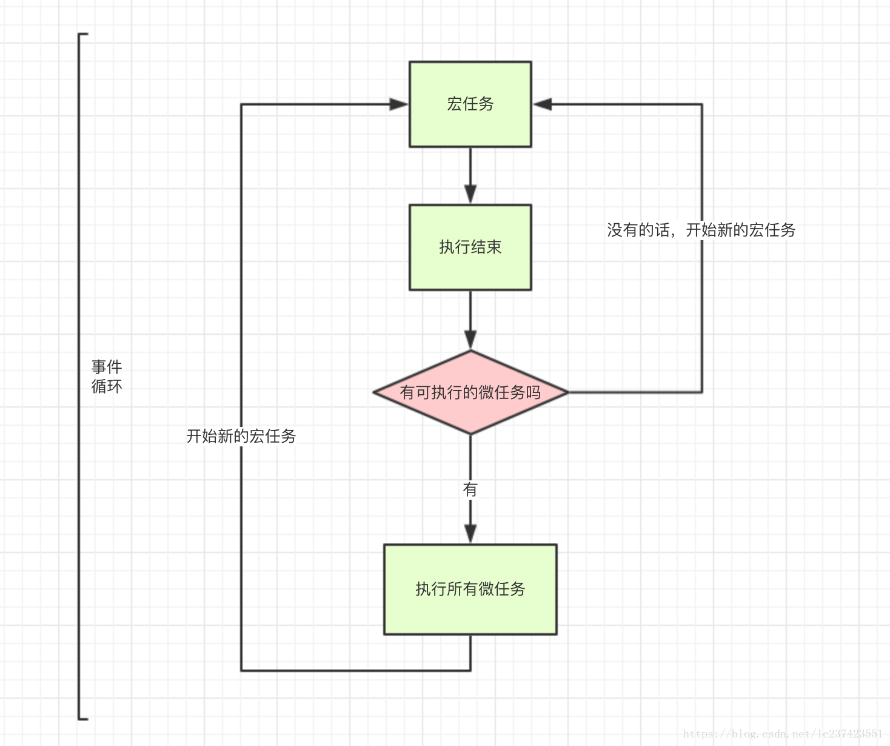

[toc]

## JS正式课第二十天

### 同步异步
> `promise是解决异步编程问题的（也就是说，让异步的代码同步执行）`

+  JS按理来说是从上往下解读代码，它是单线程的(同一时间只能做同一件事情)
+  但事件调用 -> 把任务交给了事件引擎(所有的js事件全部都是异步的)
+  同步：代码从上往下依次执行，如果一个地方卡住了，下面的代码就不执行了
+  异步：虽然从上往下依次执行，如果一个地方卡住了，不会阻止代码向下执行
	+  包括： 定时器、所有的事件 promise
		+   promise是个异步   微任务
		+  定时器 与事件也是异步  宏任务
+   异步的操作是不容易进行维护和开发的，同步操作才利于维护开发（上面的代码执行完才会执行下面的，有序的）
+  事件循环: js先执行主线程的代码，如果主线程有异步代码，比如定时器，promise或者事件，那么会把异步代码放到异步队列中存储，当异步代码的条件成立的时候，把异步代码压入到主线程中执行，压入的方式是如果有微任务时就先执行微任务，执行完微任务再执行宏任务。当主线程空间的时候执行压入的代码，执行完成之后再从异步队列中压入异步代码到主线程中，这个过程中叫事件循环

#### 宏任务和微任务


```
    <script>
    /* 
    
    JS按理来说是从上往下解读代码，它是单线程的(同一时间只能做同一件事情)

    事件调用 -> 把任务交给了事件引擎(所有的js事件全部都是异步的)

    同步：
       代码从上往下依次执行，如果一个地方卡住了，下面的代码就不执行了
       
    异步：
       虽然从上往下依次执行，如果一个地方卡住了，不会阻止代码向下执行
       包括：
           定时器、所有的事件 promise

           promise是个异步  微任务
           
           定时器 事件 宏任务
           宏任务和微任务

           异步的操作是不容易进行维护和开发的，同步操作才利于维护开发（上面的代码执行完才会执行下面的，有序的）

           promise是解决异步编程问题的（也就是说，让异步的代码同步执行）


           js先执行主线程的代码，如果主线程有异步代码，比如定时器，promise或者事件，那么会把异步代码放到异步队列中存储，当异步代码的条件成立的时候，把异步代码压入到主线程中执行，压入的方式是如果有微任务时就先执行微任务，执行完微任务再执行宏任务。当主线程空间的时候执行压入的代码，执行完成之后再从异步队列中压入异步代码到主线程中，这个过程中叫事件循环

           注意的是执行完微任务是第一层的，如果在宏任务开一个微任务，那么先执行宏任务，再执行宏任务中的微任务

          
    */ 
let a = 10;
  
   
// document.onclick = function () {
//     console.log(a);   
// }

let p = new Promise((rej,res) => {
     rej(5);
})
p.then((d) => {
  a= 20;
  console.log(d,'promise');// 5 "promise"
})
console.log(a,1111);   
    

//    let a = 10;
//    (function a() {
//        a = 20;
//        console.log(a);// 输出的是是一个函数 ƒ a() {a = 20 console.log(a); }
//    })()
    </script>
```

### promise -> 承诺
+ 为什么要用promise？
	+ promise解决了异步编程的问题
	+ 在then里面就走"同步"
>`虽然promise解决了异步编程的问题，但是在then的外面还是异步的. 没有promise也能进行开发，只不过维护起来麻烦点`

+ 如何使用promise？
	+ > `new Promise(function(resolve,reject){
                //主线程
                //当异步代码执行完，通过异步代码的结果去调用resolve或者reject
                //异步代码有可能报错或者错误，如果报错或者错误就执行reject
                //一般都是resolve(放异步的结果)
            });`
	+ 它有一个返回值，返回值是promise对象，这个对象有then方法
            then(成功函数,失败函数)
    + 第一个then  （微任务）  成功函数里面的参数就是异步的结果
    + 第二个then （微任务）  第一个then的返回值
    + `let p = new Promise(function(resolve,reject){
            resolve(5);
        });`
        `p.then(function(data){
            console.log(data);
        })`
+ > `注意：then不是函数就穿透,直到then是函数为止`
+ > `then的第二个参数为失败函数，也可以不用写，直接在then函数之后.catch()就可以了`

```
  <script>
     //then不是函数就穿透,直到then是函数为止
    // console.log(Promise.resolve(3))
    Promise.resolve(1)
    .then(2)
    .then(_=>6)
    .then(console.log); //  6
    </script>
```

```
<!DOCTYPE html>
<html lang="en">
<head>
    <meta charset="UTF-8">
    <meta name="viewport" content="width=device-width, initial-scale=1.0">
    <meta http-equiv="X-UA-Compatible" content="ie=edge">
    <title>Document</title>
</head>
<body>
    <script>
        /* 
        promise -> 承诺  

        
        为什么要用promise？
            promise解决了异步编程的问题

            在then里面就走"同步"

        
        如何使用promise？

            new Promise(function(resolve,reject){
                //主线程
                //当异步代码执行完，通过异步代码的结果去调用resolve或者reject

                //异步代码有可能报错或者错误，如果报错或者错误就执行reject
                //一般都是resolve(放异步的结果)
            });

            它有一个返回值，返回值是promise对象，这个对象有then方法
            then(成功函数,失败函数)
            第一个then  （微任务）
                成功函数里面的参数就是异步的结果

            第二个then （微任务）
                第一个then的返回值


            此时的知识点需要后期内容的铺垫和若干个异步请求实验总结才能领悟这个promise


        let p = new Promise(function(resolve,reject){
            resolve(5);
        });

        p.then(function(data){
            console.log(data);
        })

        虽然promise解决了异步编程的问题，但是在then的外面还是异步的
        没有promise也能进行开发，只不过维护起来麻烦点

       let p = new Promise(function(resolve,reject)){
            resolve();
        }
        p.then(function(data) {
            console.log(data);
        })
 
        then中包含两个函数，第一个是成功之后的回调，第二个是函数是失败之后的回调

        finally：不管是成功还是失败都会进的函数

       如果代码有可能报错，下面的代码是不会执行的，如果使用try,catch  那么try中的代码报错会进catch，报错是不会影响后面的代码执行的
        try{

        }catch (e) {

        }

        fetch是promise对象封装的

        //第一个then的返回值，是第二then的参数 ....
        fetch().then(function(d){
            return d.json();
        }).then(function(d){
            console.log(d); //d就是d.json()
        });

        当进第一个then的时候，d就是返回的数据，但是这个数据是被promise包了一层
        d.json() -> '[]'->[]


        JSON ->  长得像对象和数组的字符串，本质是字符串

        '[]'JSON  ->  []数组
        '{}'JSON  ->  {} 对象


        JSON取值是不方便的，可以使用JSON.parse(),把JSON转成对象

        parse必须为标准的JSON格式才成功转换
        '{"name":"zf"}'
        '[]' -> []

        对象转JSON -> JSON.stringify() 的副作用是函数和undefined会被过滤掉
        [] -> '[]'

        
        */
    let a = 10;
   let p =new Promise((resolve,reject) => {
    setTimeout(() => {
        a = 20
        resolve(a);
    }, 1000); 
   });
   p.then(function (a) {
    console.log(a);  // 20
    console.log(1000);
   })
   console.log(a); // 10


//    function fn(cb) {
//     setTimeout(() => {
//         a = 20
//         cb(a);
//     }, 1000);
//    }

//    fn(function(a) {
//     console.log(a);
//    })
    </script>
</body>
</html>
```

#### try ... catch...
+ 如果代码有可能报错，下面的代码是不会执行的，如果使用try,catch  那么try中的代码报错会进catch，报错是不会影响后面的代码执行的
+ 用法
> `try{`
> 
 `   }catch (e) {`
> 
` }`

#### finally
+ finally：不管是成功还是失败都会进的函数

```
<!DOCTYPE html>
<html lang="en">
<head>
    <meta charset="UTF-8">
    <meta name="viewport" content="width=device-width, initial-scale=1.0">
    <meta http-equiv="X-UA-Compatible" content="ie=edge">
    <title>Document</title>
</head>
<body>
    <script>
        /* 
        promise -> 承诺  

        
        为什么要用promise？
            promise解决了异步编程的问题

            在then里面就走"同步"

        
        如何使用promise？

            new Promise(function(resolve,reject){
                //主线程
                //当异步代码执行完，通过异步代码的结果去调用resolve或者reject

                //异步代码有可能报错或者错误，如果报错或者错误就执行reject
                //一般都是resolve(放异步的结果)
            });

            它有一个返回值，返回值是promise对象，这个对象有then方法
            then(成功函数,失败函数)
            第一个then  （微任务）
                成功函数里面的参数就是异步的结果

            第二个then （微任务）
                第一个then的返回值


            此时的知识点需要后期内容的铺垫和若干个异步请求实验总结才能领悟这个promise


        let p = new Promise(function(resolve,reject){
            resolve(5);
        });

        p.then(function(data){
            console.log(data);
        })

        虽然promise解决了异步编程的问题，但是在then的外面还是异步的
        没有promise也能进行开发，只不过维护起来麻烦点

       let p = new Promise(function(resolve,reject)){
            resolve();
        }
        p.then(function(data) {
            console.log(data);
        })
 
        then中包含两个函数，第一个是成功之后的回调，第二个是函数是失败之后的回调

        finally：不管是成功还是失败都会进的函数

       如果代码有可能报错，下面的代码是不会执行的，如果使用try,catch  那么try中的代码报错会进catch，报错是不会影响后面的代码执行的
        try{

        }catch (e) {

        }

        fetch是promise对象封装的

        //第一个then的返回值，是第二then的参数 ....
        fetch().then(function(d){
            return d.json();
        }).then(function(d){
            console.log(d); //d就是d.json()
        });

        当进第一个then的时候，d就是返回的数据，但是这个数据是被promise包了一层
        d.json() -> '[]'->[]


        JSON ->  长得像对象和数组的字符串，本质是字符串

        '[]'JSON  ->  []数组
        '{}'JSON  ->  {} 对象


        JSON取值是不方便的，可以使用JSON.parse(),把JSON转成对象

        parse必须为标准的JSON格式才成功转换
        '{"name":"zf"}'
        '[]' -> []

        对象转JSON -> JSON.stringify() 的副作用是函数和undefined会被过滤掉
        [] -> '[]'

        
        */
    let a = 10;
    let p = new Promise((resolve, reject) => {
        setTimeout(() => {
            a = 20;
            resolve(a);
            setTimeout(() => {
               b = 10; 
            },0);
            try{
                b
            }catch(e){
                reject(e);
            }
        },3000);   
    });

       p.then(function(a){
        console.log(a); 
        console.log(1000);
    },function(){
        console.log('失败'); 
    }).finally(function(){
        console.log('都来')
    });

    console.log(a);
    </script>
</body>
</html>
```
### fetch和JSON
+ fetch是promise对象封装的
	+ 用法：
    > `//第一个then的返回值，是第二then的参数 ....
        fetch().then(function(d){
            return d.json();
        }).then(function(d){
            console.log(d); //d就是d.json()
        });`
        `当进第一个then的时候，d就是返回的数据，但是这个数据是被promise包了一层  d.json() -> '[]'->[]`
+ JSON  长得像对象和数组的字符串，本质是字符串
	+ 对比： '[]'JSON  ->  []数组      '{}'JSON  ->  {} 对象
	+ JSON转对象：JSON.parse()
		+ JSON取值是不方便的，可以使用JSON.parse(),把JSON转成对象
			+ parse必须为标准的JSON格式才成功转换：'{"name":"zf"}'    '[]' -> []
    + 对象转JSON：JSON.stringify()    如：[] -> '[]'
	    + `副作用：JSON.stringify() 的副作用是函数和undefined会被过滤掉`

```
<!DOCTYPE html>
<html lang="en">
<head>
    <meta charset="UTF-8">
    <meta name="viewport" content="width=device-width, initial-scale=1.0">
    <meta http-equiv="X-UA-Compatible" content="ie=edge">
    <title>Document</title>
</head>
<body>
    <script>
        /* 
        promise -> 承诺  

        
        为什么要用promise？
            promise解决了异步编程的问题

            在then里面就走"同步"

        
        如何使用promise？

            new Promise(function(resolve,reject){
                //主线程
                //当异步代码执行完，通过异步代码的结果去调用resolve或者reject

                //异步代码有可能报错或者错误，如果报错或者错误就执行reject
                //一般都是resolve(放异步的结果)
            });

            它有一个返回值，返回值是promise对象，这个对象有then方法
            then(成功函数,失败函数)
            第一个then  （微任务）
                成功函数里面的参数就是异步的结果

            第二个then （微任务）
                第一个then的返回值


            此时的知识点需要后期内容的铺垫和若干个异步请求实验总结才能领悟这个promise


        let p = new Promise(function(resolve,reject){
            resolve(5);
        });

        p.then(function(data){
            console.log(data);
        })

        虽然promise解决了异步编程的问题，但是在then的外面还是异步的
        没有promise也能进行开发，只不过维护起来麻烦点

       let p = new Promise(function(resolve,reject)){
            resolve();
        }
        p.then(function(data) {
            console.log(data);
        })
 
        then中包含两个函数，第一个是成功之后的回调，第二个是函数是失败之后的回调

        finally：不管是成功还是失败都会进的函数

       如果代码有可能报错，下面的代码是不会执行的，如果使用try,catch  那么try中的代码报错会进catch，报错是不会影响后面的代码执行的
        try{

        }catch (e) {

        }

        fetch是promise对象封装的

        //第一个then的返回值，是第二then的参数 ....
        fetch().then(function(d){
            return d.json();
        }).then(function(d){
            console.log(d); //d就是d.json()
        });

        当进第一个then的时候，d就是返回的数据，但是这个数据是被promise包了一层
        d.json() -> '[]'->[]


        JSON ->  长得像对象和数组的字符串，本质是字符串

        '[]'JSON  ->  []数组
        '{}'JSON  ->  {} 对象


        JSON取值是不方便的，可以使用JSON.parse(),把JSON转成对象

        parse必须为标准的JSON格式才成功转换
        '{"name":"zf"}'
        '[]' -> []

        对象转JSON -> JSON.stringify() 的副作用是函数和undefined会被过滤掉
        [] -> '[]'

        
        */
    let p = new Promise((resolve,reject) => {
        setTimeout(() => {
            resolve({
                data:'{"name":"珠峰"}',
                json:function (){
                    return JSON.parse(this.data);
                }
            })
        }, 2000);
    })
    p.then(function(d) {
        return d.json()
    }).then(function(d) {
        // '{"name":"珠峰"}' --> json是字符串，把json转成对象使用JSON.parse
        console.log(d.name);// "珠峰"
    })

    console.log(JSON.stringify({a:5,fn:function(){},u:undefined,n:null}));// {"a":5,"n":null}  过滤掉了函数和undefined

    console.log(JSON.parse("{'name':'zf'}"));// 报错Unexpected token ' in JSON ，因为不是标准格式

    console.log(JSON.parse('{"name":"zf"}')); // {name: "zf"}
    </script>
</body>
</html>
```
### Promise.all() 和 Promise.race()
+ Promise.all(): Promise.all(iterable) 方法返回一个 Promise 实例，此实例在 iterable 参数内所有的 promise 都“完成（resolved）”或参数中不包含 promise 时回调完成（resolve）；如果参数中  promise 有一个失败（rejected），此实例回调失败（reject），失败原因的是第一个失败 promise 的结果。
	+ 语法： Promise.all(iterable);
	+ 参数：iterable    (一个可迭代对象，如 Array 或 String。)
	+ 返回值:
		+ 如果传入的参数是一个空的可迭代对象，则返回一个已完成（already resolved）状态的 Promise。
		+ 如果传入的参数不包含任何 promise，则返回一个异步完成（asynchronously resolved） Promise。注意：Google Chrome 58 在这种情况下返回一个已完成（already resolved）状态的 Promise。
		+ 其它情况下返回一个处理中（pending）的Promise。这个返回的 promise 之后会在所有的 promise 都完成或有一个 promise 失败时异步地变为完成或失败。 见下方关于“Promise.all 的异步或同步”示例。返回值将会按照参数内的 promise 顺序排列，而不是由调用 promise 的完成顺序决定。
> `说明:`
> `完成（Fulfillment）：
如果传入的可迭代对象为空，Promise.all 会同步地返回一个已完成（resolved）状态的promise。
如果所有传入的 promise 都变为完成状态，或者传入的可迭代对象内没有 promise，Promise.all 返回的 promise 异步地变为完成。
在任何情况下，Promise.all 返回的 promise 的完成状态的结果都是一个数组，它包含所有的传入迭代参数对象的值（也包括非 promise 值）。`
> 
> `失败/拒绝（Rejection）：
如果传入的 promise 中有一个失败（rejected），Promise.all 异步地将失败的那个结果给失败状态的回调函数，而不管其它 promise 是否完成。`

+ Promise.race():Promise.race(iterable) 方法返回一个 promise，一旦迭代器中的某个promise解决或拒绝，返回的 promise就会解决或拒绝。
	+ 语法：Promise.race(iterable);
	+ 参数：iterable (可迭代对象，类似Array。)
	+ 返回值：一个待定的 Promise 只要给定的迭代中的一个promise解决或拒绝，就采用第一个promise的值作为它的值，从而异步地解析或拒绝（一旦堆栈为空）。
	+ 描述：
		+ race 函数返回一个 Promise，它将与第一个传递的 promise 相同的完成方式被完成。它可以是完成（ resolves），也可以是失败（rejects），这要取决于第一个完成的方式是两个中的哪个。
		+ 如果传的迭代是空的，则返回的 promise 将永远等待。
		+ 如果迭代包含一个或多个非承诺值和/或已解决/拒绝的承诺，则 Promise.race 将解析为迭代中找到的第一个值。
#### Promise.all和Promise.race区别

> `race 在数组中只要有一个异步成功就返回这次成功的结果，all是数组中的异步操作都要成功才返回成功结果`
```
// Promise.all

<!DOCTYPE html>
<html lang="en">
<head>
    <meta charset="UTF-8">
    <meta name="viewport" content="width=device-width, initial-scale=1.0">
    <meta http-equiv="X-UA-Compatible" content="ie=edge">
    <title>Document</title>
</head>
<body>
    <div id="box"></div>
    <script>
    // https://timgsa.baidu.com/timg?image&quality=80&size=b9999_10000&sec=1574922989532&di=2f0cc9ab6ac5b0a24f03e4142681a024&imgtype=0&src=http%3A%2F%2Fdingyue.nosdn.127.net%2For56RieEZLZDY6WIKc9ml8wf92FEqLmgfTdbjjlA7MIu91510367213392.jpg
    // https://timgsa.baidu.com/timg?image&quality=80&size=b9999_10000&sec=1574923017852&di=a999e01a79dcbf4ceb52621d0cdb5b06&imgtype=0&src=http%3A%2F%2Fdingyue.nosdn.127.net%2Fe7lUIolRyFXVvwI7KPbGnmUpSlwWEOodj2a0kmklT00g11537710046284.jpg
    // https://timgsa.baidu.com/timg?image&quality=80&size=b9999_10000&sec=1574923111295&di=2b1a32fa430c004836882d5fb8d593c0&imgtype=0&src=http%3A%2F%2Fdownhdlogo.yy.com%2Fhdlogo%2F640640%2F640%2F640%2F76%2F1581761802%2Fu1581761802UtKOajr.jpeg

    function promisePic(url) {
        return new Promise((resolve,reject) => {
            let img = document.createElement('img');
            img.src = url;
            img.onload = function() {
                resolve(img);
            }
            img.onerror = function() {
                reject('错误');
            }
        });   
    }

    let p1 = promisePic('https://timgsa.baidu.com/timg?image&quality=80&size=b9999_10000&sec=1574922989532&di=2f0cc9ab6ac5b0a24f03e4142681a024&imgtype=0&src=http%3A%2F%2Fdingyue.nosdn.127.net%2For56RieEZLZDY6WIKc9ml8wf92FEqLmgfTdbjjlA7MIu91510367213392.jpg');

    let p2 = promisePic('https://timgsa.baidu.com/timg?image&quality=80&size=b9999_10000&sec=1574923017852&di=a999e01a79dcbf4ceb52621d0cdb5b06&imgtype=0&src=http%3A%2F%2Fdingyue.nosdn.127.net%2Fe7lUIolRyFXVvwI7KPbGnmUpSlwWEOodj2a0kmklT00g11537710046284.jpg');

    Promise.all([p1,p2]).then(([a,b]) => {
        box.append(a);
        box.append(b);
        return promisePic('https://timgsa.baidu.com/timg?image&quality=80&size=b9999_10000&sec=1574923111295&di=2b1a32fa430c004836882d5fb8d593c0&imgtype=0&src=http%3A%2F%2Fdownhdlogo.yy.com%2Fhdlogo%2F640640%2F640%2F640%2F76%2F1581761802%2Fu1581761802UtKOajr.jpeg')

    },() => {
        console.log('发生错误');
    }).then((img) => {
        box.append(img);
    }, () => {
        console.log('再次发生错误');
    })
    </script>
</body>
</html>
```

```
<!DOCTYPE html>
<html lang="en">
<head>
    <meta charset="UTF-8">
    <meta name="viewport" content="width=device-width, initial-scale=1.0">
    <meta http-equiv="X-UA-Compatible" content="ie=edge">
    <title>Document</title>
</head>
<body>
    <script src="./jquery.min.js"></script>
    <script>
     function myFetch(url) {
         return new Promise(function(resolve,reject) {
             $.ajax({
                 url,
                 success:function(data) {
                     resolve(data);
                 },
                 error:reject
             });
         })
     }
    //race 在数组中只要有一个异步成功就返回这次成功的结果，all是数组中的异步操作都要成功才返回成功结果
     let p = Promise.race([myFetch('2.json','1.json')]);

    /*
        then的第二个参数为失败函数，也可以不用写，直接在then函数之后.catch()就可以了
    */
 
    p.then(d => {
        console.log(d);
    },(error) => {
        console.log(error);// {readyState: 4, getResponseHeader: ƒ, getAllResponseHeaders: ƒ, setRequestHeader: ƒ, overrideMimeType: ƒ, …}
        console.log(error.status);// 404
    })
    </script>
</body>
</html>
```

### 手写fetch

```
<!DOCTYPE html>
<html lang="en">
<head>
    <meta charset="UTF-8">
    <meta name="viewport" content="width=device-width, initial-scale=1.0">
    <meta http-equiv="X-UA-Compatible" content="ie=edge">
    <title>Document</title>
</head>
<body>
    <script src="./jquery.min.js"></script>
    <script>
     function myFetch(url) {
         return new Promise(function(resolve,reject) {
             $.ajax({
                 url,
                 success:function(data) {
                     resolve(data);
                 },
                 error:reject
             });
         })
     }
    //race 在数组中只要有一个异步成功就返回这次成功的结果，all是数组中的异步操作都要成功才返回成功结果
    //  let p = Promise.race([myFetch('2.json','1.json')]);

    let p = myFetch('1.json');
    p.then(d => {
        console.log(d);// '[{name: "尹德智"}]'
        console.log(d[0].name);// '尹德智'
    });
    </script>
</body>
</html>
```


