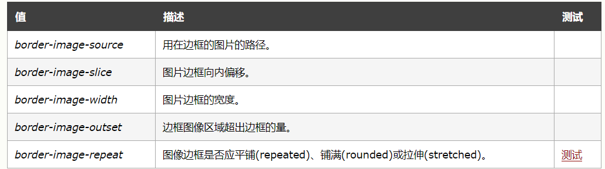
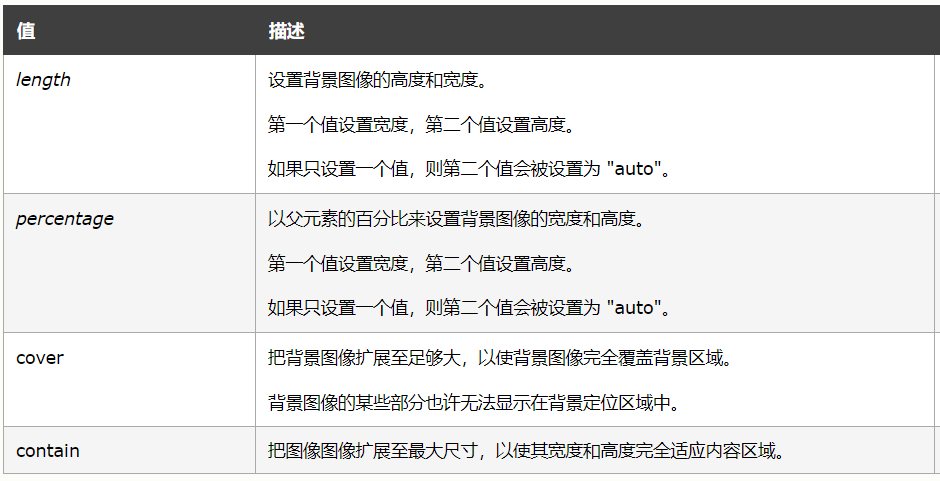
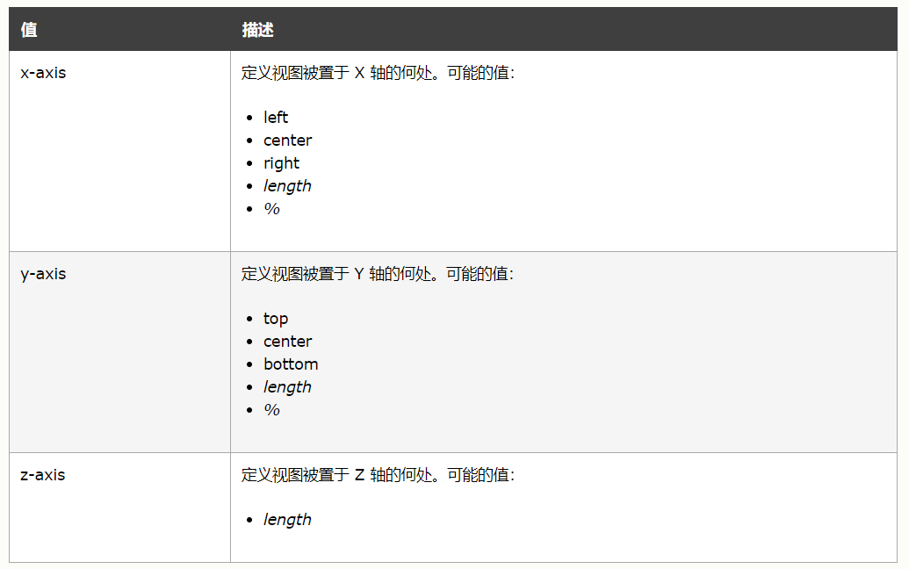
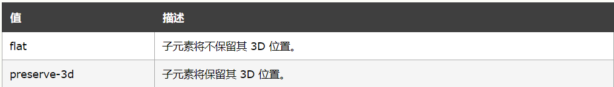
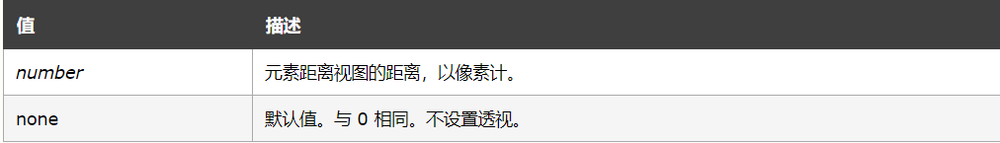
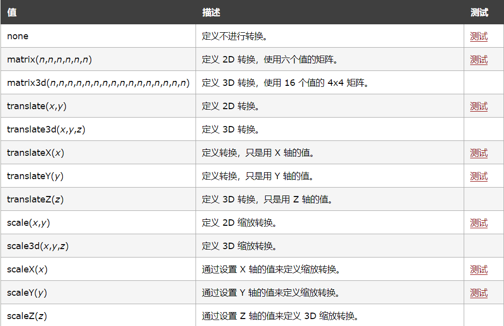

## JS正式课第二十八天

### css3选择器

```
 /*
        选择器比重

        !important   10000

        style        1000
        
        #            100
        
        .            10

        targName、:  1
         
        通用选择器（*）、子选择器（>）、相邻选择器（+）、同胞选择器（~）、权重值为0
    


        > !important(10000) >  style(1000) > #(100) > 类，伪类(10) > targe，伪元素(1) > *+~ (0)
 
        > div[class|="a"]  class要么是a要么是a-开头的

        > nth-child(n)选择父元素的第N个子元素，N是整数（1,2,3）、关键字（even、odd）、公式（2n+1），n的初始值为1.

        > nth-last-child(n)选择父元素的倒数第n个子元素(所有子元素中查找)

        > nth-of-type(n) 只在同一种类型的原型上查找，第n个元素

        > :only-child选择父元素只包含一个子元素

        > only-of-type选择父元素只包含一个同类型的子元素

        > empty  选择没有子元素的元素，并且该元素没有任何文本节点
        > first-child 第一个子元素
        > last-child 最后一个子元素

    */
```

### 字体

```
<!DOCTYPE html>
<html lang="en">
<head>
    <meta charset="UTF-8">
    <meta name="viewport" content="width=device-width, initial-scale=1.0">
    <meta http-equiv="X-UA-Compatible" content="ie=edge">
    <title>Document</title>
<style>
@font-face
{
    /* 定义字体的类名 */
    font-family: aaa;
    src: url('StencilStd.otf')
}
/* i{
    font-family:'aaa';
} */

.a{
    font-family: aaa;
    color:red;
    font-size:12px;
}
.bb{
    color:teal;
}

</style>
</head>
<body>
    <div class="a">abc</div>
    <div>abc</div>
</body>
</html>
```

#### 字体图标(矢量图标)
+ https://www.iconfont.cn/     阿里巴巴矢量图标库
+ 运用方法：
	+ 将需要用的所有字体图标选中，然后添加的一个自定义的新项目中，下载到本地，解压文件后找到其中的iconfont.css文件，放到自己项目的css文件夹中，然后再页面中通过link引入(`<link rel="stylesheet" href="./iconfont.css">`)，在需要添加图标的标签中的class名中加入iconfont和相对应的字体图标class名(`<i class="iconfont icon-yonghu a"></i>`)
	+ 第二中方法直接选中svg格式，然后复制svg代码粘贴到自己所需引入图标的标签中

```
<i><svg t="1575864404858" class="icon" viewBox="0 0 1024 1024" version="1.1" xmlns="http://www.w3.org/2000/svg" p-id="5508" width="32" height="32"><path d="M689.536 192c26.816 0 50.794667 16.64 60.202667 41.706667l78.08 207.978666 67.754666-39.125333 27.562667 47.786667-50.709333 29.269333a64.213333 64.213333 0 0 1 27.157333 52.522667v202.368a64.298667 64.298667 0 0 1-64.298667 64.298666h-27.648V874.666667h-55.146666v-75.861334H255.957333V874.666667H200.853333v-75.861334H173.184a64.298667 64.298667 0 0 1-64.32-64.298666v-202.368a64.213333 64.213333 0 0 1 27.2-52.522667L85.333333 450.346667l27.584-47.786667 67.733334 39.104 78.08-207.957333A64.298667 64.298667 0 0 1 318.933333 192h370.602667z m145.728 342.954667H173.184v199.552h662.101333v-199.552z m-556.288 50.090666a41.386667 41.386667 0 1 1 0 82.752 41.386667 41.386667 0 0 1 0-82.752z m455.125333 0a41.386667 41.386667 0 1 1 0 82.752 41.386667 41.386667 0 0 1 0-82.752z m-44.565333-328.746666H318.933333l-79.402666 211.52h529.386666l-79.36-211.52z m-79.573333 46.037333v62.058667h-206.869334v-62.08h206.869334z" p-id="5509" fill="#df3b26"></path></svg></i>
```

### css3新属性
+ border-radius 也有四个值，顺序也是按照顺时针，border-radius:50%; 圆角 或者那个值写成宽度的一半（前提：宽高一样）
+ box-shadow：
  + 第一个值：阴影水平偏移
  + 第二个值：阴影垂直偏移
  + 第三个值：阴影的模糊度(模糊的距离)
  + 第四个值：阴影的大小
  + 第五个值：颜色
  + 第六个值：默认是outset inset 内阴影
+border-imgage 设置一个图像为元素的边框
	+ border-image属性是速记属性用于设置 border-image-source, border-image-slice, border-image-width, border-image-outset 和border-image-repeat 的值。
	+ 语法： border-image: source slice width outset repeat|initial|inherit


```
<!DOCTYPE html>
<html lang="en">
<head>
    <meta charset="UTF-8">
    <title>Document</title>
<style>
#box{
    width:100px;
    height:100px;
    border: 10px solid transparent;
    border-image: url('border.png') 30 round;
}
</style>
</head>
<body>
    <div id="box"></div>
</body>
</html>
```

#### box-sizing
+ border-box:ie盒模型，代码中的width就是大盒子的总宽
+ content-box：标准盒模型，代码中的width指的是content的宽。（默认）
#### background-size  属性规定背景图像的尺寸
+ 语法：background-size: length|percentage|cover|contain;



```
<!DOCTYPE html>
<html lang="en">
<head>
    <meta charset="UTF-8">
    <title>Document</title>
<style>
#box{
    width:30px;
    height:30px;
    background:url('../border.png') no-repeat;
    /* background-size:30px; */
    /*设置cover之后会跟着容器的宽高走*/
    background-size:cover;

    /*filter 高斯模糊 */
    filter: blur(10px);
    transition: .5s;
}
#box:hover{
    filter: blur(0);
}
</style>
</head>
<body>
    <div id="box"></div>
</body>
</html>
```
### css3 3D
+ transform-origin  设置旋转元素的基点位置(2D 转换元素能够改变元素 x 和 y 轴。3D 转换元素还能改变其 Z 轴。)
	+ 语法：transform-origin: x-axis y-axis z-axis;

+ transform-style  使被转换的子元素保留其 3D 转换(transform-style: preserve-3d;)
	+ 语法：transform-style: flat | preserve-3d;	

+ perspective 景深  设置元素被查看位置的视图  
	+ perspective 属性定义 3D 元素距视图的距离，以像素计。该属性允许您改变 3D 元素查看 3D 元素的视图。
	+ 当为元素定义 perspective 属性时，其子元素会获得透视效果，而不是元素本身。
    + perspective 属性只影响 3D 转换元素。
    + 与 perspective-origin 属性一同使用该属性，这样您就能够改变 3D 元素的底部位置。
    + 语法：perspective: number | none;
    + 景深 数值越大离的越远，数值越小离的就越近


```
<!DOCTYPE html>
<html lang="en">
<head>
    <meta charset="UTF-8">
    <meta name="viewport" content="width=device-width, initial-scale=1.0">
    <meta http-equiv="X-UA-Compatible" content="ie=edge">
    <title>Document</title>
<style>
#box{
    width:100px;
    height:100px;
    transition: .5s;
    border:1px solid #000;
    transform-origin:left;
    margin: 20% auto;
    transform-style: preserve-3d;
}

#box1{
    width:300px;
    height:300px;
    border:1px solid #000;
    /*
        景深 数值越大离的越远，数值越小离的就越近
    */
    perspective: 50px;
}
#box1:hover > div{
    /*类似于平面转*/
    /* transform: rotateZ(120deg); */
    /* transform: rotateY(120deg); */
    transform: rotateY(90deg);
}
</style>
</head>
<body>
    <div id="box1">
        <div id="box">11332112</div>
    </div>
<script>

</script>
</body>
</html>
```
+ transform transform 属性向元素应用 2D 或 3D 转换。该属性允许我们对元素进行旋转、缩放、移动或倾斜
	+ 语法： transform: none | transform-functions;
