[toc]

## JS正式课第二十九天

### 1、 flex 布局的出现

布局的传统解决方案，基于盒状模型，依赖 display属性 + position属性 + float属性。它对于那些特殊布局非常不方便，比如，垂直居中就不容易实现。
2009年，W3C提出了一种新的方案—-Flex布局，可以简便、完整、响应式地实现各种页面布局。

###2、 flex布局的兼容性问题

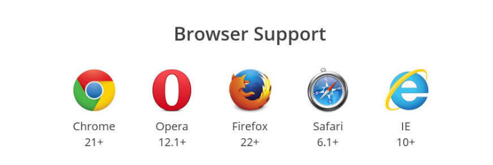

`注意：设为Flex布局以后，子元素的float、clear和vertical-align属性将失效。`

### 3、flex 布局的定义
Flex是Flexible Box的缩写，意为”弹性布局”，用来为盒状模型提供最大的灵活性。
任何一个容器都可以指定为Flex布局。flex 布局有两个值：

+ display:flex; 代表的是块级
+ display:inline-flex; 代表的是行内块

下面的例子证明，display:flex; 的时候，两个div是上下排列的，但是如果是display：inline-flex 的时候是左右排列的

```
<!DOCTYPE html>
<html lang="en">
<head>
<meta charset="UTF-8">
<meta name="viewport" content="width=device-width, initial-scale=1.0">
<meta http-equiv="X-UA-Compatible" content="ie=edge">
<title>Document</title>
<style>
        /* 
          flex 布局有两个值：
          display:flex;代表的是块级
          display:inline-flex;代表的是行内块
         */
      *{
          margin:0;
          padding:0;
      }
       .box1{
           width: 100px;
           height: 100px;
           background:green;
           display:inline-flex;
       }
       .box2{
           width: 100px;
           height: 100px;
           background:pink;
           display:inline-flex;
       }
</style>
</head>
<body>
<div class="box1">box1</div>
<div class="box2">box2</div>
</body>
</html>
```

### 4、flex 布局的基本概念

采用Flex布局的元素，称为Flex容器（flex container），简称”容器”。它的所有子元素自动成为容器成员，称为Flex项目（flex item），简称”项目”。

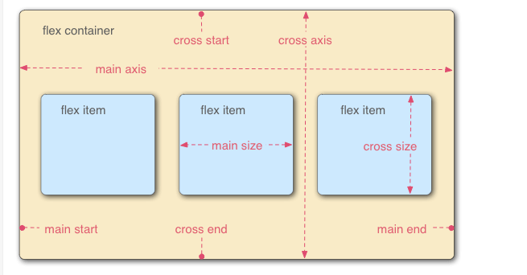

容器默认存在两根轴：水平的主轴（main axis）和垂直的交叉轴（cross axis）。主轴的开始位置（与边框的交叉点）叫做main start，结束位置叫做main end；交叉轴的开始位置叫做cross start，结束位置叫做cross end。

### 5、容器的属性
+ flex-direction
+ flex-wrap
+ flex-flow
+ justify-content
+ align-items
+ align-content

#### 5.1 flex-direction属性: 设置主轴的方向

+ row：主轴的方向是水平，从从左到右
+ column：主轴的方向是垂直的，从上到下
+ row-reverse：主轴的方向是水平，从右到左
+ column-reverse：主轴的方向是垂直的，从下到上

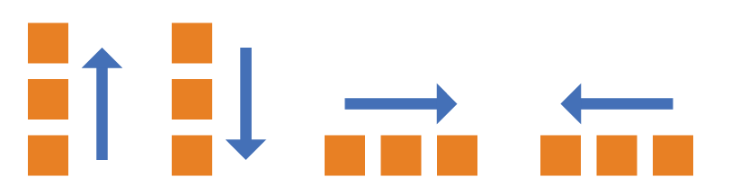

```
<!DOCTYPE html>
<html lang="en">
<head>
<meta charset="UTF-8">
<meta name="viewport" content="width=device-width, initial-scale=1.0">
<meta http-equiv="X-UA-Compatible" content="ie=edge">
<title>Document</title>
<style>
    *{
        margin:0;padding:0;
    }
    ul,ol{
        list-style: none;
    }
    ul{
        display:flex;
        /* flex-direction: row; */
        /* flex-direction: column; */
        /* flex-direction: row-reverse; */
        flex-direction: column-reverse;
    }
    ul>li{
        width:100px;
        height:100px;
        background:green;
        margin-left:10px;
    }
</style>
</head>
<body>
<ul>
<li>1</li>
<li>2</li>
<li>3</li>
<li>4</li>
<li>5</li>
<li>6</li>
</ul>
</body>
</html>
```

#### 5.2 flex-wrap:

+ wrap: 换行
+ nowrap: 不换行（默认）
+ wrap-reverse：换行，不过第一行在最下面

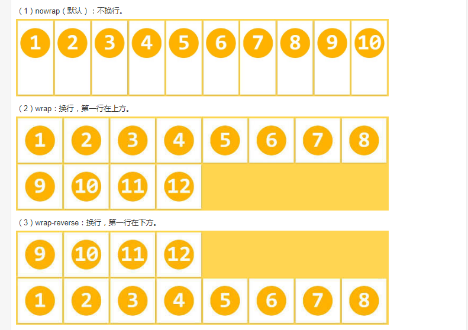

#### 5.3 flex-flow

flex-flow属性是flex-direction属性和flex-wrap属性的简写形式，默认值为row nowrap。

`flex-flow:row wrap;写了这个之后，下面的案例效果跟上一个一样`

```
<!DOCTYPE html>
<html lang="en">
<head>
<meta charset="UTF-8">
<meta name="viewport" content="width=device-width, initial-scale=1.0">
<meta http-equiv="X-UA-Compatible" content="ie=edge">
<title>flex-flow</title>
<style>
    *{
        margin:0;padding:0;
    }
    /* 
      flex-flow 是flex-direction 和flex-wrap 的简写
     */
    ul,ol{
        list-style: none;
    }
    ul{
        display:flex;
        flex-flow:row wrap
    }
    ul>li{
        width:400px;
        height:400px;
        background:green;
        margin-left:10px;
        margin-bottom:10px;
    }
</style>
</head>
<body>
<ul>
<li>1</li>
<li>2</li>
<li>3</li>
<li>4</li>
<li>5</li>
<li>6</li>
<li>7</li>
</ul>
</body>
</html>
```

#### 5.4 justify-content属性定义了项目在主轴上的对齐方式

justify-content: 
+ flex-start 
+  flex-end 
+  center 
+  space-between
+  space-around
+  space-evenly


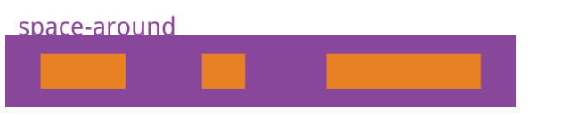


space-evenly

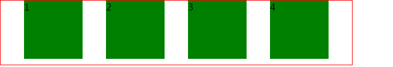

#### 5.5 align-items属性：align-items属性定义项目在交叉轴上如何对齐。

align-items: 
+ flex-start 
+ flex-end 
+ center
+  baseline 
+  stretch

`stretch（默认值）`：如果项目未设置高度或设为auto，将占满整个容器的高度。


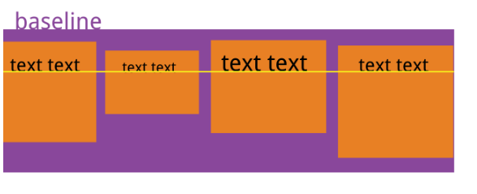

#### 5.6 align-content属性
align-content属性定义了多根轴线的对齐方式。如果项目只有一根轴线，该属性不起作用。（`也就是说得有项目换行`）

.box { 
align-content: flex-start | flex-end | center | space-between | space-around | stretch; 
}

align-content: 
+ flex-start 
+ flex-end 
+ center 
+ space-between
+ space-around
+ stretch

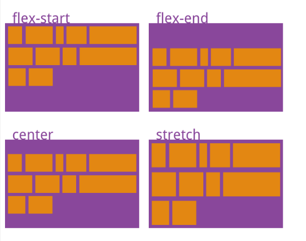

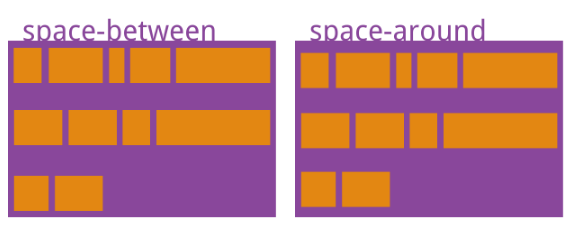

### 六、项目的属性

以下6个属性设置在项目上。
+ order
+ flex-grow
+ flex-shrink
+ flex-basis
+ flex
+ align-self

#### 6.1 order属性定义项目的排列顺序。数值越小，排列越靠前，默认为0。

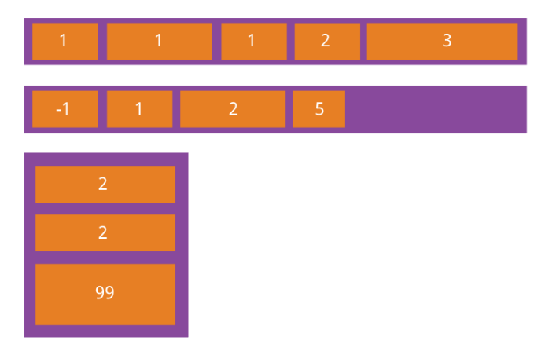

#### 6.2 flex-grow属性

flex-grow属性定义项目的放大比例，默认为0，即如果存在剩余空间，也不放大。 
如果所有项目的flex-grow属性都为1，则它们将等分剩余空间（如果有的话）。如果一个项目的flex-grow属性为2，其他项目都为1，则前者占据的剩余空间将比其他项多一倍。

```
.item {
flex-grow: <number>; /* default 0 */
}
```

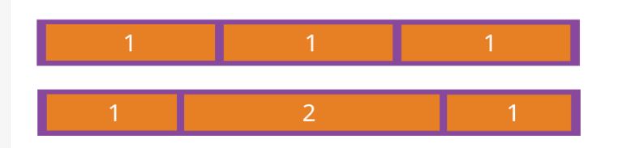

如果所有项目的flex-shrink属性都为1，当空间不足时，都将等比例缩小。如果一个项目的flex-shrink属性为0，其他项目都为1，则空间不足时，前者不缩小。
负值对该属性无效。

#### 6.4 flex-basis属性
flex-basis属性定义了在分配多余空间之前，项目占据的主轴空间（main size）。浏览器根据这个属性，计算主轴是否有多余空间。它的默认值为auto，即项目的本来大小。它可以设为跟width或height属性一样的值（比如350px），则项目将占据固定空间。

```
.item {
flex-basis: <length> | auto; /* default auto */
}
```

#### 6.5 flex属性

flex属性是flex-grow, flex-shrink 和 flex-basis的简写，默认值为0 1 auto。后两个属性可选。

```
.item {
flex: none | [ <'flex-grow'> <'flex-shrink'>? || <'flex-basis'> ]
}
```
#### 6.6 align-self属性
align-self属性允许单个项目有与其他项目不一样的对齐方式，可覆盖align-items属性。默认值为auto，表示继承父元素的align-items属性，如果没有父元素，则等同于stretch。

```
.item {
align-self: auto | flex-start | flex-end | center | baseline | stretch;
}
```
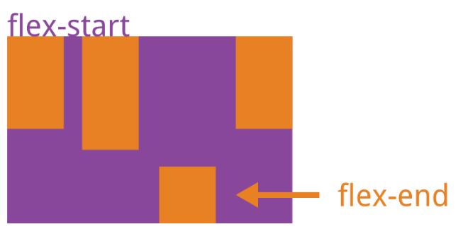


