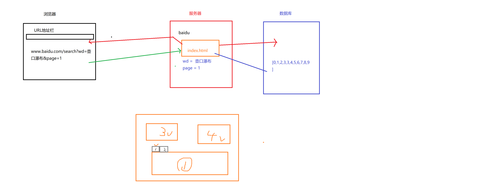

[toc]

## JS正式课第三十一天
### AJAX 
+ Asynchronous（异步） Javascript（js） And（和） XML（标记语言,数据） 
+ 它是一个前后台数据交互的一种技术（找后台拿数据的方式）
+ 难点: 如何操作数据（各种数据类型的应用），异步，参数如何拼接(字段是什么东西?name=zf&age=10)，如何开启服务
+ ajax获取数据并不难，难的是拿到数据之后你怎么办？(业务逻辑)
+ ajax最大的优点 -> 可以局部刷新，减轻服务器的压力，提升用户体验
```
    在工作中：
        $.ajax({})
        fetch('')
        axios.get('')
        wx.request('')
        jsonp_fetch('')
        ...

    ajax:
        <script src="data.js"></script> 
        let data = {
            "0":{
                "pid":-1,
                "id":0,
                "title":'我的文档',
                checked:false
            },
            "1":{
                "pid":-1,
                "id":1,
                "title":'我的音乐',
                checked:false
            },

        }

        XML -> json -> '[]' || '{name:"小明",age:18,info:"哈哈哈"}'

        可以拿到data
``` 

#### 传统的请求

```
<!DOCTYPE html>
<html lang="en">
<head>
    <meta charset="UTF-8">
    <title>Document</title>
</head>
<body>
  <form action="/get"  method="GET">
        注册的用户名:<input name="user" type="text"/> </br>
        注册的密码:<input type="password" name="pw"/>
        <input type="submit" value="提交" />
  </form>
  <script>
    /*
        action:请求的地址
        method:请求的方式(get,post...)
        name="user"，name="pw":字段 
            -> user=liucheng&pw=1234

        刷新了页面
    */
  </script>
</body>
</html>
```

#### ajax请求


```
<!DOCTYPE html>
<html lang="en">

<head>
    <meta charset="UTF-8">
    <meta name="viewport" content="width=device-width, initial-scale=1.0">
    <meta http-equiv="X-UA-Compatible" content="ie=edge">
    <title>Document</title>
</head>

<body>
    注册的用户名: <input type="text" id="user"> <br>
    注册的密码: <input type="password" id="pw">
    <button id="btn">提交</button>

    <script>
        /*
        url + 参数

        code:1 -> 没有可以注册
        code:0 -> 用户名被占用
*/
        // fetch('/get?user='+user.value+'&pw='+pw.value).then(d=>d.json()).then(d=>{
        //     console.log(d);
        // })

        //当用户名失焦的时候请求服务器，问问服务器到底当前的用户名能不能注册？
        //    fetch('/get?user=' + user.value + '$pw=' + pw.value).then(d=> d.json()).then(d=> {
        //        console.log(d);
        //    }) 

        user.onblur = function () {
            fetch('/get?user=' + user.value).then(d => d.json()).then(d => {
                console.log(d);
            })

        }
    </script>
</body>

</html>
```

### 如何启动服务器？
- 点击（点进去）服务器文件(hello world)（文件不能是中文）
- 看看有没有node_modules文件，有就不用管，没有要安装依赖文件
    - 第一种方式:shift + 鼠标右键 选择在此处打开终端
    - 第二种方式:把服务器文件拖到vscode中，点击终端
    - npm install 安装依赖

- 运行服务器
    - 输入npm run start 或者输入 node app 按tab键（自动帮你补齐）

- *** 浏览器要输入localhost/xx.html  (打开方式)，千万不要双击直接运行文件(不要在本地打开，要使用localhost的方式去打开)

- 代码放到public文件夹下

### ajax的交互模型
 - 创建一个XMLHttpRequest对象  
 - 填写请求方式，和请求地址，是否异步
 - 发送请求
 - 监听数据响应
 - 接收到数据
>`XML全称EXtensible Markup Language,翻译为可扩展置标语言,可扩展标记语言或可延伸 标示语言,是一种置标语言`
>`responseText 属性返回字符串形式的响应`
```
<!DOCTYPE html>
<html lang="en">
<head>
    <meta charset="UTF-8">
    <meta name="viewport" content="width=device-width, initial-scale=1.0">
    <meta http-equiv="X-UA-Compatible" content="ie=edge">
    <title>Document</title>
</head>
<body>
    注册的用户名: <input type="text" id="user"> <span id="s"></span><br>
       注册的密码: <input type="password" id="pw">
       <button id="btn">提交</button>
       <script>
           /* 
           XHR XML Http  Request 

           XML全称EXtensible Markup Language,翻译为可扩展置标语言,可扩展标记语言或可延伸 标示语言,是一种置标语言
           */

        let re = /^[a-zA-Z][\w-]{5,7}$/; // 以字母开头,以数字字母下划线，6-8位
        user.onfocus = function() {
            user.style.border = '1px solid black'; 
            s.innerText = '';
        }
       user.onblur = function() {
           // 发起ajax请求(打电话模式)

           /*
                1.创建一个电话
                2.输入号码
                3.按绿色键拨打
                4.等待
                5.通话
            */
        //    console.log(XMLHttpRequest);
        let val = user.value.trim();
        if(val && re.test(val)) {// 保证不为空且符合规则
            let xhr = new XMLHttpRequest; // 创建一个电话
           xhr.open('GET','/get?user='+this.value,true);  // 第一参数获取方式，第二个地址，第三个是否异步，默认为true  输入号码
           xhr.send();// 拨打，发送
           xhr.onload = function() {// 等待
            //    console.log(xhr.responseText); // 通话   responseText 属性返回字符串形式的响应
            //    console.log(JSON.parse(xhr.responseText));
            let d = JSON.parse(xhr.responseText); 
            if(d.code === 0) {
                user.style.border = '1px solid red';
            }else if(d.code === 1){
                user.style.border = '1px solid green'; 
            }
           }
        }else {
            s.innerText = '请检查输入的格式';
            user.style.border = '1px solid red'; 
        }
           

       }
       </script>
</body>
</html>
```
```
    GET是通过url进行请求（4步就发送请求了）

        http://www.baidu.com:88/get?user=lilei#age=18
        协议 域名 端口 接口 查询信息  hash信息

        GET的优势就是快 （用于展示类的）

        相对不安全（在请求的时候会显示在地址栏或者历史记录里面查到）

        请求体积是有限的（会根据浏览器的标准来限制） 传大的东西传不了

        在低版本IE下有缓存问题(/get?user=liucheng)
        第一次和第二次请求的url是一致的那么第二次会走第一次的缓存

        解决:
            第一种:不用get用post
            第二种:每次url不一致
                /get?user=liucheng&random=3213321321
                /get?user=liucheng&random=3213325748


        输入的内容是中文的时候，在IE下会出现错误请求和返回
        是因为IE的低版本在解析中文的时候解析会有问题。

        解决方案:
            把中文转成URI编码
                encodeURI('续') -> %E7%BB%AD
                encodeURIComponent
            URI编码转中文
                decodeURI('%E7%BB%AD') -> 续
                decodeURIComponent('%E7%BB%AD')


    POST是通过服务器来发送请求的（跟用户相关的信息，发送体积比较大的文件）（至少6步才能成功发送请求）

        相对安全，因为它是通过服务器来发送请求的

        理论上体积可以是无限大（但是一般后端开发人员都会给予限制）

        比get要慢

        必须添加请求头
        xhr.setRequestHearder('content-type','application/x-www-form-urlencoded');
```
#### post
##### post传统获取方式

```
<!DOCTYPE html>
<html lang="en">
<head>
    <meta charset="UTF-8">
    <meta name="viewport" content="width=device-width, initial-scale=1.0">
    <meta http-equiv="X-UA-Compatible" content="ie=edge">
    <title>Document</title>
</head>
<body>
    <!-- 传统获取方式 -->
        <form action="/post" name="user" method="POST">
            注册的用户名: <input type="text" name="user"> <br>
            注册的密码: <input type="password" name="pw" id="">
            <input type="submit" value="提交">
         </form>
</body>
</html>
```
#### post运用ajax

```
<!DOCTYPE html>
<html lang="en">
<head>
    <meta charset="UTF-8">
    <meta name="viewport" content="width=device-width, initial-scale=1.0">
    <meta http-equiv="X-UA-Compatible" content="ie=edge">
    <title>Document</title>
</head>
<body>
    注册的用户名: <input type="text" id="user"> <span id="s"></span><br>
    注册的密码: <input type="password" id="pw">
    <button id="btn">提交</button>
    <script>
    user.onblur = function() {
        let xhr = new XMLHttpRequest;
        xhr.open('post','/post',true);
        xhr.setRequestHeader('content-type','application/x-www-form-urlencode');
        xhr.send('user='+this.value);
        xhr.onload = function() {
            console.log(xhr.responseText);
        }
    }
    </script>
</body>
</html>
```
#### get在IE低版本浏览器的缓存问题和获取中文不能转URI编码的问题（post不存在）

```
<!DOCTYPE html>
<html lang="en">
<head>
    <meta charset="UTF-8">
    <meta name="viewport" content="width=device-width, initial-scale=1.0">
    <meta http-equiv="X-UA-Compatible" content="ie=edge">
    <title>Document</title>
</head>
<body>
    
    注册的用户名: <input type="text" id="user"> <span id="s"></span><br>
       <script>

           /* 
           get:
           
           一. 在低版本IE下有缓存问题(/get?user=liucheng)
           第一次和第二次请求的url是一致的那么第二次会走第一次的缓存

           解决方案：
           第一种：不用get用post
           第二种：每一次的url不一致( xhr.open('GET','/get?user='+this.value + '&myrandom='+Date.now(),true);)

           二. 输入的内容是中文的时候，在IE下会出现错误请求和返回
           是因为IE的低版本在解析中文的时候解析会有问题

           解决方案：把中文转成URI编码格式
           decodeURI(); // URI编码转钟文
           decodeURIComponent();// URI编码转钟文
           encodeURI();// 中文转URI编码
          encodeURIComponent(); // 中文转URI编码
           
           */
       user.onblur = function() {
           // 发起ajax请求(打电话模式)
        //    console.log(XMLHttpRequest);
        let val = user.value.trim();
            var xhr = new XMLHttpRequest; // 创建一个电话
           xhr.open('GET','/get?user='+encodeURI(this.value) + '&myrandom='+ Date.now(),true);  // 第一参数获取方式，第二个地址，第三个是否异步，默认为true  输入号码
           xhr.send();// 拨打，发送
           xhr.onload = function() {// 等待
               console.log(xhr.responseText); // 通话   responseText 属性返回字符串形式的响应
               console.log(JSON.parse(xhr.responseText));
       }
    }
       </script>
</body>
</html>
```