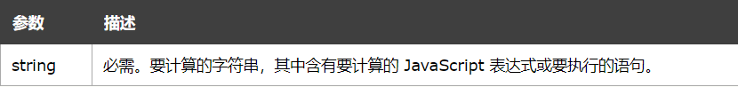
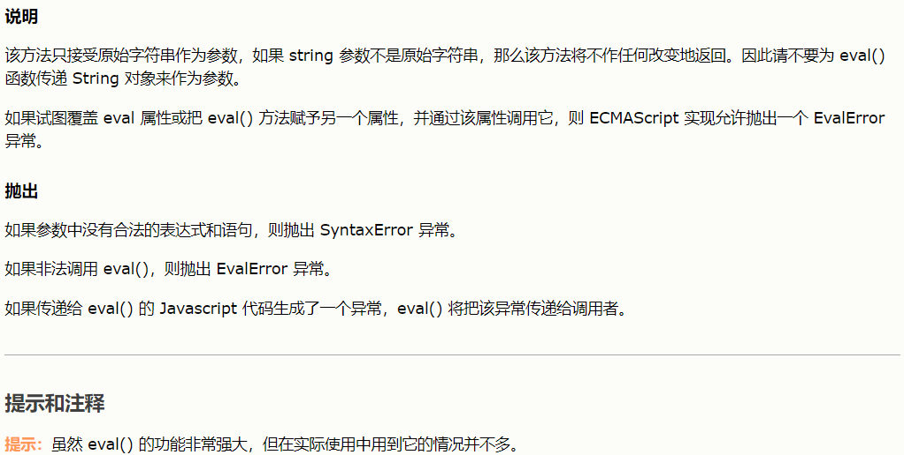
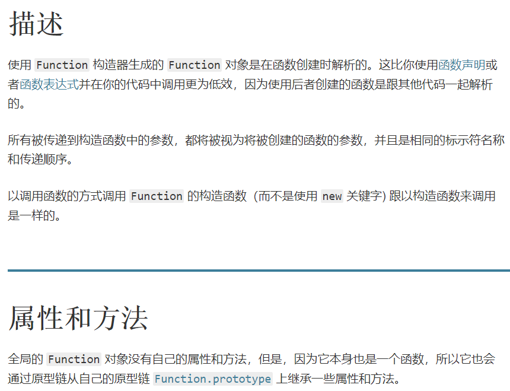

[toc]

## JS正式课第三十二天

### URLSearchParams
+ 把对象转变成url上面查询信息的写法，例如a=1&b=2
+ 可以把请求路由中的字符串   key=1 ，拼接成key：1   键值对格式，这样方便后端直接使用

```
    <script>
        let obj = {
            name: '孙悟空',
            age: 300,
            sex: 'man',
            skill: 'bang',
            fire: 10000
        }

        let orr = '' + new URLSearchParams(obj);
        let ora = new URLSearchParams(obj).toString();

        console.log(orr, ora);// 'name=%E5%AD%99%E6%82%9F%E7%A9%BA&age=300&sex=man&skill=bang&fire=10000'  'name=%E5%AD%99%E6%82%9F%E7%A9%BA&age=300&sex=man&skill=bang&fire=10000'
    </script>
```

### JavaScript eval() 函数
+ eval() 函数可计算某个字符串，并执行其中的的 JavaScript 代码。
+ 语法：eval(string)
+ 返回值：通过计算 string 得到的值（如果有的话）。




### new Function()语法
+ 语法：new Function ([arg1[, arg2[, ...argN]],] functionBody)
+ 参数： 
	+ arg1, arg2, ... argN     被函数使用的参数的名称必须是合法命名的。参数名称是一个有效的JavaScript标识符的字符串，或者一个用逗号分隔的有效字符串的列表;例如“×”，“theValue”，或“a,b”。
	+ functionBody 一个含有包括函数定义的 JavaScript 语句的字符串。


```
let fn1 = new Function('a,b','return (a+b)');
console.log(fn1(1,2)); //  3
```

### fetch的post
```
    fetch(url,{
        method:'post',
        headers:{
            'content-type':'application/x-www-form-urlencoded'
        },
        body:'key=val&key2=val2'
        也可以写成
        body:''+new URLSearchParmas({
            key:val,
            key2:val2
            如果value是中文还会帮我们转成URI编码
        })
    })
```

### 请求头和响应头

+ General
> Request URL  请求的地址
> Request Method  请求的方式  GET POST HEAD DELETE PUT..
> Status Code   状态码
> Remote Address  当前页面的端口号

+ Response Headers (响应头) -> 服务器发给你的东西(接收到的)

+ Request Headers (请求头) -> 发给服务器的东西(发给别人的)

+ Query String Parmeters (请求体)

### http状态码  1-6开头的

> 100 服务器已经接收请求，希望客户端继续发送请求

> 200 - 207都是成功

> 301 永久重定向

> 302 临时重定向

> 304 一种缓存

> 400 就是有误的意思

> 401 当前请求需要用户验证

> 403 服务器已经理解请求，但是拒绝执行它

> 404 请求失败，请求所希望得到的资源未被在服务器上发现

> 5字开头的是服务器的错误

> 500  服务器端出错了

> 501 服务器不支持当前请求所需要的某个功能。

> 502 作为网关或者代理工作的服务器尝试执行请求时，从上游服务器接收到无效的响应。
> 503 由于临时的服务器维护或者过载，服务器当前无法处理请求

### onload与onreadystatechange
+ onload  低版本的IE不支持
+ onreadystatechange所有都支持
	+ onreadystatechange是可以监听发送请求的状态
    + 5次状态 0-4，但是0你永远都监听不到，1-4

```
如果把onreadystatechange放到send之前能够多监听一次，放到send之后就少监听一次

0: 请求未初始化
1: 服务器连接已建立
2: 请求已接收
3: 请求处理中
4: 请求已完成，且响应已就绪
```

### 补充
#### JSON转对象的三种方法
+ JSON.parse()
+ eval
+  new Function('','return '+'{name:"xxx"}')() 