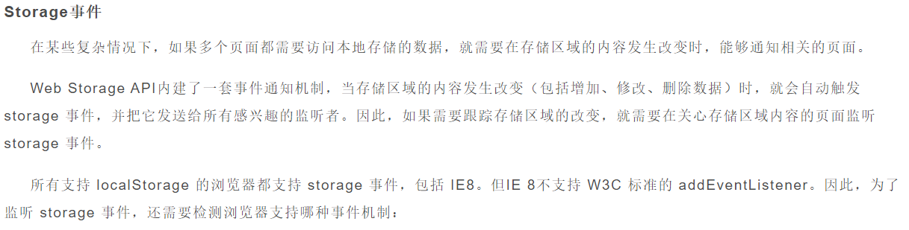
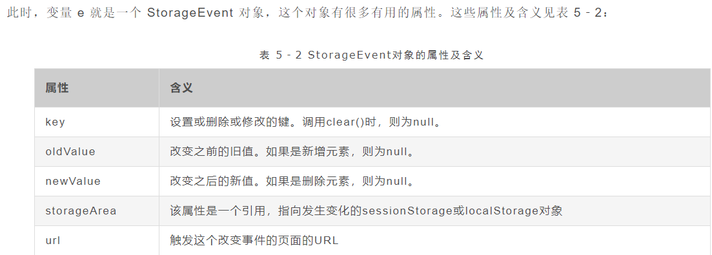

[toc]

## JS正式课第三十四天

### AJAX 
    - Asynchronous（异步） Javascript（js） And（和） XML（标记语言,数据）

    - 它是一个前后台数据交互的一种技术（找后台拿数据的方式）

    - 难点: 如何操作数据（各种数据类型的应用），异步，参数如何拼接(字段是什么东西?name=zf&age=10)，如何开启服务

    - ajax获取数据并不难，难的是拿到数据之后你怎么办？(业务逻辑)

```
    在工作中：
        $.ajax({})
        fetch('')
        axios.get('')
        wx.request('')
        jsonp_fetch('')
        ...

    ajax:
        <script src="data.js"></script> 
        let data = {
            "0":{
                "pid":-1,
                "id":0,
                "title":'我的文档',
                checked:false
            },
            "1":{
                "pid":-1,
                "id":1,
                "title":'我的音乐',
                checked:false
            },

        }

        XML -> json -> '[]' || '{name:"小明",age:18,info:"哈哈哈"}'

        可以拿到data
``` 

- ajax最大的优点 -> 可以局部刷新，减轻服务器的压力，提升用户体验


### 如何启动服务器？
- 点击（点进去）服务器文件(hello world)（文件不能是中文）
- 看看有没有node_modules文件，有就不用管，没有要安装依赖文件
    - 第一种方式:shift + 鼠标右键 选择在此处打开终端
    - 第二种方式:把服务器文件拖到vscode中，点击终端
    - npm install 安装依赖

- 运行服务器
    - 输入npm run start 或者输入 node app 按tab键（自动帮你补齐）

- *** 浏览器要输入localhost/xx.html  (打开方式)，千万不要双击直接运行文件(不要在本地打开，要使用localhost的方式去打开)

- 代码放到public文件夹下

### ajax的交互模型
    - 创建一个XMLHttpRequest对象  
    - 填写请求方式，和请求地址，是否异步
    - 发送请求
    - 监听数据响应
    - 接收到数据

### GET和POST
```
    GET是通过url进行请求（4步就发送请求了）

        http://www.baidu.com:88/get?user=lilei#age=18
        协议 域名 端口 接口 查询信息  hash信息

        GET的优势就是快 （用于展示类的）

        相对不安全（在请求的时候会显示在地址栏或者历史记录里面查到）

        请求体积是有限的（会根据浏览器的标准来限制） 传大的东西传不了

        在低版本IE下有缓存问题(/get?user=liucheng)
        第一次和第二次请求的url是一致的那么第二次会走第一次的缓存

        解决:
            第一种:不用get用post
            第二种:每次url不一致
                /get?user=liucheng&random=3213321321
                /get?user=liucheng&random=3213325748


        输入的内容是中文的时候，在IE下会出现错误请求和返回
        是因为IE的低版本在解析中文的时候解析会有问题。

        解决方案:
            把中文转成URI编码
                encodeURI('续') -> %E7%BB%AD
                encodeURIComponent
            URI编码转中文
                decodeURI('%E7%BB%AD') -> 续
                decodeURIComponent('%E7%BB%AD')


    POST是通过服务器来发送请求的（跟用户相关的信息，发送体积比较大的文件）（至少6步才能成功发送请求）

        相对安全，因为它是通过服务器来发送请求的

        理论上体积可以是无限大（但是一般后端开发人员都会给予限制）

        比get要慢

        必须添加请求头
        xhr.setRequestHearder('content-type','application/x-www-form-urlencoded');

```


#### xhr有upload这个属性是一个对象，代表上传时候的事件

> xhr.upload.onprogress  上传时候的进度

```
    ev里面有total -> 文件的总体积
    ev里面有loaded -> 当前上传的体积

    ev.loaded / ev.total  =  0-1
```


### 刷新之后还有（数据是不变的） 
```
    1.刷新之后请求一次数据

    2.把数据存储在浏览器中
        cookie 
            - 后端技术，基于浏览器实现的
            - 用来存储用户的操作信息
            - 一次http请求（填写用户名密码），后端只知道这次请求某人是否合法，http是无状态的，不能记录某人登录过账户
            所以说使用cookie去存储某个人操作，下次请求的时候，把上一次的操作发给后端，就知道某人是否登录过账户

            cookie的生命周期
            默认的生命周期是当浏览器关闭，生命就结束

            如果不要走默认的生命周期使用 expires

            expires=需要设置的时间 

            let o = new Date();
            o.setDate(new Date().getDate() + 1);  //比当前时间多1天

            document.cookie = 'name=pq; expires='+o;

            cookie，在以前每个域名只能设置几个或者几十个，字字千金，现在据说有5M

            cookie必须使用服务器环境

        
            
        localStorage
        sessionStorage
```
### FormData

```
 /*
            FormData
                能够把files[n]变成二进制的数据

            它的实例上有一个方法，append(key,value)

            有几个字段就写几个append
            fd.append('image',file.files[0]) 
                'image=dnsadhshcduba9u'
            fd.append('user',this.value);
                'user=lilei'

            'image=dnsadhshcduba9u&user=lilei'
            

        */
```
#### FormData实例下的几种方法
+ append   能够把files[n]变成二进制的数据 append(key,value)
+ set  设置或者修改
+ has 查询符合条件的字段
+ delete 删除
+ get  获取
+ getAll  找出同名的字段（至少有两个），返回一个数

```
<!DOCTYPE html>
<html lang="en">
<head>
    <meta charset="UTF-8">
    <title>Document</title>
</head>
<body>
<script>
    let fd = new FormData();
    /*
        user=1&user=2&user=3&user=4

        user=1&passw=123&id=5&xx=yy

    */

    // fd.append('user','hyw,bx,bw');
    // fd.append('user','bx');
    fd.set('user','bx');  //'[1,2,3]'   //之前如果有的key值会被覆盖
    // fd.append('user','bw'); //追加，不会覆盖同名的key值

    console.log(fd.has('user')) //失败包含参数key  true/false
    
    // fd.set('user'); 
    fd.delete('user'); //删除参数key

    console.log(fd.get('user'));

    // console.log(fd.getAll('user')); //找出同名的key，返回一个数组

    
</script>
</body>
</html>
```

### 本地存储

#### cookie

```
 /*
        刷新之后还有（数据是不变的） 

        [1,2,3]

        1.刷新之后请求一次数据

        2.把数据存储在浏览器中
            cookie 
                - 后端技术，基于浏览器实现的(一般都是后端来设置,也可以前端来种)
                - 用来存储用户的操作信息
                - 一次http请求（填写用户名密码），后端只知道这次请求某人是否合法，http是无状态的，不能记录某人登录过账户
                所以说使用cookie去存储某个人操作，下次请求的时候，把上一次的操作发给后端，就知道某人是否登录过账户
            localStorage
            sessionStorage
    */
    
    /*
    // console.log(document.cookie); //读操作

    // document.cookie = 'name=pq'; //写操作
    // document.cookie = 'age=13';
    // console.log(document.cookie); //读操作
    /*
        * 读操作需要注意的是，一次读取会把当前域名下的所有cookie都获取出来
        格式为'key=val; key2=val2',分号后面有空格
    */

    // let o = new Date();
    // o.setDate(new Date().getDate() + 1);

    // console.log(o)

    // document.cookie = 'name=pq; expires='+o;

    /*
        cookie的生命周期
            默认的生命周期是当浏览器关闭，生命就结束

            如果不要走默认的生命周期使用 expires

            expires=需要设置的时间 

            let o = new Date();
            o.setDate(new Date().getDate() + 1);  //比当前时间多1天

            document.cookie = 'name=pq; expires='+o;

        cookie，在以前每个域名只能设置几个或者几十个，字字千金，现在据说有5M

        cookie必须使用服务器环境
    */
```

```
<!DOCTYPE html>
<html lang="en">
<head>
    <meta charset="UTF-8">
    <title>Document</title>
<style>
#box{
    padding: 30px;
    border:1px solid #000;
}
</style>
</head>
<body>
    <!-- <ul id="ul"></ul> -->
    <h1 id="h1"></h1>
    <div id="box">
        用户名:<input type="text" id="user"/>
        密码:<input type="password" id="pw"/>
        <button id="btn">登录</button>
    </div>
<script>
    /*
        刷新之后还有（数据是不变的） 

        [1,2,3]

        1.刷新之后请求一次数据

        2.把数据存储在浏览器中
            cookie 
                - 后端技术，基于浏览器实现的(一般都是后端来设置,也可以前端来种)
                - 用来存储用户的操作信息
                - 一次http请求（填写用户名密码），后端只知道这次请求某人是否合法，http是无状态的，不能记录某人登录过账户
                所以说使用cookie去存储某个人操作，下次请求的时候，把上一次的操作发给后端，就知道某人是否登录过账户
            localStorage
            sessionStorage
    */

    // ajax('data.xml',{
    //     dataType:'xml'
    // }).then(d=>{
    //     const person = d.getElementsByTagName('person');
    //     let temp = '';
    //     for(let i=0;i<person.length;i++){
    //         temp += `<li>我的名字叫:${person[i].children[0].innerHTML},今年${person[i].children[1].innerHTML}岁,我想说:${person[i].children[3].innerHTML}</li>`
    //     }
    //     ul.innerHTML = temp;
    //     // console.log(person);
    // })

    // console.log(document.cookie); //读操作

    // document.cookie = 'name=pq'; //写操作
    // document.cookie = 'age=13';
    // console.log(document.cookie); //读操作
    /*
        * 读操作需要注意的是，一次读取会把当前域名下的所有cookie都获取出来
        格式为'key=val; key2=val2',分号后面有空格
    */

    // let o = new Date();
    // o.setDate(new Date().getDate() + 1);

    // console.log(o)

    // document.cookie = 'name=pq; expires='+o;

    /*
        cookie的生命周期
            默认的生命周期是当浏览器关闭，生命就结束

            如果不要走默认的生命周期使用 expires

            expires=需要设置的时间 

            let o = new Date();
            o.setDate(new Date().getDate() + 1);  //比当前时间多1天

            document.cookie = 'name=pq; expires='+o;

        cookie，在以前每个域名只能设置几个或者几十个，字字千金，现在据说有5M

        cookie必须使用服务器环境
    */


    let sql = [
        {
            user:'郝永旺',
            pw:123
        },
        {
            user:'尹德智',
            pw:321
        }
    ];


    
    setCookie('name','xxoo',{
        setTime:{
            date:10
        }
    });

    function setCookie(key,val,time){
        if(time){
            let o = new Date;
            // o.setMinutes(new Date().getMinutes() + time);
            let t;
            let prop;
            for(let attr in time.setTime){
                t = attr[0].toUpperCase()+attr.substr(1);
                prop = attr;
            }
            // console.log('set'+t,time.setTime[prop])
            // return ;
            o['set'+t](new Date()['get'+t]()+time.setTime[prop]);

            // console.log(o);

            document.cookie = key + '=' + val + '; expires='+o;
        }else{
            document.cookie = key + '=' + val;
        }   
    }

    function getCookie(key){
        let c = document.cookie;
        let val;
        c.split('; ').forEach(item=>{
            let ary = item.split('=');
            if(ary[0] === key){
                val = ary[1];
            }
        });
        return val;
    }

    function removeCookie(key,val){
        setCookie(key,val,{setTime:{date:-1}});
    }

    removeCookie('user','尹德智');

    console.log(getCookie('user'));

   


    let c = document.cookie;
    //刷新页面的时候取cookie，看看有没有user，有user说明已经登录过，否则没有人登录
    c.split('; ').forEach(item=>{
        let ary = item.split('=');
        if(ary[0] === 'user'){
           h1.innerHTML = '欢迎'+ ary[1] + "回来";
           box.style.display = 'none';
        }
    }); //'user=xx; id=yy'->['user=xx','id=yy']


    btn.onclick = function(){
        let val1 = user.value;
        let val2 = pw.value;

        let o = sql.find(item=>item.user === val1);
        if(o){
            if(o.pw === val2*1){
                alert('登录成功');
                document.cookie = 'user='+o.user;
                window.location.reload();
            }else{  
                alert('用户名或密码错误');
            }
        }else{
            alert('没有此人');
        }
    }


    function ajax(url,opt){
        return new Promise(function(resolve,reject){
            var myopt = opt || {}
            let defaultObj = {
                method: 'get',//默认的请求方式
                body: '',//默认的请求体
                headers:{},//默认的请求头
                dataType:'json',//默认拿到的数据是对象
                timeout:10000,//默认10秒后为超时
                ontimeout: function(){},//超时干的事儿
                async:true//默认异步
            }
            for(var attr in myopt){
                defaultObj[attr] = myopt[attr];
            }
            myopt = defaultObj;


            var len = arguments.length; //2为没有配置项，3为有配置项
            var xhr = new XMLHttpRequest;
            
            //只有异步才能够进行设置超时和监听超时
            if(myopt.async === true){
                xhr.timeout = myopt.timeout; //设置超时时间
                xhr.ontimeout = myopt.ontimeout; //监听超时
            }   
            function ready(){
                //如果是异步才需要使用onreadystatechange去监听
                if(myopt.async === true){
                    xhr.onreadystatechange = function(){
                        if(xhr.readyState === 4){
                            //成功
                            succOrError();
                        }
                    }
                }else{
                    //同步时候逻辑
                    succOrError();
                }
            }

            function succOrError(){
                if(/(20[0-7])|(30[14])/.test(xhr.status)){
                    if(myopt.dataType === 'json'){
                        resolve(eval('('+xhr.responseText+')'));
                    }else if(myopt.dataType === 'xml'){
                        resolve(xhr.responseXML);
                    }
                }else{
                    reject(xhr.status);
                }
            }

            if(len === 1){ //直接走get即可
                ready();
                xhr.open('get',url,true);
                xhr.send();
            }else if(len === 2){ //传了第三个参数（配置项）
                if(/^get$/i.test(myopt.method)){
                    ready();
                    //有没有 myopt.body 如果有就url+body，没有就不用加?号了,如果没有body，但是也没？就添加一个？号
                    url = myopt.body?url+'?'+myopt.body:(url.includes('?')?url:url+'?');
                    xhr.open('get',url+'&myrandom='+Date.now(),myopt.async);
                    xhr.send();
                    
                }else if(/^post$/i.test(myopt.method)){
                    ready();
                    xhr.open('post',url,myopt.async);

                    for(var attr in myopt.headers){
                        if(myopt.headers.hasOwnProperty(attr)){
                            xhr.setRequestHeader(attr,myopt.headers[attr]);
                        }
                    }
                    xhr.send(myopt.body);
                }
            } 
        });
    }

</script>
</body>
</html>
```

#### localStorage

```
 /*
        localStorage
            专门为前端准备的本地存储

            生命周期:（跟域名走的）
                只要不删除，就永远留着

            据说有体积有5M，而且未来还会增加

        增:
            localStorage.setItem(key,val)
        删：
            localStorage.removeItem(key)
        查:
            localStorage.getItem(key)
        清除:
            localStorage.clear()
    */ 
```

```
<!DOCTYPE html>
<html lang="en">
<head>
    <meta charset="UTF-8">
    <title>Document</title>
</head>
<body>
<script>
    /*
        localStorage
            专门为前端准备的本地存储

            生命周期:（跟域名走的）
                只要不删除，就永远留着

            据说有体积有5M，而且未来还会增加

        增:
            localStorage.setItem(key,val)
        删：
            localStorage.removeItem(key)
        查:
            localStorage.getItem(key)
        清除:
            localStorage.clear()
    */    

    localStorage.setItem('user','pjc');
    localStorage.setItem('user2','pl');

    localStorage.clear();

    // console.log(localStorage.getItem('user'));


   
</script>
</body>
</html>
```

##### localStorage下的onstorage事件



```
/*
        onstorage事件

            兄弟页面才能触发:同一个浏览器，同一个域名，不同的tab

        cookie 前端用基本上就是为了本地缓存，后端用是为了下次操作的时候把记录发送给后端
    */ 
```
###### 相关项目购物车
+ 项目说明在同一项目下的两个页面，通过onstorage事件操作会互相影响，以达到购物车的增减一致

```
// 第一个页面
<!DOCTYPE html>
<html lang="en">
<head>
    <meta charset="UTF-8">
    <meta name="viewport" content="width=device-width, initial-scale=1.0">
    <meta http-equiv="X-UA-Compatible" content="ie=edge">
    <title>Document</title>
    <!-- <link rel="stylesheet" href="./index.css"> -->
</head>
<body>
    <div id="box">
        <h2>服装类商品</h2>
        <ul id="ul1">
            <li>大衣</li>
            <li>羽绒服</li>
            <li>西服</li>
            <li>休闲装</li>
            <li>商务套装</li>
            <li>汉服</li>
            <li>定制服装</li>
            <li>工装</li>
        </ul>
    </div>
    <div id="box2">
        <h2>购物车</h2>
        <ul id="ul2">

        </ul>
    </div>
</body>
    <script src="./myindex.js"></script>
</html>
```

```
//第二个页面

<!DOCTYPE html>
<html lang="en">
<head>
    <meta charset="UTF-8">
    <meta name="viewport" content="width=device-width, initial-scale=1.0">
    <meta http-equiv="X-UA-Compatible" content="ie=edge">
    <title>Document</title>
    <!-- <link rel="stylesheet" href="./index.css"> -->
</head>
<body>
    <div id="box">
        <h2>电器类商品</h2>
        <ul id="ul1">
            <li>洗衣机</li>
            <li>冰箱</li>
            <li>彩电</li>
            <li>微波炉</li>
            <li>油烟机</li>
            <li>洗碗机</li>
            <li>扫地机</li>
            <li>电饭煲</li>
        </ul>
    </div>
    <div id="box2">
        <h2>购物车</h2>
        <ul id="ul2"></ul>
    </div>
</body>
    <script src="./myindex.js"></script>
</html>
```

```
// 需要进行操作的样式表
*{
    margin: 0;
    padding:0;
    list-style: none;
    font-size:12px;
}

#box{
    width:100px;
    border:1px solid slateblue;
    float: left;
}
#ul1 li,#ul2 li{
    height:40px;
    line-height: 40px;
    text-align: center;
    border-bottom: 1px solid slateblue;
}
h2{
    text-align: center;
}
#box2{
    width:100px;
    float: right;
    border:1px solid slateblue;
}

```

```
//js操作

//用户打开页面后，先判断下设置样式是否存在，如果没有就获取并设置到本地存储，如果有则直接应用
let style = localStorage.getItem('style');
if (!style) {
    fetch('./index.css').then(e => e.text()).then(d => {
        let link = document.createElement('style');
        link.innerHTML = d;
        document.querySelector('head').append(link);
        localStorage.setItem('style', d);
    })
} else {
    let link = document.createElement('style');
    link.innerHTML = style;
    document.querySelector('head').append(link);
}

const lis = document.querySelectorAll('#ul1 li');// 获取所有的商品列表
let ary = JSON.parse(localStorage.getItem('gwc')) || [];// 获取设置的本地存储

render(ary);// 每次刷新时用获取到的本地存储刷新购物车列表

// 添加购物车
lis.forEach((ele,i) => {
    ele.onclick = function() {
        if(!ary.includes(this.innerText)) {
            ary.push(this.innerText);
            localStorage.setItem('gwc',JSON.stringify(ary));// 设置本地存储时，会默认转字符串所以需要先通过JSON方法转成对象(数组)
            render(ary);
        }
    }
});

// 只要修改了localStorage的值，兄弟页面就会触发这个事件
window.onstorage = function () {
    ary = JSON.parse(localStorage.getItem('gwc')) || [];
    render(ary);
}

//通过点击ul2删除购物车列表对应项
ul2.onclick = function(ev) {
    if(ev.target.tagName === 'LI') {
        ary = ary.filter(item => item !== ev.target.innerText);// 过滤ary，返回所有不等于已删掉li的项
        render(ary);
        localStorage,setItem('gwc',JSON.stringify(ary));
    }
}

//渲染页面
function render(ary) {
    let html = ary.map(item => `<li>${item}</li>`).join('');
    ul2.innerHTML = html;
}
```

	
 
#### sessionStorage

```
<script>
    /*
        sessionStorage
            都是本地存储
            默认生命周期就是把浏览器关闭就死亡
            setItem
            getItem
            removeItem
            clear
            5M

        不同点:
            不能设置生命周期
            不能使用onstroage事件
    */   
   
    // sessionStorage.setItem('user','哈哈');
    
</script>
```
### 浏览器对象类型
>`不同浏览器定义不同，基本不兼容`

+ window.innerHeight  浏览器的高度
+ window.pageYoffset  滚动条的距离  只能读不能写
+ window.scrollTo(x,y) 设置滚动条距离 
+  window.location:
	+   window.location:
	+  hostname -> 当前host的名字
	+   href -> url链接
	+  origin -> 源
	+  pathname -> 路径名字（一般是接口）
	+   protocol: 协议
	+  port: 端口
	+  reload 刷新页面
	+   hash  锚信息，哈希值  #之后的（包含#号）  **修改它不会刷新页面**
		+  当hash值变化的时候，会触发一个onhashchange的事件  dsadsa?dsdsa=112 >
	+ search  查询信息  ?dsdsa# ?号到#之间的信息 修改它是会刷新页面的
	>`不管是改变hash还是改变search都会使浏览器记录用户操作（就可以使用返回前进键了）`
	>` ajax最大的缺陷就是丧失浏览器历史记录，所谓的不安全`
	>`当切换路由的时候会从后端的静态资源中查找需要传资源到前台，后端跳转路由会刷新页面， 这样会影响用户体验，所以使用hash来充当跳路由的动作来请求资源，这样一来第一能够成功请求资源，二来，不刷新页面` 

+ window.navigator.userAgent  用户的内核信息（字符串）（注意的是容易被模拟）
+ window.history 浏览器的历史记录，能够使用前进后退，还可以伪造一个url地址并且不刷新页面
	+ back 返回
	+ forward 前进
	+ go(1) 前进 -1后退
	+ pushState 记录url状态的
		+ 用法： pushState(数据,null,伪造的url)
		+ 注意:伪造的url如果没有服务端配合，那么是不能刷新页面，不然一刷新又去找服务器，最后会报404
	+ replaceState 替换记录
```
    <script>
        // 设置虚假url
        window.history.pushState({
        num:0
    },'','http://localhost/history.html/1');    
    </script>
```

```
<!DOCTYPE html>
<html lang="en">
<head>
    <meta charset="UTF-8">
    <meta name="viewport" content="width=device-width, initial-scale=1.0">
    <meta http-equiv="X-UA-Compatible" content="ie=edge">
    <title>Document</title>
</head>
<body>
        <button>1111</button>
        <button>2222</button>
        <button>3333</button>
        <p id="p">第一张图片</p>

        <input type="button" value="后退" id="btn"/>
<script>
    let ary = ['第一张图片','第二张图片','第三张图片'];
    const btns = document.querySelectorAll('button');

    btns.forEach((ele,i)=>{
        ele.onclick = function(){
            p.innerHTML = ary[i];
            window.history.pushState({
                    num:i
                },'','http://localhost/history1.html/'+i);
                }
    });

    btn.onclick = function(){
        window.history.go(-1);
    }

    //当操作历史记录的时候去触发这个事件
    window.onpopstate = function(ev){
        // console.log(ev.state.num);
        //触发这个事件的时候，通过ev.state去拿之前存的数据
        p.innerHTML = ary[ev.state.num];
    }   

</script>
</body>
</html>
```

#### hash相关

```
<!DOCTYPE html>
<html lang="en">
<head>
    <meta charset="UTF-8">
    <title>Document</title>
</head>
<body>
    <button>1111</button>
    <button>2222</button>
    <button>3333</button>
    <p id="p">第一张图片</p>

    <input type="button" value="后退" id="btn"/>

<script>
    let ary = ['第一张图片','第二张图片','第三张图片'];
    const btns = document.querySelectorAll('button');

    let hash = window.location.hash;
    let index = 0;
    if(hash){
        index = window.location.hash.match(/page\/(\d)/)[1];
        p.innerHTML = ary[index];
    }else{
        window.location.hash = 'page/0';
    }

    btns.forEach((ele,i)=>{
        ele.onclick = function(){
            p.innerHTML = ary[i];
            window.location.hash = 'page/'+i; 
        }
    });

    btn.onclick = function(){
        index --
        if(index < 0){
            index = 0;
        }
        window.location.hash = 'page/'+ index; 
    }

    window.onhashchange = function(){
       index = window.location.hash.match(/page\/(\d)/)[1];
       p.innerHTML = ary[index];
    }

</script>
</body>
</html
```


