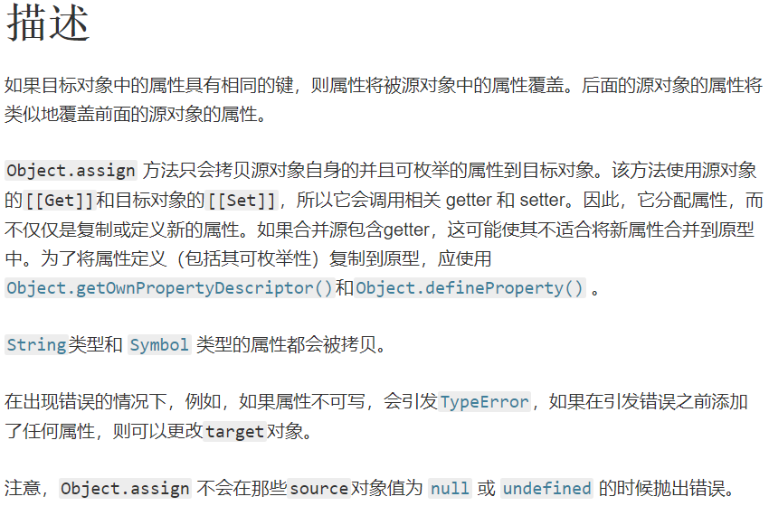

[toc]

## JS正式课第三十五天
### Object.assign()
+ Object.assign() 方法用于将所有可枚举属性的值从一个或多个源对象复制到目标对象。它将返回目标对象。
+ 语法：Object.assign(target, ...sources)
+ 参数：
	+ target   目标对象。
	+ sources 源对象。
+ 返回值： 目标对象。



> `针对深拷贝，需要使用其他办法，因为 Object.assign()拷贝的是属性值。假如源对象的属性值是一个对象的引用，那么它也只指向那个引用。`

```
const obj = { a: 1 };
const copy = Object.assign({}, obj);
console.log(copy); // { a: 1 }
```
###  跨域(源)
+ 同源策略:一种关于安全方面的约定，它是浏览器最核心也最基本的安全功能，
        如果缺少了同源策略，则浏览器的正常功能可能都会受到影响。
        Web是构建在同源策略基础之上的，浏览器只是针对同源策略的一种实现。
#### 源:
+ 协议:
	+ http/https(比http更加安全，因为在传输的时候需要进行安全证书的认证)
	+ ftp
	+ file
	+ ...
+ 域名:(IP的另一个名字)   www.baidu.com
+ 端口：80 443 8080 等等 

#### 同源:同域名、同协议、同端口
#### 跨源:不用域名、不同协议、不同端口，只要有一个不同就叫跨域

```
            https://www.baidu.com:80  我

            http://www.baidu.com:80  协议不一样=跨域

            https://www.baidu.com:81 端口不一样=跨域

            https://www.taobao.com:80 域名不一样=跨域

            https://news.baidu.com:80  跨域


            https://baidu.com
            https://blog.baidu.com   跨域
```
#### 跨域的解决方案
1.CORS
                    80端口下访问8080端口下的/kuayu接口

                    需要高版本浏览的XMLHttpRequest + 后端设置白名单

                    优点:
                        前端什么都不用做，只需要后台添加白名单即可

                    缺点:
                        低版本不兼容
2.服务器代理

                    服务器能够进行跨域请求第三方资源，服务器跨域的代码又和我端同源，就等同于我端跨域第三方资源

                    优点:前端基本不用做什么，需要自己配置第三方资源路径

                    缺点:别人变了的你也得变。

                    http://localhost:80 -> https://movie.douban.com/j/search_subjects?type=tv&tag=国产剧

3.jsonp
                    json + padding 把数据内填充

                    fn([1,2,3])
                    fn2(1,2,3)

                    function fn(a){
                        alert(a)
                    }
                    function fn2(a){
                        console.log(a)
                    }

```
<!DOCTYPE html>
<html lang="en">
<head>
    <meta charset="UTF-8">
    <title>Document</title>
</head>
<body>
    111
    <script>
        let xhr = new XMLHttpRequest;
        xhr.open('get','http://localhost:8080/kuayu?name=hh');  
        xhr.send();
        xhr.onload = function(){
            console.log(xhr.responseText)
        }  
    </script>
</body>
</html>
```

```
<!DOCTYPE html>
<html lang="en">
<head>
    <meta charset="UTF-8">
    <title>Document</title>
</head>
<body>
    111
    <script>
        let xhr = new XMLHttpRequest;
        xhr.open('get','/proxy');  
        xhr.send();
        xhr.onload = function(){
            console.log(xhr.responseText)
        }  
    </script>
</body>
</html>
```
#### jsonp
##### 有些标签天生就支持跨域
+  a href = ""
+  img src = ""
+  link href="1.css"
+  script  src=""
> `script标签会尽量解析外链资源把资源变成js代码`
##### jsonp需要哪些条件
 1.*全局*定义一个函数
 2.后端的数据要知道你定义的函数叫什么名字
 3.后端把数据放到函数调用中
 4.通过script标签发送请求 等同于函数调用,还传了参给你
#####  ajax和jsonp数据有什么区别？
+ ajax请求来的数据不带函数名加括号;jsonp请求的数据是带函数名 + 括号的
+ jsonp只能是get请求，因为走的是url; ajax请求方式可以请求jsonp数据，但是jsonp数据不能访问到ajax数据
  > `缘由：因为ajax-> xhr.responseText (fn('{"name":"zhufeng"}'))
                jsonp -> '{"name":"zhufeng"}'`
### window.open   打开一个网页
+ 必须人为手动来调用，才执行，不然会被高版本浏览器拦截
+ window.open(url,打开方式(默认新开一个窗口),控制浏览器[有兼容性问题])
+ 返回值是新打开的页面，可以使用close()
+ window.close(); 关闭浏览器

```
document.onclick = function(){
        let a =  window.open('http://baidu.com');

        setTimeout(() => {
            a.close();
        }, 3000);
        // console.log(a);
    }
```