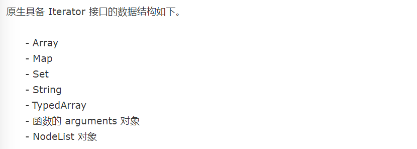
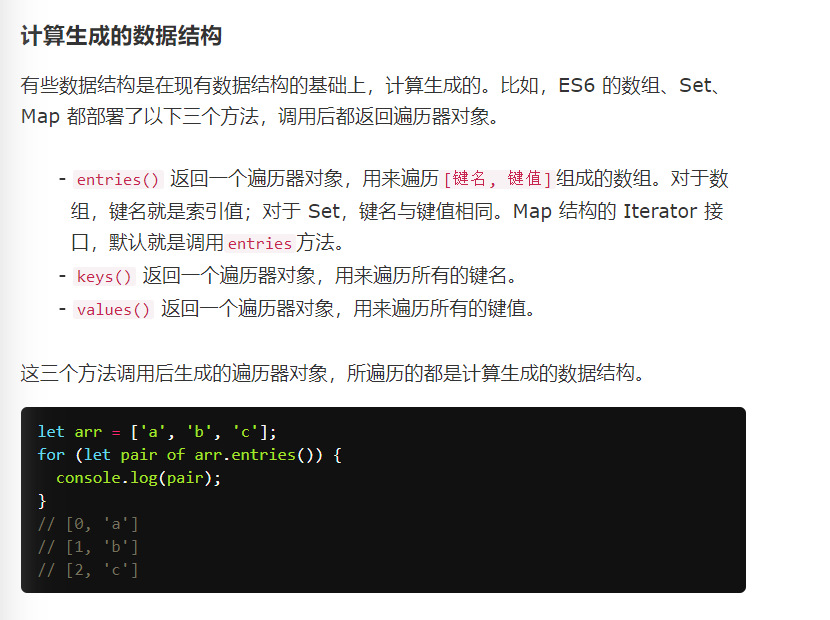

## JS正式课第三十六天
### 复习

```
ajax

        fetch()

        get:
            url的方式请求 （可暴露的）  

            www.baidu.com
            路径:
                localhost/1.html || localhost/static/1.html

            接口:
                localhost/api?user=login

            localhost/api?user=白晓

            呼叫李磊/找人?找哪个名字="白晓"

            fetch('/api?wd=山东')
            xhr.open('get','/api?wd=山东');
            $.ajax({
                url:'/api',
                data:{
                    wd:'山东'
                }
            });


         localhost


        post:
            服务端 （不可暴露）

            localhost/api/post

            send(user=白晓&pw=123)


        script src='localhost/s?wd="山东"'

        /users/
        fetch('/users/',{
            method:'POST',
            headers:{

            },
            body:''+new URLSearchParmas({
                username:'lilei',
                password:'123',
                mobile:2132435542,
                .....
            })
        })

        send('username=lilei&password=123')

        到底是get还是post，有2种方式可以得到，
            第一种:
                接口文档(有别人的代码)
            
            第二种:
                自己测
                问

        
        localhost/dasdsa
        'user=yubin'
            xhr.send('user=yubin')

        localhost/dsadas?pw=123
        

        fetch ->ES6新的api，基于promise
            get
            post

        axios -> 基于promise封装XMLHttpRequest

        axios里面拦截器，方便做些钩子处理

        XMLHttpRequest可以监听细节，监听请求过程1-4
        超时处理、abort强制中断，onabort中断监听


        XHR（浏览器自带的api） 和 axios（基于这个XHR来封装的一个js库） 区别


        网络7层协议
        http://www.ruanyifeng.com/blog/2012/05/internet_protocol_suite_part_i.html

```
### 网络七层协议（OSI七层模型） http://www.ruanyifeng.com/blog/2012/05/internet_protocol_suite_part_i.html


+ https://baike.baidu.com/item/%E7%BD%91%E7%BB%9C%E4%B8%83%E5%B1%82%E5%8D%8F%E8%AE%AE/6056879?fr=aladdin

### TCP-三次握手和四次挥手简单理解
三次握手（three-way handshaking）

1.背景：TCP位于传输层，作用是提供可靠的字节流服务，为了准确无误地将数据送达目的地，TCP协议采纳三次握手策略。

2.原理：

1）发送端首先发送一个带有SYN（synchronize）标志地数据包给接收方。

2）接收方接收后，回传一个带有SYN/ACK标志的数据包传递确认信息，表示我收到了。

3）最后，发送方再回传一个带有ACK标志的数据包，代表我知道了，表示’握手‘结束。

通俗的说法

1）Client：嘿，李四，是我，听到了吗？

2）Server：我听到了，你能听到我的吗?

3）Client：好的，我们互相都能听到对方的话，我们的通信可以开始了。


四次挥手（Four-Way-Wavehand）

1.意义：当被动方收到主动方的FIN报文通知时，它仅仅表示主动方没有数据再发送给被动方了。但未必被动方所有的数据都完整的发送给了主动方，所以被动方不会马上关闭SOCKET,它可能还需要发送一些数据给主动方后，再发送FIN报文给主动方，告诉主动方同意关闭连接，所以这里的ACK报文和FIN报文多数情况下都是分开发送的。

2.原理：

 1）第一次挥手：Client发送一个FIN，用来关闭Client到Server的数据传送，Client进入FIN_WAIT_1状态。

 2）第二次挥手：Server收到FIN后，发送一个ACK给Client，确认序号为收到序号+1（与SYN相同，一个FIN占用一个序号），Server进入CLOSE_WAIT状态。

 3）第三次挥手：Server发送一个FIN，用来关闭Server到Client的数据传送，Server进入LAST_ACK状态。

 4）第四次挥手：Client收到FIN后，Client进入TIME_WAIT状态，接着发送一个ACK给Server，确认序号为收到序号+1，Server进入CLOSED状态，完成四次挥手

通俗的说法

1）Client：我所有东西都说完了

2）Server：我已经全部听到了，但是等等我，我还没说完

3）Server：好了，我已经说完了

4）Client：好的，那我们的通信结束l


> `class Fn{} //-> function Fn
    console.log(typeof Fn); // 'function'`

### Generator 函数(参考:http://es6.ruanyifeng.com/#docs/generator)
+ 调用 Generator 函数后，该函数并不执行，返回的也不是函数运行结果， 而是一个**指向内部状态**的指针对象，也就是上一章介绍的遍历器对象（Iterator Object）
+ 总结一下，调用 Generator 函数，返回一个遍历器对象， 代表 Generator 函数的内部指针。一开始函数是不会执行的，因为它是个状态对象
+ 如何让这个Generator函数执行呢？
	+ Generator 函数的调用方法与普通函数一样，也是在函数名后面加上一对圆括号。不同的是，调用 Generator 函数后，该函数并不执行，返回的也不是函数运行结果，而是一个指向内部状态的指针对象，也就是上一章介绍的遍历器对象（Iterator Object）。
	+ 下一步，必须调用遍历器对象的next方法，使得指针移向下一个状态。也就是说，每次调用next方法，内部指针就从函数头部或上一次停下来的地方开始执行，直到遇到下一个yield表达式（或return语句）为止。换言之，Generator 函数是分段执行的，yield表达式是暂停执行的标记，而next方法可以恢复执行。
   + 每次调用遍历器对象的next方法，就会返回一个有着value和done两个属性的对象。
        {value:xx,done:false}
   + value属性表示当前的内部状态的值，是yield或者return表达式后面那个表达式的值；done属性是一个布尔值，表示是否遍历结束,false代表没结束，true代表结束了
+ yield表达式本身没有返回值，或者说总是返回undefined。next方法可以带一个参数，该参数就会被当作上一个yield表达式的返回值。
+ for...of 循环   for...of循环可以自动遍历 Generator 函数运行时生成的Iterator对象，且此时不再需要调用next方法。
+ yield* 表达式    
	+ 如果在 Generator 函数内部，调用另一个 Generator 函数。需要在前者的函数体内部，自己手动完成遍历。
	+ ES6 提供了yield*表达式，作为解决办法，用来在一个 Generator 函数里面执行另一个 Generator 函数。

```
    <script>
    function* fn() {
        console.log('请求之前');
        let res = yield request('./sleep?user=lilei');
        console.log('已拿到数据' + res);
        console.log('请求之后');
    }

    let f = fn();
    document.onclick = function() {
        f.next();
    }

    function request(url) {
        let xhr = new XMLHttpRequest;
        xhr.open('get',url);
        xhr.send();
        xhr.onload = function() {
            f.next(xhr.responseText);
        }
    }

    /* 
    以上代码输出顺序为：'请求之前'   5s之后'已拿到数据{"code":1,"msg":"没有介个银!"}'   最后'请求之后'
     */
    </script>
```

### onabort  当网络中断的时候触发
+  xhr.abort()  强行中断

```
let xhr = null;
        send.onclick = function(){
            xhr = new XMLHttpRequest;
            xhr.open('get','/sleep?name=lilei');
            xhr.send();
            xhr.onload = function(){
                console.log(xhr.responseText);
            }
            xhr.onabort = function(){
                console.log('触发')
            }
        }
        abort.onclick = function(){
            xhr.abort();
        }
```

### async函数(它就是 Generator 函数的语法糖。)
+ async函数就是将 Generator 函数的星号（*）替换成async，将yield替换成await，仅此而已。
+ async函数对 Generator 函数的改进，体现在以下四点。
	+ 内置执行器: Generator 函数的执行必须靠执行器，所以才有了co模块，而async函数自带执行器。也就是说，async函数的执行，与普通函数一模一样，只要一行。
	+ 更好的语义: async和await，比起星号和yield，语义更清楚了。async表示函数里有异步操作，await表示紧跟在后面的表达式需要等待结果。
	+ 更广的适用性: co模块约定，yield命令后面只能是 Thunk 函数或 Promise 对象，而async函数的await命令后面，可以是 Promise 对象和原始类型的值（数值、字符串和布尔值，但这时会自动转成立即 resolved 的 Promise 对象）
	+ 返回值是 Promise: async函数的返回值是 Promise 对象，这比 Generator 函数的返回值是 Iterator 对象方便多了。你可以用then方法指定下一步的操作。
+ 基本用法： async函数返回一个 Promise 对象，可以使用then方法添加回调函数。当函数执行的时候，一旦遇到await就会先返回，等到异步操作完成，再接着执行函数体内后面的语句。
```
     document.onclick = async function fn(){
        console.log('请求之前');
        //唯一要注意的是，await后面必须是个promise对象
        let res = await fetch('/sleep?user=123').then(e=>e.text());
        console.log('拿到数据'+res);
        console.log('请求之后');
    }
```
### Iterator 和 for...of 循环
+  统一的遍历api   for...of
+  一个数据结构只要部署了Symbol.iterator属性， 就被视为具有 iterator 接口，就可以用for...of循环遍历它的成员。
+  也就是说，for...of循环内部调用的是数据结构的Symbol.iterator方法。
+  要遍历key ->  ary.keys()
+  要遍历value -> ary.values()
+  都要遍历 -> ary.entries()
+  字符串，数组，Map，Set,querySelectorAll都有Symbol.iterator
+  对象没有遍历接口，但是可以添加一个遍历接口
+  关于（Symbol.iterator） Iterator 的作用有三个：一是为各种数据结构，提供一个统一的、简便的访问接口；二是使得数据结构的成员能够按某种次序排列；三是 ES6 创造了一种新的遍历命令for...of循环，Iterator 接口主要供for...of消费。





```
    <script>
    let ary = [1,2,3];

    for(let i of ary.values()) {
        console.log(i);// 1 2   3
    }

    for(let [k,v] of ary.entries()) {
        console.log(k,v);// 0 1    1  2     2 3
    }
    </script>
```

#### 为普通对象封装一个遍历接口

```
   <script>
        Object.prototype[Symbol.iterator] = function () {
            let ary = Object.keys(this); // ['name','age','sex']
            let len = ary.length; // 获取到keys的长度，即循环的次数
            let index = 0;// 从0开始循环
            let that = this;
            return {
                next() {
                    if (index < len) {// 只要index小于对象的keys的length就继续循环
                        return {
                            //把对象的key和val通过value传到外面
                            value: {
                                key: ary[index],
                                val: that[ary[index++]]
                            },
                            done: false  // 只要没有循环完就为false
                        }
                    } else {
                        // 循环完之后就把done的值设为true

                        return {
                            value: undefined,
                            done: true
                        }
                    }
                }
            }
        }

        let obj2 = {
            name2: '哈哈'
        }

        for (let { key, val } of obj2) {
            console.log(key, val); // name2 哈哈
        }
    </script>
```

