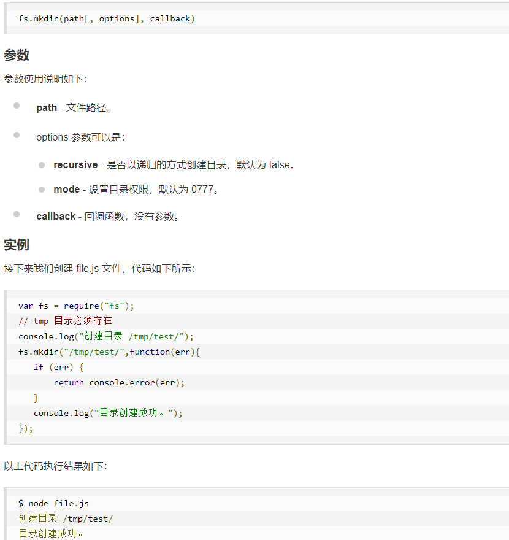
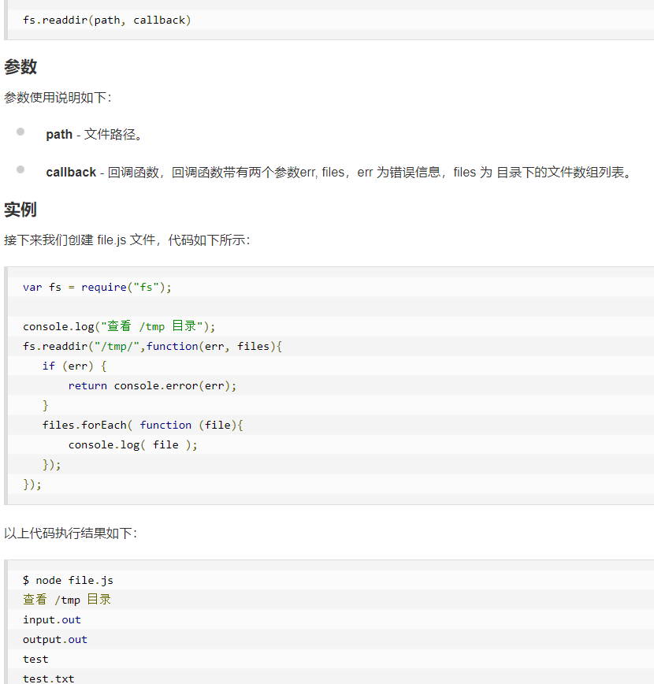
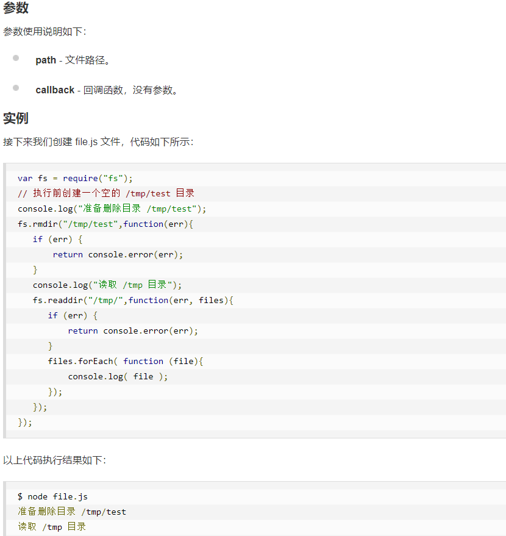

[toc]

## JS正式课第三十八天

### Node.js  web模块
####  writeHead:设置响应头

```
  第一个参数:状态码
  第二个参数:
      {
          配置响应信息
      }
```

### Node.js 文件系统模块
#### mkdir 创建文件夹


#### readdir  读取文件夹


```
fs.readdir(path,(error,filesAry)=>{

    })
```
#### fs.rmdir(path, callback)  删除文件夹


#### fs.rename(oldPath, newPath, callback)  文件夹重命名

### Node.js   url模块    url 模块用于处理与解析 URL

### Node.js  querystring模块   
+ querystring 模块提供用于解析和格式化 URL 查询字符串的实用工具

### Node.js Express 框架
+ http://www.expressjs.com.cn/
+ 安装：  npm install express -S
+ 引入模块：const express = require('express');
+ Express 应用使用回调函数的参数： request 和 response 对象来处理请求和响应的数据。
+ 

```
app.get('/', function (req, res) {
   // --
})
```

```
request 和 response 对象的具体介绍：

Request 对象 - request 对象表示 HTTP 请求，包含了请求查询字符串，参数，内容，HTTP 头部等属性。常见属性有：

req.app：当callback为外部文件时，用req.app访问express的实例
req.baseUrl：获取路由当前安装的URL路径
req.body / req.cookies：获得「请求主体」/ Cookies
req.fresh / req.stale：判断请求是否还「新鲜」
req.hostname / req.ip：获取主机名和IP地址
req.originalUrl：获取原始请求URL
req.params：获取路由的parameters
req.path：获取请求路径
req.protocol：获取协议类型
req.query：获取URL的查询参数串
req.route：获取当前匹配的路由
req.subdomains：获取子域名
req.accepts()：检查可接受的请求的文档类型
req.acceptsCharsets / req.acceptsEncodings / req.acceptsLanguages：返回指定字符集的第一个可接受字符编码
req.get()：获取指定的HTTP请求头
req.is()：判断请求头Content-Type的MIME类型
Response 对象 - response 对象表示 HTTP 响应，即在接收到请求时向客户端发送的 HTTP 响应数据。常见属性有：

res.app：同req.app一样
res.append()：追加指定HTTP头
res.set()在res.append()后将重置之前设置的头
res.cookie(name，value [，option])：设置Cookie
opition: domain / expires / httpOnly / maxAge / path / secure / signed
res.clearCookie()：清除Cookie
res.download()：传送指定路径的文件
res.get()：返回指定的HTTP头
res.json()：传送JSON响应
res.jsonp()：传送JSONP响应
res.location()：只设置响应的Location HTTP头，不设置状态码或者close response
res.redirect()：设置响应的Location HTTP头，并且设置状态码302
res.render(view,[locals],callback)：渲染一个view，同时向callback传递渲染后的字符串，如果在渲染过程中有错误发生next(err)将会被自动调用。callback将会被传入一个可能发生的错误以及渲染后的页面，这样就不会自动输出了。
res.send()：传送HTTP响应
res.sendFile(path [，options] [，fn])：传送指定路径的文件 -会自动根据文件extension设定Content-Type
res.set()：设置HTTP头，传入object可以一次设置多个头
res.status()：设置HTTP状态码
res.type()：设置Content-Type的MIME类型
```
#### 请求和响应
+ Express 应用使用回调函数的参数： request 和 response 对象来处理请求和响应的数据。

```
app.get('/', function (req, res) {
   // --
})
```
#### 静态文件
+ Express 提供了内置的中间件 express.static 来设置静态文件如：图片， CSS, JavaScript 等。

```
你可以使用 express.static 中间件来设置静态文件路径。例如，如果你将图片， CSS, JavaScript 文件放在 public 目录下，你可以这么写：

app.use('/public', express.static('public'));
我们可以到 public/images 目录下放些图片,如下所示：

node_modules
server.js
public/
public/images
public/images/logo.png
```

### Express中间件body-parser
+ 在http请求中，POST、PUT、PATCH三种请求方法中包含着请求体，也就是所谓的request，在Nodejs原生的http模块中，请求体是要基于流的方式来接受和解析。
+ body-parser是一个HTTP请求体解析的中间件，使用这个模块可以解析JSON、Raw、文本、URL-encoded格式的请求体

```
body-parser 用法
 

1、下载 body-parser 模块  ：   npm install body-parser  

 

2、require body-parser 模块（引入），并用一个变量接收（此处栗子变量为 bodyparser）

 

3、将 bodyparser 注册为中间件

 

 

const express = require('express')
// 在此处 require body-parser 模块
const bodyparser = require('body-parser')

const app = express()
app.listen(3001, () => console.log('app is running...'))

// 在此处 use 这个 bodyparser 中间件
app.use(bodyparser.urlencoded({ extended: false }))
```