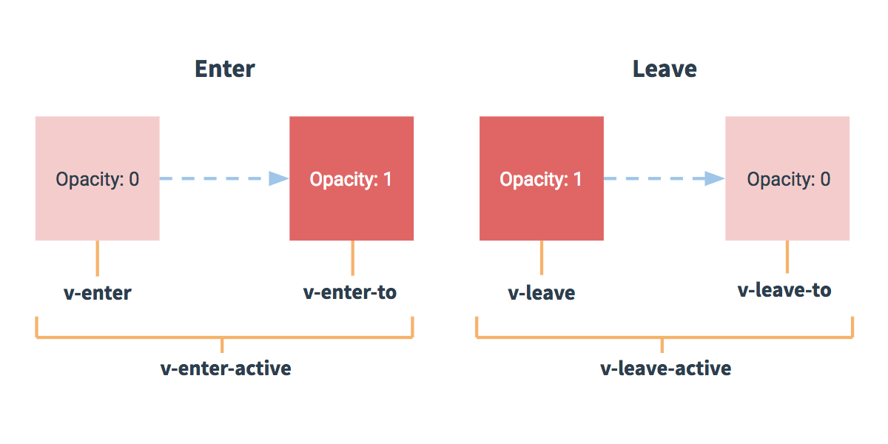

[toc]

## JS正式课第四十六天
### Vue

    - jquery    52.8k
    - angular   55.8k
    - React     141k
    - vue       155k
        - MVVM框架  Model View  View Model(双向数据绑定)
        - M-model数据，V-view视图  C-控制器control

        - 难点:父子组件的传递,路由配置和使用,生命周期,vuex,**逻辑**,做项目

> https://cn.vuejs.org/

- 渐进式（弱主张，逐渐学习的，有过程的学习，vue全家桶:vue,vue-router,vuex,vue-cli）：JavaScript 框架

### 使用vue
    - 引vue
    - 在html里挂载一个根元素
        ```
            <div id="app"></div>
        ```
    - 实例化vue  -> new Vue({})

    - 配置参数
        - el:'挂载元素'（不能挂body和html）,
        - data（存数据）:在**new Vue**下值为***对象***
        - 在组件里面data为函数，函数要return {num:0}

    - 输出数据用 双花括号 {{放数据名称即可}} 小胡子

### 指令
    - 为了方便开发者开发，vue中使用了指令，这些指令包含了很多元素身上的属性和js的一些内置方法

    v-text  ----> innerText
    v-html  ----> innerHTML
    v-show  ----> display:block/none  布尔值
    v-if  看下布尔值是否为true，为true就渲染否则就不渲染
    v-else 限制:它上面必须是v-if或者v-else-if
    v-else-if 限制：前一兄弟元素必须有 v-if 或 v-else-if。
    v-on:（缩写@）事件名="事件函数|简单语法"
        一般事件函数是放在methods下
        - $event  
            如果不传参，第一个参数就是事件对象
            *** 如果传了参还想拿到事件对象，需要在模板中的事件函数内传一个
        - 修饰符  .13  .enter .stop  .prevent .once ...
        - 解绑事件可以使用
            ```
                @mousedown="onoff && down($event)"
                当onoff是真的就添加事件，假的就解除事件
            ```

    v-for="val,key in 数据"  遍历对象或者数组
        如果是数组val就是数组的成员，key就是索引
        如果是对象val键值，key键名

### filter过滤器
    Vue.filter('名字',(val)=>{
        return val.xxx
    })

    {{ val | '名字' }}


> 局部:
    - new Vue({filters:{
        名字:(val){

        }
    }})

### computed  计算属性（通过data中的数据变化进行二次操作且一上来就执行一次）
    ```
        computed:{
            //getter
            revers(){
                return xxx
            }

            revers:{
                get(){
                    return  xxx
                },
                set(){

                }
            }
        }
    ```
    - getter
    - setter

### watch 通过data中的**指定**数据变化进行二次操作
    ```
        watch:{
            //默认不会深度监听
            ary(){
                xxx
            },
            ary:{
                handler(){

                },
                deep:true   //深度监听
                immediate: true  //一上来就触发
            }
        }
    ```

### ref 为了快速定位元素或者组件
    ```
        <ppa ref="xx">

        this.$refs.xx
    ```

### 组件
    ```
        //放在new Vue上方
        Vue.component('组件名',{
            template:``,  注意的是顶层只能有一个元素
            data(){
                return {
                    ary:[]
                }
            }
        })


        {
            components:{
                组件名:对象
            }
        }

    ```
### 组件的传递
    ```
        传递:
            通过子组件的属性来传
            <div num="3"></div>（静态的） 或者
            <div :num="pnum"></div>（动态的）

        接收:
            {
                props:['num']
            }
    ```

    在父级传递数据给自己的时候，可以让自己拥有父级的数据并且不与父级数据相关联
        1.通过子组件的属性来传
            <div :num="pnum"></div>（动态的）

        2.使用props接收
            {
                props:['num']
            }

        3.把接收过来的数据变成自己的
            {
                props:['num'],
                data(){
                    return {
                        cnum:this.num
                    }
                }
            }


    ```
        子传父:
            1.父级需要定义一个改变自己数据的方法
            2.子级需要定义一个事件，去调用父级的方法
                this.$emit('自定义事件名',可以传参)
            3.在子组件的行间绑定子级的事件，值为父级的修改数据的方法
    ```

### Vue.nextTick  数据改变，DOM更新完成之后触发

### vue中的provide和inject

```
浅析
provide 和 inject 主要为高阶插件/组件库提供用例。并不推荐直接用于应用程序代码中。

定义说明：这对选项是一起使用的。以允许一个祖先组件向其所有子孙后代注入一个依赖，不论组件层次有多深，并在起上下游关系成立的时间里始终生效。

通俗的说就是：组件得引入层次过多，我们的子孙组件想要获取祖先组件得资源，那么怎么办呢，总不能一直取父级往上吧，而且这样代码结构容易混乱。这个就是这对选项要干的事情。

provide：是一个对象，或者是一个返回对象的函数。里面呢就包含要给子孙后代的东西，也就是属性和属性值。

inject：一个字符串数组，或者是一个对象。属性值可以是一个对象，包含from和default默认值。
```

```
<!DOCTYPE html>
<html lang="en">
<head>
    <meta charset="UTF-8">
    <meta name="viewport" content="width=device-width, initial-scale=1.0">
    <meta http-equiv="X-UA-Compatible" content="ie=edge">
    <title>Document</title>
</head>
<body>
    <div id="app">
         <chil></chil>
    </div>
    <template id="chil">
        <div>{{ary2}}</div>
    </template>
<script src="./vue.js"></script>
<script src="./chil.js"></script>
<script>
   /*
        <ppa :data="ary">  官推
        {
            props:['data']
        }

        父组件:
        provide:{
            ary2:[1,2,3]
        }
        子组件:
        inject:['ary2']


        this.$parent拿到父级的实例，可以通过实例获取父级的数据

    */
   new Vue({
       el:"#app",
       components:{
           chil,
       },
       data:{
          num:102,
       },
       provide:{
           ary2:[1,2,3]
       }
       
    })
</script>
</body>
</html>
```

```
const chil = {
    template:'#chil',
    created() {
        /*
            this.$parent拿到父级的实例
            可以通过实例获取父级的数据
        */
       console.log(this.$parent.num); // 102
    },
    inject:['ary2']
}
```

###  插槽 vlot
+  在开发中写什么结构就是什么结构，优点就是固定统一，缺点就是不够灵活；就是为了解决不灵活的问题，能够自定义一些组件，能够替换之前默认的配置

#### 匿名插槽
+  子组件中定义slot
+  父组件中给调用的子组件双标签内填入结构
+  这个时候slot就被填入结构覆盖

```
<!DOCTYPE html>
<html lang="en">

<head>
    <meta charset="UTF-8">
    <meta name="viewport" content="width=device-width, initial-scale=1.0">
    <meta http-equiv="X-UA-Compatible" content="ie=edge">
    <title>Document</title>
    <style>
        .box {
            width: 100px;
            height: 100px;
            background: hotpink;
        }

        .box2 {
            width: 100px;
            height: 100px;
            background: skyblue;
        }
    </style>
</head>

<body>
  <div id="app">
     <chil>
        <div class="box2">我们是害虫</div>
     </chil>
  </div>
  <template id="chil">
      <div>
          <slot>
              <div class="box"></div>
          </slot>
      </div>
  </template>
  <script src="./vue.js"></script>
   <script>
   const chil = {
       template:'#chil',

   }
   new Vue ({
       el:'#app',
       components:{
           chil,
       }
   })
   </script>
</body>

</html>
```

#### 具名插槽
+ 在slot标签中设置一个name属性，值为随意
+ 在插入替换内容的时候，在替换标签中定义一个slot的属性值和要替换的name对应

```
<!DOCTYPE html>
<html lang="en">

<head>
    <meta charset="UTF-8">
    <meta name="viewport" content="width=device-width, initial-scale=1.0">
    <meta http-equiv="X-UA-Compatible" content="ie=edge">
    <title>Document</title>
</head>

<body>
    <div id="app">
        <chil>
            <div slot="footer">我有八只脚</div>
            <div slot="body">我身长八丈</div>
            <div slot="head">我有九颗头颅</div>
        </chil>
    </div>
    <template id="chil">
        <div>
            <slot name="head">
                <div class="head">头部</div>
            </slot>
            <slot name="body">
                <div class="body">身体</div>
            </slot>
            <slot name="footer">
                <div class="footer">脚</div>
            </slot>
        </div>
    </template>
    <script src="./vue.js"></script>
    <script>
        const chil = {
            template: '#chil',
        }
        new Vue({
            el: '#app',
            components: {
                chil,
            }
        })
    </script>
</body>

</html>
```

#### 作用域插槽

```
在子级的slot中
1.定义一个name="唯一个标识符"
2.通过v-bind去传入使用的数据

在父级template中
1.v-slot:name标识符 = "自定义的名字"
    ** v-slot可以缩写为#
2.使用自定义的名字.xx

<slot name="cc" :age="index" >

<template #cc="cdata">
{{cdata.age}}
</template>
```

```
<!DOCTYPE html>
<html lang="en">
<head>
    <meta charset="UTF-8">
    <meta name="viewport" content="width=device-width, initial-scale=1.0">
    <meta http-equiv="X-UA-Compatible" content="ie=edge">
    <title>Document</title>
</head>
<body>
    <div id="app">
        <chil :data='ary'>
            <!-- <template v-slot:cdata = "childrenData"> -->
            <template #cdata = "childrenData">
                <!-- childrenData -->
                <h2>我的名字是：{{childrenData.nn}}</h2>
                <p>我的年龄是：{{childrenData.age}}</p>
                <p>我的编号是：{{childrenData.id}}</p>
            </template>
        </chil>
    </div>
    <template id="chil">
        <div>
            <ul>
                <li v-for="(val,key) in data" :key="val.id">
                    <slot
                     name="cdata"
                     :nn="val.name"
                     :age="val.age"
                     :id="val.id"
                    >{{val.name}}</slot
                    >
                </li>
            </ul>
        </div>
    </template>
    <script src="./vue.js"></script>
    <script>
    const chil = {
       template:'#chil',
          props:['data'],
    }; 
    new Vue({
        el:'#app',
        data:{
           ary:[
             {
                 id:0,
                 name:'小李',
                 age:18,
             },
             {
                 id:1,
                 name:'老田',
                 age:20,
             },
             {
                 id:2,
                 name:'老妖',
                 age:22
             }
           ],
        },
        components:{
            chil
        }, 
    })
    </script>
</body>
</html>
```

### transition  过渡动画

```
Props：

name - string，用于自动生成 CSS 过渡类名。例如：name: 'fade' 将自动拓展为.fade-enter，.fade-enter-active等。默认类名为 "v"
appear - boolean，是否在初始渲染时使用过渡。默认为 false。
css - boolean，是否使用 CSS 过渡类。默认为 true。如果设置为 false，将只通过组件事件触发注册的 JavaScript 钩子。
type - string，指定过渡事件类型，侦听过渡何时结束。有效值为 "transition" 和 "animation"。默认 Vue.js 将自动检测出持续时间长的为过渡事件类型。
mode - string，控制离开/进入的过渡时间序列。有效的模式有 "out-in" 和 "in-out"；默认同时生效。
duration - number | { enter: number, leave: number } 指定过渡的持续时间。默认情况下，Vue 会等待过渡所在根元素的第一个 transitionend 或 animationend 事件。
enter-class - string
leave-class - string
appear-class - string
enter-to-class - string
leave-to-class - string
appear-to-class - string
enter-active-class - string
leave-active-class - string
appear-active-class - string
事件：

before-enter
before-leave
before-appear
enter
leave
appear
after-enter
after-leave
after-appear
enter-cancelled
leave-cancelled (v-show only)
appear-cancelled
用法：

<transition> 元素作为单个元素/组件的过渡效果。<transition> 只会把过渡效果应用到其包裹的内容上，而不会额外渲染 DOM 元素，也不会出现在检测过的组件层级中。

<!-- 简单元素 -->
<transition>
  <div v-if="ok">toggled content</div>
</transition>

<!-- 动态组件 -->
<transition name="fade" mode="out-in" appear>
  <component :is="view"></component>
</transition>

<!-- 事件钩子 -->
<div id="transition-demo">
  <transition @after-enter="transitionComplete">
    <div v-show="ok">toggled content</div>
  </transition>
</div>
new Vue({
  ...
  methods: {
    transitionComplete: function (el) {
      // 传入 'el' 这个 DOM 元素作为参数。
    }
  }
  ...
}).$mount('#transition-demo')
```
#### 进入/离开 & 列表过渡
+ 参考： https://cn.vuejs.org/v2/guide/transitions.html

##### 概述
Vue 在插入、更新或者移除 DOM 时，提供多种不同方式的应用过渡效果。
包括以下工具：

+ 在 CSS 过渡和动画中自动应用 class
+ 可以配合使用第三方 CSS 动画库，如 Animate.css
+ 在过渡钩子函数中使用 JavaScript 直接操作 DOM
+ 可以配合使用第三方 JavaScript 动画库，如 Velocity.js

##### 单元素/组件的过渡
+ Vue 提供了 transition 的封装组件，在下列情形中，可以给任何元素和组件添加进入/离开过渡
	+ 条件渲染 (使用 v-if)
	+ 条件展示 (使用 v-show)
	+ 动态组件
	+ 组件根节点

```
<div id="demo">
  <button v-on:click="show = !show">
    Toggle
  </button>
  <transition name="fade">
    <p v-if="show">hello</p>
  </transition>
</div>
new Vue({
  el: '#demo',
  data: {
    show: true
  }
})
.fade-enter-active, .fade-leave-active {
  transition: opacity .5s;
}
.fade-enter, .fade-leave-to /* .fade-leave-active below version 2.1.8 */ {
  opacity: 0;
}
```

```
当插入或删除包含在 transition 组件中的元素时，Vue 将会做以下处理：

自动嗅探目标元素是否应用了 CSS 过渡或动画，如果是，在恰当的时机添加/删除 CSS 类名。

如果过渡组件提供了 JavaScript 钩子函数，这些钩子函数将在恰当的时机被调用。

如果没有找到 JavaScript 钩子并且也没有检测到 CSS 过渡/动画，DOM 操作 (插入/删除) 在下一帧中立即执行。(注意：此指浏览器逐帧动画机制，和 Vue 的 nextTick 概念不同)
```

##### 过渡的类名

```
在进入/离开的过渡中，会有 6 个 class 切换。

v-enter：定义进入过渡的开始状态。在元素被插入之前生效，在元素被插入之后的下一帧移除。

v-enter-active：定义进入过渡生效时的状态。在整个进入过渡的阶段中应用，在元素被插入之前生效，在过渡/动画完成之后移除。这个类可以被用来定义进入过渡的过程时间，延迟和曲线函数。

v-enter-to: 2.1.8版及以上 定义进入过渡的结束状态。在元素被插入之后下一帧生效 (与此同时 v-enter 被移除)，在过渡/动画完成之后移除。

v-leave: 定义离开过渡的开始状态。在离开过渡被触发时立刻生效，下一帧被移除。

v-leave-active：定义离开过渡生效时的状态。在整个离开过渡的阶段中应用，在离开过渡被触发时立刻生效，在过渡/动画完成之后移除。这个类可以被用来定义离开过渡的过程时间，延迟和曲线函数。

v-leave-to: 2.1.8版及以上 定义离开过渡的结束状态。在离开过渡被触发之后下一帧生效 (与此同时 v-leave 被删除)，在过渡/动画完成之后移除。
```


```
对于这些在过渡中切换的类名来说，如果你使用一个没有名字的 <transition>，则 v- 是这些类名的默认前缀。如果你使用了 <transition name="my-transition">，那么 v-enter 会替换为 my-transition-enter。

v-enter-active 和 v-leave-active 可以控制进入/离开过渡的不同的缓和曲线
```

```
CSS 过渡
常用的过渡都是使用 CSS 过渡。

下面是一个简单例子：

<div id="example-1">
  <button @click="show = !show">
    Toggle render
  </button>
  <transition name="slide-fade">
    <p v-if="show">hello</p>
  </transition>
</div>
new Vue({
  el: '#example-1',
  data: {
    show: true
  }
})
/* 可以设置不同的进入和离开动画 */
/* 设置持续时间和动画函数 */
.slide-fade-enter-active {
  transition: all .3s ease;
}
.slide-fade-leave-active {
  transition: all .8s cubic-bezier(1.0, 0.5, 0.8, 1.0);
}
.slide-fade-enter, .slide-fade-leave-to
/* .slide-fade-leave-active for below version 2.1.8 */ {
  transform: translateX(10px);
  opacity: 0;
}

CSS 动画
CSS 动画用法同 CSS 过渡，区别是在动画中 v-enter 类名在节点插入 DOM 后不会立即删除，而是在 animationend 事件触发时删除。

示例：(省略了兼容性前缀)

<div id="example-2">
  <button @click="show = !show">Toggle show</button>
  <transition name="bounce">
    <p v-if="show">Lorem ipsum dolor sit amet, consectetur adipiscing elit. Mauris facilisis enim libero, at lacinia diam fermentum id. Pellentesque habitant morbi tristique senectus et netus.</p>
  </transition>
</div>
new Vue({
  el: '#example-2',
  data: {
    show: true
  }
})
.bounce-enter-active {
  animation: bounce-in .5s;
}
.bounce-leave-active {
  animation: bounce-in .5s reverse;
}
@keyframes bounce-in {
  0% {
    transform: scale(0);
  }
  50% {
    transform: scale(1.5);
  }
  100% {
    transform: scale(1);
  }
}
```
###### 自定义过渡的类名

```
我们可以通过以下特性来自定义过渡类名：

enter-class
enter-active-class
enter-to-class (2.1.8+)
leave-class
leave-active-class
leave-to-class (2.1.8+)
他们的优先级高于普通的类名，这对于 Vue 的过渡系统和其他第三方 CSS 动画库，如 Animate.css 结合使用十分有用。

示例：

<link href="https://cdn.jsdelivr.net/npm/animate.css@3.5.1" rel="stylesheet" type="text/css">

<div id="example-3">
  <button @click="show = !show">
    Toggle render
  </button>
  <transition
    name="custom-classes-transition"
    enter-active-class="animated tada"
    leave-active-class="animated bounceOutRight"
  >
    <p v-if="show">hello</p>
  </transition>
</div>
new Vue({
  el: '#example-3',
  data: {
    show: true
  }
})

同时使用过渡和动画
Vue 为了知道过渡的完成，必须设置相应的事件监听器。它可以是 transitionend 或 animationend ，这取决于给元素应用的 CSS 规则。如果你使用其中任何一种，Vue 能自动识别类型并设置监听。

但是，在一些场景中，你需要给同一个元素同时设置两种过渡动效，比如 animation 很快的被触发并完成了，而 transition 效果还没结束。在这种情况中，你就需要使用 type 特性并设置 animation 或 transition 来明确声明你需要 Vue 监听的类型。
```
##### 相关实例
###### 实例1

```
<!DOCTYPE html>
<html lang="en">

<head>
    <meta charset="UTF-8">
    <meta name="viewport" content="width=device-width, initial-scale=1.0">
    <meta http-equiv="X-UA-Compatible" content="ie=edge">
    <title>Document</title>
    <style>
        * {
            margin: 0;
            padding: 0;
        }

        .shadow {
            width: 100vw;
            height: 100vh;
            position: absolute;
            top: 0;
            left: 0;
            z-index: 0;
            background: rgba(0, 0, 0, .5);
        }

        /* .tk-box {
            position: relative;
        } */

        #box {
            width: 400px;
            height: 200px;
            border-radius: 20px;
            background: white;
            display: flex;
            justify-content: center;
            /* align-items: flex-end; */
            position: absolute;
            z-index: 99999;
            left:0;
            top:0;
            right:0;
            bottom:0;
            margin: auto;
            box-shadow: 1px 1px 1px rgba(0, 0, 0, .5);
        }

        .btns {
            position: absolute;
            bottom: 0;
        }

        .txt {
            width: 300px;
            height: 150px;
            display: flex;
            flex-direction: column;
            justify-content: center;
            align-items: center;
        }
    </style>
</head>

<body>
    <div id="app">
        <button @click="changeOnoff">点击</button>
        <transition name="n" @before-enter="beforeEnter" @enter="enter" @after-enter="afterEnter"
            @before-leave="beforeLeave" @leave="leave" @after-leave="afterLeave">
            <!-- appear - boolean，是否在初始渲染时使用过渡。默认为 false。 -->
            <chil v-show="onoff" :chiloff='onoff' @conff="changeOnoff">
                <template slot="content">
                    <p>Hello</p>
                    <p>This is beautiful world!</p>
                </template>
            </chil>
        </transition>
        <div class="shadow" v-show="onoff"></div>
    </div>
    <template id="chil">
        <div class="tk-box">
            <div id="box">
                <div class="txt">
                    <slot name="content"></slot>
                </div>
                <div class="btns">
                    <button @click="off">确定</button>
                    <button @click="off">取消</button>
                </div>
            </div>
        </div>
    </template>
    <script src="./vue.js"></script>
    <script>
        const chil = {
            template: '#chil',
            props: ['chiloff'],
            methods: {
                off() {
                    this.$emit('conff');
                }
            }
        }
        new Vue({
            el: '#app',
            data: {
                onoff: false,
            },
            methods: {
                changeOnoff() {
                    this.onoff = !this.onoff;
                },
                beforeEnter(ele) {
                    ele.style.position = 'relative';
                    ele.style.zIndex = 999;
                    ele.style.transiton = '.5s';
                    ele.style.transform = 'translateY(0)';
                },
                enter(ele) {
                    ele.style.zIndex = 999;
                    ele.offsetLeft;// dom元素刚生成未能即使渲染，导致过度失效，所以主动触发页面回流（重绘），刷新DOM；更改 offsetTop、offsetLeft、 offsetWidth、offsetHeight；scrollTop、scrollLeft、scrollWidth、scrollHeight；clientTop、clientLeft、clientWidth、clientHeight；getComputedStyle() 、currentStyle（）。这些都会触发回流。回流导致DOM重新渲染，平时要尽可能避免，但这里，为了动画即时生效播放，则主动触发回流，刷新DOM。
                    ele.style.transition = '.5s';
                    ele.style.transform = 'translateY(200px)';
                },
                afterEnter(ele) {

                },
                beforeLeave(ele) {
                    ele.style.position = 'relative';
                    ele.style.zIndex = 999;
                    ele.style.transform = 'translateY(200px)';
                },
                leave(ele) {
                    ele.offsetLeft;
                    ele.style.transition = '.5s';
                    ele.style.transform = 'translateY(-200px)';
                },
                afterLeave(ele) {

                }
            },
            components: {
                chil
            }
        })
    </script>
</body>

</html>
```
###### 实例2

```
<!DOCTYPE html>
<html lang="en">
<head>
    <meta charset="UTF-8">
    <meta name="viewport" content="width=device-width, initial-scale=1.0">
    <meta http-equiv="X-UA-Compatible" content="ie=edge">
    <title>Document</title>
    <style>
    * {
        margin: 0;
        padding:0;
    }
    /* 初始位置 */
    .v-enter,.v-leave-to{
        opacity: 0;
        transform:translateX(300px);
    }
    /* 运动过程 */
    .v-enter-active,.v-leave-active{
        transition: .5s;
    }
    /* 结束 */
    .v-enter-to,.v-leave {
        opacity: 1;
        transform: translateX(0);
    }

    /* 自定义的是"my-"开头 */
    /* 初始位置 */
    .my-enter,.my-leave-to{
        opacity: 0;
        transform:translateY(300px);
    }
    /* 运动过程 */
    .my-enter-active,.my-leave-active{
        transition: .5s;
    }
    /* 结束 */
    .my-enter-to,.my-leave {
        opacity: 1;
        transform: translateY(0);
    }
    </style>
</head>
<body>
    <div id="app">
        <button @click="onoff = !onoff">点击</button>
        <transition>
            <chil v-show="onoff"></chil>
        </transition>
        <hr />
        <button @click="onoff2 = !onoff2">点击</button>
        <transition name="my">
            <div v-show="onoff2">我是一个大魔王</div>
        </transition>
         <!-- 可以设置一个name属性，让我们能够自定义css动画 -->
    </div>
    <template id="chil">
        <div>你是个小二逼</div>
    </template>
    <script src="./vue.js"></script>
     <script>
         const chil = {
             template:'#chil'
         }
     new Vue({
         el:'#app',
         data:{
             onoff:false,
             onoff2:false,
         },
         components:{
             chil,
         }
     })
     </script>
</body>
</html>
```
###### 实例3

```
<!DOCTYPE html>
<html lang="en">

<head>
    <meta charset="UTF-8">
    <meta name="viewport" content="width=device-width, initial-scale=1.0">
    <meta http-equiv="X-UA-Compatible" content="ie=edge">
    <title>Document</title>
    <style>
        * {
            margin: 0;
            padding: 0;
        }

        #box {
            width: 20px;
            height: 20px;
            background-color: skyblue;
            border-radius: 50%;
        }
    </style>
</head>

<body>
    <div id="app">
        <button @click="onoff = !onoff">点击</button>
        <transition @before-enter="beforeEnter" @enter="enter" @after-enter="afterEnter">
            <chil v-show="onoff"></chil>
        </transition>
    </div>
    <template id="chil">
        <div id="box"></div>
    </template>
    <script src="./vue.js"></script>
    <script>
        const chil = {
            template: '#chil'
        }
        new Vue({
            el: '#app',
            data: {
                onoff: false,
                onoff2: false,
            },
            methods:{
            beforeEnter(ele){
                ele.style.opacity = '1';
                ele.style.transform = 'translate(0,0)';
            },
            enter(ele,done){
                ele.offsetTop;// dom元素刚生成未能即使渲染，导致过度失效，所以主动触发页面回流（重绘），刷新DOM；更改 offsetTop、offsetLeft、 offsetWidth、offsetHeight；scrollTop、scrollLeft、scrollWidth、scrollHeight；clientTop、clientLeft、clientWidth、clientHeight；getComputedStyle() 、currentStyle（）。这些都会触发回流。回流导致DOM重新渲染，平时要尽可能避免，但这里，为了动画即时生效播放，则主动触发回流，刷新DOM。
                ele.style.transition = '.5s';
                ele.style.transform = 'translate(200px,400px)';
                done();
            },
            afterEnter(ele){
                ele.style.opacity = '0';
                this.onoff = false;
            }
        },
            components: {
                chil,
            }
        })
    </script>
</body>

</html>
```
### vue-cli

```
 /*
        安装
            yarn global add @vue/cli

        创建项目
            vue create hw
    */   
```

