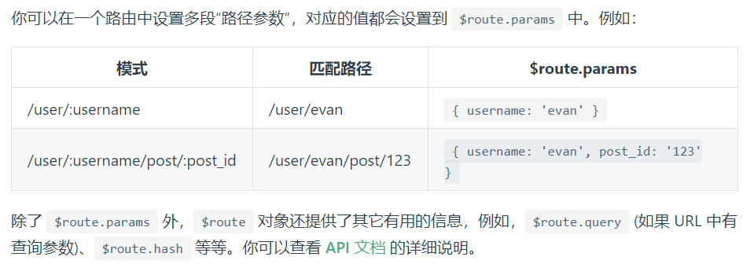
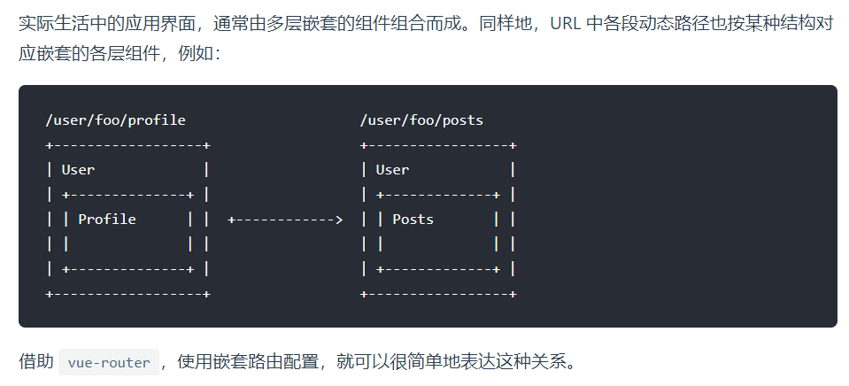

[toc]

## JS正式课第四十八天
### `$route`和 `$router`
+  $route    获取路由的信息（属性）
	+   this.$route.parmas
+ $router 跳转路由的方法(方法)
	+ $router.push()
    + $router.replace()
    + $router.go()
### 动态路由
>`参考：https://router.vuejs.org/zh/guide/essentials/dynamic-matching.html`
+ 定义：我们经常需要把某种模式匹配到的所有路由，全都映射到同个组件。例如，我们有一个 User 组件，对于所有 ID 各不相同的用户，都要使用这个组件来渲染。那么，我们可以在 vue-router 的路由路径中使用“动态路径参数”(dynamic segment) 来达到这个效果
+ 一个“路径参数”使用冒号 : 标记。当匹配到一个路由时，参数值会被设置到 this.$route.params，可以在每个组件内使用。


```
动态路由:
      主体一样，但是部分内容不一样，可以使用动态路由
      写法:
        /about/:id 匹配下面几种路由(这个id是自定义的)
          /about/1
          /about/2

使用:
  $route.params.id   
  切换的时候不会触发一些钩子函数，比如created，可以使用watch监听

  watch:{
    '$route'(){

    }
     }
```

```
const User = {
  template: '<div>User</div>'
}

const router = new VueRouter({
  routes: [
    // 动态路径参数 以冒号开头
    { path: '/user/:id', component: User }
  ]
})
```
#### 响应路由参数的变化

```
当使用路由参数时，例如从 /user/foo 导航到 /user/bar，原来的组件实例会被复用。因为两个路由都渲染同个组件，比起销毁再创建，复用则显得更加高效。不过，这也意味着组件的生命周期钩子不会再被调用。

复用组件时，想对路由参数的变化作出响应的话，你可以简单地 watch (监测变化) $route 对象：
```

```
const User = {
  template: '...',
  watch: {
    '$route' (to, from) {
      // 对路由变化作出响应...
    }
  }
}
```

```
使用:
        $route.params.id   
        切换的时候不会触发一些钩子函数，比如created，可以使用watch监听

        watch:{
          '$route'(){

          }
        }

```
#### 捕获所有路由或 404 Not found 路由
> `常规参数只会匹配被 / 分隔的 URL 片段中的字符。如果想匹配任意路径，我们可以使用通配符 (*)：`

```
{
  // 会匹配所有路径
  path: '*'
}
{
  // 会匹配以 `/user-` 开头的任意路径
  path: '/user-*'
}
```

```
当使用通配符路由时，请确保路由的顺序是正确的，也就是说含有通配符的路由应该放在最后。路由 { path: '*' } 通常用于客户端 404 错误。如果你使用了History 模式，请确保正确配置你的服务器。

当使用一个通配符时，$route.params 内会自动添加一个名为 pathMatch 参数。它包含了 URL 通过通配符被匹配的部分：

// 给出一个路由 { path: '/user-*' }
this.$router.push('/user-admin')
this.$route.params.pathMatch // 'admin'
// 给出一个路由 { path: '*' }
this.$router.push('/non-existing')
this.$route.params.pathMatch // '/non-existing'
```
### 嵌套路由
>`在路由配置中使用children:[{path:'x'}]  匹配的是  /parent/x`
  `注意的是parent组件中需要写上router-view 要不然子组件渲染不出来`     
  `如果进入parent下没有指定的children,又要默认添加一个组件，可以在path上写个''`


```
<div id="app">
  <router-view></router-view>
</div>
const User = {
  template: '<div>User {{ $route.params.id }}</div>'
}

const router = new VueRouter({
  routes: [
    { path: '/user/:id', component: User }
  ]
})
// 这里的 <router-view> 是最顶层的出口，渲染最高级路由匹配到的组件。同样地，一个被渲染组件同样可以包含自己的嵌套 <router-view>。
```
>`要在嵌套的出口中渲染组件，需要在 VueRouter 的参数中使用 children `

```
const router = new VueRouter({
  routes: [
    { path: '/user/:id', component: User,
      children: [
        {
          // 当 /user/:id/profile 匹配成功，
          // UserProfile 会被渲染在 User 的 <router-view> 中
          path: 'profile',
          component: UserProfile
        },
        {
          // 当 /user/:id/posts 匹配成功
          // UserPosts 会被渲染在 User 的 <router-view> 中
          path: 'posts',
          component: UserPosts
        }
      ]
    }
  ]
})
```

```
要注意，以 / 开头的嵌套路径会被当作根路径。 这让你充分的使用嵌套组件而无须设置嵌套的路径。

你会发现，children 配置就是像 routes 配置一样的路由配置数组，所以呢，你可以嵌套多层路由。
```
### 编程式的导航
> `参考：https://router.vuejs.org/zh/guide/essentials/navigation.html`
```
除了使用 <router-link> 创建 a 标签来定义导航链接，我们还可以借助 router 的实例方法，通过编写代码来实现。

#router.push(location, onComplete?, onAbort?)
注意：在 Vue 实例内部，你可以通过 $router 访问路由实例。因此你可以调用 this.$router.push。

想要导航到不同的 URL，则使用 router.push 方法。这个方法会向 history 栈添加一个新的记录，所以，当用户点击浏览器后退按钮时，则回到之前的 URL。

当你点击 <router-link> 时，这个方法会在内部调用，所以说，点击 <router-link :to="..."> 等同于调用 router.push(...)。

声明式	编程式
<router-link :to="...">	router.push(...)
该方法的参数可以是一个字符串路径，或者一个描述地址的对象。例如：

// 字符串
router.push('home')

// 对象
router.push({ path: 'home' })

// 命名的路由
router.push({ name: 'user', params: { userId: '123' }})

// 带查询参数，变成 /register?plan=private
router.push({ path: 'register', query: { plan: 'private' }})
注意：如果提供了 path，params 会被忽略，上述例子中的 query 并不属于这种情况。取而代之的是下面例子的做法，你需要提供路由的 name 或手写完整的带有参数的 path：

const userId = '123'
router.push({ name: 'user', params: { userId }}) // -> /user/123
router.push({ path: `/user/${userId}` }) // -> /user/123
// 这里的 params 不生效
router.push({ path: '/user', params: { userId }}) // -> /user
同样的规则也适用于 router-link 组件的 to 属性。

在 2.2.0+，可选的在 router.push 或 router.replace 中提供 onComplete 和 onAbort 回调作为第二个和第三个参数。这些回调将会在导航成功完成 (在所有的异步钩子被解析之后) 或终止 (导航到相同的路由、或在当前导航完成之前导航到另一个不同的路由) 的时候进行相应的调用。在 3.1.0+，可以省略第二个和第三个参数，此时如果支持 Promise，router.push 或 router.replace 将返回一个 Promise。

注意： 如果目的地和当前路由相同，只有参数发生了改变 (比如从一个用户资料到另一个 /users/1 -> /users/2)，你需要使用 beforeRouteUpdate 来响应这个变化 (比如抓取用户信息)。

#router.replace(location, onComplete?, onAbort?)
跟 router.push 很像，唯一的不同就是，它不会向 history 添加新记录，而是跟它的方法名一样 —— 替换掉当前的 history 记录。

声明式	编程式
<router-link :to="..." replace>	router.replace(...)
#router.go(n)
这个方法的参数是一个整数，意思是在 history 记录中向前或者后退多少步，类似 window.history.go(n)。

例子

// 在浏览器记录中前进一步，等同于 history.forward()
router.go(1)

// 后退一步记录，等同于 history.back()
router.go(-1)

// 前进 3 步记录
router.go(3)

// 如果 history 记录不够用，那就默默地失败呗
router.go(-100)
router.go(100)
#操作 History
你也许注意到 router.push、 router.replace 和 router.go 跟 window.history.pushState、 window.history.replaceState 和 window.history.go好像， 实际上它们确实是效仿 window.history API 的。

因此，如果你已经熟悉 Browser History APIs，那么在 Vue Router 中操作 history 就是超级简单的。

还有值得提及的，Vue Router 的导航方法 (push、 replace、 go) 在各类路由模式 (history、 hash 和 abstract) 下表现一致。
```

```
编程导航:
      $router.push()
      $router.replace()
      $router.go()

      可以传字符串和对象 
        '/'
        {
          path:'/'
          name:'home',
          query:{
            name:'白晓'   -> /?name=白晓
          },
          params:{
            nn:'白晓'  -> 注意的是路由上不会显示nn，但是可以通过$route.params.nn去获取
          }
        }
```
### 重定向和别名
>`参考：https://router.vuejs.org/zh/guide/essentials/redirect-and-alias.html`
```
重定向
重定向也是通过 routes 配置来完成，下面例子是从 /a 重定向到 /b：

const router = new VueRouter({
  routes: [
    { path: '/a', redirect: '/b' }
  ]
})
重定向的目标也可以是一个命名的路由：

const router = new VueRouter({
  routes: [
    { path: '/a', redirect: { name: 'foo' }}
  ]
})
甚至是一个方法，动态返回重定向目标：

const router = new VueRouter({
  routes: [
    { path: '/a', redirect: to => {
      // 方法接收 目标路由 作为参数
      // return 重定向的 字符串路径/路径对象
    }}
  ]
})
注意导航守卫并没有应用在跳转路由上，而仅仅应用在其目标上。在下面这个例子中，为 /a 路由添加一个 beforeEach 或 beforeLeave 守卫并不会有任何效果。

其它高级用法，请参考例子。

#别名
“重定向”的意思是，当用户访问 /a时，URL 将会被替换成 /b，然后匹配路由为 /b，那么“别名”又是什么呢？

/a 的别名是 /b，意味着，当用户访问 /b 时，URL 会保持为 /b，但是路由匹配则为 /a，就像用户访问 /a 一样。

上面对应的路由配置为：

const router = new VueRouter({
  routes: [
    { path: '/a', component: A, alias: '/b' }
  ]
})
“别名”的功能让你可以自由地将 UI 结构映射到任意的 URL，而不是受限于配置的嵌套路由结构。
```

```
重定向:
        { path: '/a', redirect: { name: 'foo' }}
```
### 路由组件传参
> `参考：https://router.vuejs.org/zh/guide/essentials/passing-props.html`
```
 路由传参:
 可以在路由配置项中配置一个props,如果为true，那么子组件可以通过
  props去接收parmas参数
    可以看Home.vue中的 p4
 
 可以传字符串和对象 
        '/'
        {
          path:'/'
          name:'home',
          query:{
            name:'白晓'   -> /?name=白晓
          },
          params:{
            nn:'白晓'  -> 注意的是路由上不会显示nn，但是可以通过$route.params.nn去获取
          }
        }
```

```
在组件中使用 $route 会使之与其对应路由形成高度耦合，从而使组件只能在某些特定的 URL 上使用，限制了其灵活性。

使用 props 将组件和路由解耦：

取代与 $route 的耦合

const User = {
  template: '<div>User {{ $route.params.id }}</div>'
}
const router = new VueRouter({
  routes: [
    { path: '/user/:id', component: User }
  ]
})
通过 props 解耦

const User = {
  props: ['id'],
  template: '<div>User {{ id }}</div>'
}
const router = new VueRouter({
  routes: [
    { path: '/user/:id', component: User, props: true },

    // 对于包含命名视图的路由，你必须分别为每个命名视图添加 `props` 选项：
    {
      path: '/user/:id',
      components: { default: User, sidebar: Sidebar },
      props: { default: true, sidebar: false }
    }
  ]
})
这样你便可以在任何地方使用该组件，使得该组件更易于重用和测试。

#布尔模式
如果 props 被设置为 true，route.params 将会被设置为组件属性。

#对象模式
如果 props 是一个对象，它会被按原样设置为组件属性。当 props 是静态的时候有用。

const router = new VueRouter({
  routes: [
    { path: '/promotion/from-newsletter', component: Promotion, props: { newsletterPopup: false } }
  ]
})
#函数模式
你可以创建一个函数返回 props。这样你便可以将参数转换成另一种类型，将静态值与基于路由的值结合等等。

const router = new VueRouter({
  routes: [
    { path: '/search', component: SearchUser, props: (route) => ({ query: route.query.q }) }
  ]
})
URL /search?q=vue 会将 {query: 'vue'} 作为属性传递给 SearchUser 组件。

请尽可能保持 props 函数为无状态的，因为它只会在路由发生变化时起作用。如果你需要状态来定义 props，请使用包装组件，这样 Vue 才可以对状态变化做出反应。
```
### 导航守卫
>`参考：https://router.vuejs.org/zh/guide/advanced/navigation-guards.html`

```
next(); 执行之后的路由跳转
  next(false) 中断路由跳转
  next('/') 等同于push  或者使用  next({ path: '/' })

  如果有全局和局部，那么全局优先级大

  全局的beforeEach(要切换路由的时候触发)

  组件中的beforeRouteLeave 离开组件的时候触发
  复用组件使用beforeRouteUpdate去进行监听

  路由中的beforeEnter 进入路由的时候触发
```

#### 完整的导航解析流程
`导航被触发。
在失活的组件里调用离开守卫。
调用全局的 beforeEach 守卫。
在重用的组件里调用 beforeRouteUpdate 守卫 (2.2+)。
在路由配置里调用 beforeEnter。
解析异步路由组件。
在被激活的组件里调用 beforeRouteEnter。
调用全局的 beforeResolve 守卫 (2.5+)。
导航被确认。
调用全局的 afterEach 钩子。
触发 DOM 更新。
用创建好的实例调用 beforeRouteEnter 守卫中传给 next 的回调函数。`

#### 全局前置守卫

```
你可以使用 router.beforeEach 注册一个全局前置守卫：

const router = new VueRouter({ ... })

router.beforeEach((to, from, next) => {
  // ...
})
当一个导航触发时，全局前置守卫按照创建顺序调用。守卫是异步解析执行，此时导航在所有守卫 resolve 完之前一直处于 等待中。

每个守卫方法接收三个参数：

to: Route: 即将要进入的目标 路由对象

from: Route: 当前导航正要离开的路由

next: Function: 一定要调用该方法来 resolve 这个钩子。执行效果依赖 next 方法的调用参数。

next(): 进行管道中的下一个钩子。如果全部钩子执行完了，则导航的状态就是 confirmed (确认的)。

next(false): 中断当前的导航。如果浏览器的 URL 改变了 (可能是用户手动或者浏览器后退按钮)，那么 URL 地址会重置到 from 路由对应的地址。

next('/') 或者 next({ path: '/' }): 跳转到一个不同的地址。当前的导航被中断，然后进行一个新的导航。你可以向 next 传递任意位置对象，且允许设置诸如 replace: true、name: 'home' 之类的选项以及任何用在 router-link 的 to prop 或 router.push 中的选项。

next(error): (2.4.0+) 如果传入 next 的参数是一个 Error 实例，则导航会被终止且该错误会被传递给 router.onError() 注册过的回调。

确保要调用 next 方法，否则钩子就不会被 resolved。
```
#### 全局解析守卫

```
在 2.5.0+ 你可以用 router.beforeResolve 注册一个全局守卫。这和 router.beforeEach 类似，区别是在导航被确认之前，同时在所有组件内守卫和异步路由组件被解析之后，解析守卫就被调用。
```
#### 全局后置钩子

```
你也可以注册全局后置钩子，然而和守卫不同的是，这些钩子不会接受 next 函数也不会改变导航本身：

router.afterEach((to, from) => {
  // ...
})
```
#### 路由独享的守卫

```
你可以在路由配置上直接定义 beforeEnter 守卫：

const router = new VueRouter({
  routes: [
    {
      path: '/foo',
      component: Foo,
      beforeEnter: (to, from, next) => {
        // ...
      }
    }
  ]
})
这些守卫与全局前置守卫的方法参数是一样的。
```
#### 组件内的守卫
+ beforeRouteEnter
+ beforeRouteUpdate (2.2 新增)
+ beforeRouteLeave

```
最后，你可以在路由组件内直接定义以下路由导航守卫：

beforeRouteEnter
beforeRouteUpdate (2.2 新增)
beforeRouteLeave
const Foo = {
  template: `...`,
  beforeRouteEnter (to, from, next) {
    // 在渲染该组件的对应路由被 confirm 前调用
    // 不！能！获取组件实例 `this`
    // 因为当守卫执行前，组件实例还没被创建
  },
  beforeRouteUpdate (to, from, next) {
    // 在当前路由改变，但是该组件被复用时调用
    // 举例来说，对于一个带有动态参数的路径 /foo/:id，在 /foo/1 和 /foo/2 之间跳转的时候，
    // 由于会渲染同样的 Foo 组件，因此组件实例会被复用。而这个钩子就会在这个情况下被调用。
    // 可以访问组件实例 `this`
  },
  beforeRouteLeave (to, from, next) {
    // 导航离开该组件的对应路由时调用
    // 可以访问组件实例 `this`
  }
}
beforeRouteEnter 守卫 不能 访问 this，因为守卫在导航确认前被调用,因此即将登场的新组件还没被创建。

不过，你可以通过传一个回调给 next来访问组件实例。在导航被确认的时候执行回调，并且把组件实例作为回调方法的参数。

beforeRouteEnter (to, from, next) {
  next(vm => {
    // 通过 `vm` 访问组件实例
  })
}
注意 beforeRouteEnter 是支持给 next 传递回调的唯一守卫。对于 beforeRouteUpdate 和 beforeRouteLeave 来说，this 已经可用了，所以不支持传递回调，因为没有必要了。

beforeRouteUpdate (to, from, next) {
  // just use `this`
  this.name = to.params.name
  next()
}
这个离开守卫通常用来禁止用户在还未保存修改前突然离开。该导航可以通过 next(false) 来取消。

beforeRouteLeave (to, from , next) {
  const answer = window.confirm('Do you really want to leave? you have unsaved changes!')
  if (answer) {
    next()
  } else {
    next(false)
  }
}
```

### 路由元信息
>`参考：https://router.vuejs.org/zh/guide/advanced/meta.html`

```
定义路由的时候可以配置 meta 字段：

const router = new VueRouter({
  routes: [
    {
      path: '/foo',
      component: Foo,
      children: [
        {
          path: 'bar',
          component: Bar,
          // a meta field
          meta: { requiresAuth: true }
        }
      ]
    }
  ]
})
那么如何访问这个 meta 字段呢？

首先，我们称呼 routes 配置中的每个路由对象为 路由记录。路由记录可以是嵌套的，因此，当一个路由匹配成功后，他可能匹配多个路由记录

例如，根据上面的路由配置，/foo/bar 这个 URL 将会匹配父路由记录以及子路由记录。

一个路由匹配到的所有路由记录会暴露为 $route 对象 (还有在导航守卫中的路由对象) 的 $route.matched 数组。因此，我们需要遍历 $route.matched 来检查路由记录中的 meta 字段。

下面例子展示在全局导航守卫中检查元字段：

router.beforeEach((to, from, next) => {
  if (to.matched.some(record => record.meta.requiresAuth)) {
    // this route requires auth, check if logged in
    // if not, redirect to login page.
    if (!auth.loggedIn()) {
      next({
        path: '/login',
        query: { redirect: to.fullPath }
      })
    } else {
      next()
    }
  } else {
    next() // 确保一定要调用 next()
  }
})
```
### HTML DOM confirm() 方法

```
定义和用法
confirm() 方法用于显示一个带有指定消息和 OK 及取消按钮的对话框。

语法
confirm(message)
参数	描述
message	要在 window 上弹出的对话框中显示的纯文本（而非 HTML 文本）
说明
如果用户点击确定按钮，则 confirm() 返回 true。如果点击取消按钮，则 confirm() 返回 false。

在用户点击确定按钮或取消按钮把对话框关闭之前，它将阻止用户对浏览器的所有输入。在调用 confirm() 时，将暂停对 JavaScript 代码的执行，在用户作出响应之前，不会执行下一条语句。

提示和注释
提示：对话框按钮的文字是不可改变的，因此请小心地编写问题或消息，使它适合用确认和取消来回答。

实例
<html>
<head>
<script type="text/javascript">
function disp_confirm()
  {
  var r=confirm("Press a button")
  if (r==true)
    {
    document.write("You pressed OK!")
    }
  else
    {
    document.write("You pressed Cancel!")
    }
  }
</script>
</head>
<body>

<input type="button" onclick="disp_confirm()"
value="Display a confirm box" />

</body>
</html>
```

