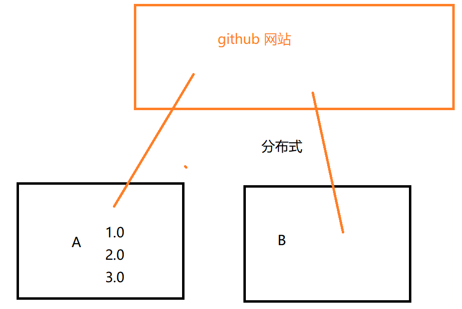
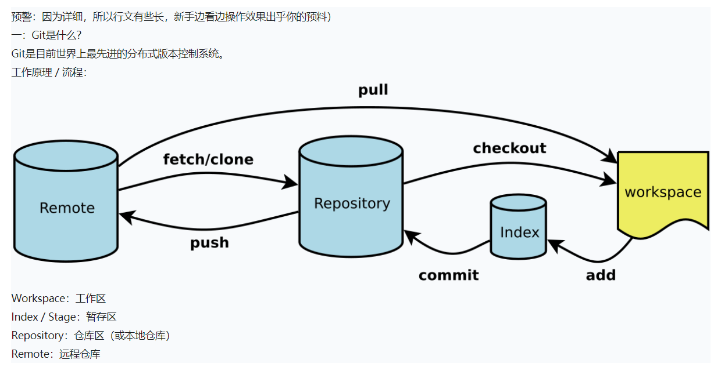

[toc]

## JS正式课第一天
### git和github
+ git：版本控制工具
	+ 需求：之前有个老项目运行还不错，但是觉得技术比较陈旧，设计的风格也比较古老，所以公司决定更新迭代，当程序员开发完成后，测试的也是没问题，但是上线的时候网站挂了，问你怎么办

      新的挂了，老的正常运行，那么就先让老版本回滚，等新版本的网站确认没问题再次上线即可

      版本的时光穿梭
+ github：网站、远程代码管理仓库，贵圈基友平台（交流、学习）

	+ 集中式  vs  分布式
     
	     - 集中式缺点：必须联网，都使用一个中央服务器，有可能会造成数据丢失
	     - 分布式：不用联网就能进行版本控制，速度快

### git

#### 设置作者信息（可读可写）
+ 设置用户名  git  config  --global user.name "你的英文名字"
+ 设置邮箱   git config --global user.email "bzh2lf163@163.com"  能够收到邮件的邮箱
+  查看设置信息 git config -l
#### 初始化版本控制状态
+ 找到要控制的文件目录，鼠标右键，找到git bash here  点击
+ 打开控制台，输入git  init
+ 版本控制都是基于.git这个隐藏文件的，如果不小心把git文件删除，那么就不能进行版本控制了
+ 查看git状态  git  status
+ git add 文件名  将工作区目录下文件放到暂存区
+ git add .   将工作区目录下所有文件放到暂存区
+ 通过Tab键补全文件名
+ 通过ll或者ls查看目录的文件或者文件的修改信息
+ 通过上下键查看刚才输入命令记录
+ 查看输入命令历史：history
+ 查看git版本：git --version  
+ 查看当前目录路径：pwd
+ git  commit -m '备注'   从暂存区到版本区 （能直接识别的注释即可）
+ git commit -a -m '备注'  快速把工作的代码放到版本区（已经管理过的文件）
    注意：上面这个命令，前提条件是文件已经提交过一次才可以使用，如果是新文件则需要用git  add重新添加
+ git rm -r --cache  .   清理缓存
+ 查看版本 git log       git reflog（如果版本操作的多，使用这个命令）
+
####  查看每个区域的不同点  

	+ 工作区和暂存区的区别  git  diff
	+ 工作区和版本区的区别   git  diff  master
	+ 暂存区和版本区的区别 git diff  --cached
	
#####过滤指定文件
+ 创建一个.gitignore文件   touch  .gitignore
+ 配置过滤项：
	+ 规则：https://www.cnblogs.com/zhihang/p/10611475.html
	+ /create.txt   过滤文件
	+ node_modeules/  过滤文件夹及文件夹里面的内容
	+ '# '　　　　用于注释

	+ '*' (一个星号)　　匹配除'\'之外的多个所有字符 #例：*.txt 所有的txt文件

	+ /test/ 　　 代表不管理 test目录下的所有文件，不包含test目录

	+ /test 　　  代表不管test 此目录，包含test目录文件

	+ ! 　　　　 代表取反，需要管理 #例；因为gitignore是用于排除的git 文件管理，当你在一个目录下要排除的文件远远大于管理的文件时，你可以搭配文件排除和！使用,实例：/root/test/ !/root/test/except.txt 注：在父级目录（root）没有被全部排除下，except.txt 才会被管理

	+ ? 　　　　匹配除'\'之外的一个所有字符 #例： test?.txt 可以匹配到 testa.txt、testk.txt等文件

	+	[] 　　　　匹配数组中指定指定的字符 #例：test[k,l] 可以匹配到 testk.txt、testl.txt， 之外都不行

	+	**  (两个星号)　　　　用于匹配多层目录 #例: root/**/test 可以匹配到 root/a/b/c/test 、root/fd/gg/test等目录
	
+ 如果配置不起作用，可以先把之前的操作清除一下，再进行过滤操作
  清除命令    git rm -r --cache  . 
+ 警告：gitignore 的忽略规则只适用还没管理的文件，假如你有忽略规则在你添加之前被git 管理，那添加的忽略规则将无法适用已经管理的文件 

#### 撤销（回滚）
     git   reset --hard  版本id

### github
+ 其实有很多代码托管平台 github  只是其中一个  码云  coding  等等
+ 把我们的代码放到远程仓库
	+ 在github创建一个项目
	+ 绑定密钥
           ssh-keygen -t rsa  -C "邮箱名" （绑一次即可）
       查看是否已经绑定成功
            ssh -T git@github.com
   
   + 确定版本库是最新的（没有东西可以提交了）
   + 查看远程仓库
           git  remote -v (使用git init 的时候是看不出来的)
   + 添加远程仓库
           git remote  add  origin(这个名字是可以改变的)   git@github.com:xb2lf/Mobike1.git
   + git pull origin master (保证能够成功上传，进行远程和本地合并)
   + git  push origin master   上传（第一次会出现让输入用户名和密码）
+ 第二种方法
	+ 先在远程仓库中创建一个项目
	+ git  clone  项目的地址
	+ git add  .       git  commit -m ""
	+ git push origin  master
#### 下载课件
> git clone git@github.com:nizp/2019-10-8.git

### node

#### npm
    NPM 跟着node安装一起安装下来的模块
    NPM 是目前最大的资源管理平台

    Yarn  最快的资源管理平台
          安装： npm  install -g yarn 

    创建项目:
        npm init -y 会生成一个package.json的文件，这个文件里面放的时候所有的项目配置依赖
    
    如何下载资源呢
    npm  install   资源名
          -g 全局安装
          -s  项目依赖
    下载下来的时候会自动生成一个node_modules的文件夹，文件夹放的就是你需要的资源
    
    卸载

    npm uninstall  资源名
